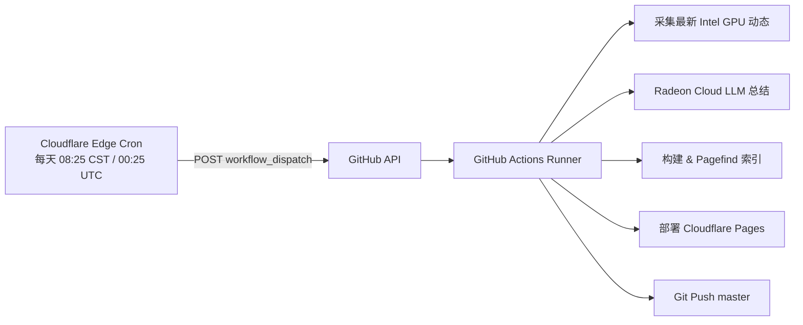

# Cloudflare Worker 外挂定时触发器 (cron-intel-daily)

专为解决 GitHub Actions 原生 Cron 调度器经常延误或掉单而设计的云端外挂定时触发器。

部署于 Cloudflare Workers，利用 Cloudflare 原生 Cron Triggers 每天北京时间 08:25（UTC 00:25）准时向 GitHub REST API 发送 `workflow_dispatch` 请求，精确唤醒 `daily-intel-gpu.yml` 任务。

## 架构



## 线上信息

- **Worker 名称**：`cron-intel-daily`
- **线上地址**：`https://cron-intel-daily.animeweaver959.workers.dev`
- **Cron 表达式**：`25 0 * * *`（UTC 00:25 = 北京时间 08:25）
- **触发目标**：`Blackwood416/Blackwood416.github.io` 的 `daily-intel-gpu.yml`（分支 `master`）

## HTTP 接口

- `GET /health`：健康检查接口，返回当前时间。
- `GET /trigger` 或 `GET /`：手动立即触发一次 GitHub Actions 工作流。

## 本地维护与更新

如需重新部署或更新代码：

```powershell
cd cloudflare-cron
$env:CLOUDFLARE_API_TOKEN="<YOUR_CF_TOKEN>"
$env:CLOUDFLARE_ACCOUNT_ID="<YOUR_CF_ACCOUNT_ID>"
npx wrangler deploy
```

如需更新 GitHub 访问 Token（`GH_PAT`）：

```powershell
cd cloudflare-cron
$ghToken = (gh auth token)
$ghToken | npx wrangler secret put GH_PAT
```
