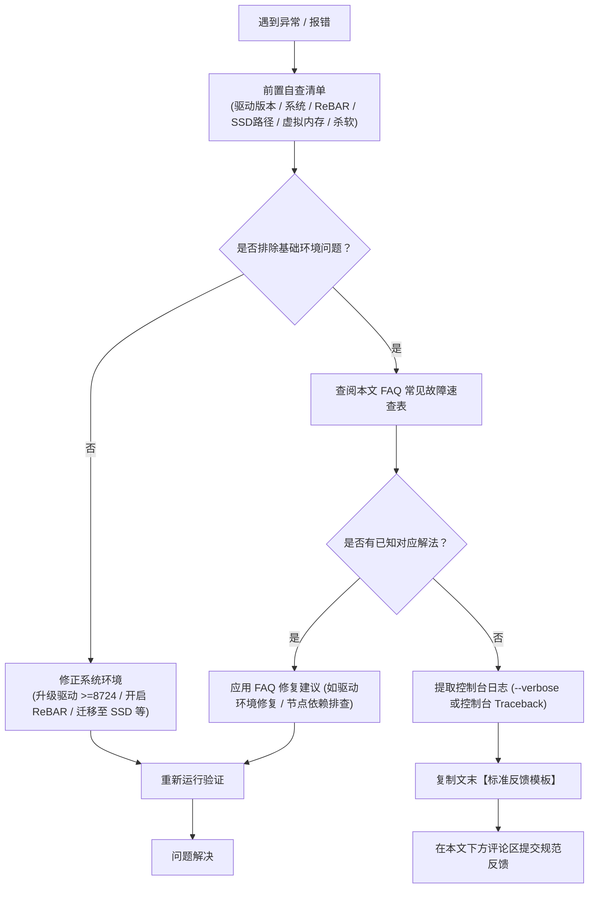

# Intel Arc A770 ComfyUI 整合包使用指南与问题反馈专帖

为了方便大家在 **Intel Arc A770 (16G/8G)** 上顺畅体验 AI 绘图与工作流创作，我制作并发布了本套开箱即用的 **ComfyUI A770 专用整合包**。

随着开源生态的发展，目前整合包已全面拥抱**主线 PyTorch（原生 XPU 设备后端与 Level Zero 运行时支持）**，不再依赖过往繁琐的外部扩展层。不过由于 Intel 独立显卡底层驱动、Level Zero SDK 以及第三方自定义节点生态的特殊性，在运行新型模型或安装扩展节点时，仍可能出现环境或算子兼容性问题。

为提升排查效率，避免零散且缺乏关键信息的留言（例如“闪退了怎么办”、“报错跑不动”），特设此专帖用于**集中收集问题反馈与经验交流**。在评论区留言前，请务必阅读本文的**自查流程**与**反馈规范**。

---

## 一、反馈与排查流转规范

在遇到任何报错或异常行为时，请参考以下标准处理流程：



---

## 二、反馈前自查清单（排除 80% 常见坑）

大部分启动失败或莫名崩溃通常由底层软硬件环境未就绪引起。请在提交反馈前，逐项核对以下清单：

### 1. 显卡驱动版本：推荐 8724 及以上版本
> [!IMPORTANT]
> **显卡驱动版本直接决定底层算力调度的稳定性。**
> - **驱动版本要求**：强烈推荐安装 **`32.0.101.8724` 及以上版本**。
> - **底层依赖说明**：该版本及以上驱动附带的 **Level Zero SDK 版本大于等于 1.28.2**，完整适配主线 PyTorch XPU 的底层算子调用。若使用老版本驱动，极易发生设备探测异常或算子执行报错。

### 2. 操作系统支持：最低 Windows 10 22H2
- Intel 官方驱动目前支持的最低系统版本为 **Windows 10 22H2**（Windows 11 各版本均良好支持）。
- 更早版本的 Windows 10 或 Windows 7/8 无法正常加载最新的 Intel 图形与计算驱动。

### 3. 必须开启 Resizable BAR (ReBAR) 与 Above 4G Decoding
- **ReBAR 是 Intel Arc 显卡发挥性能与正确寻址显存的硬性指标**。
- 若未开启 ReBAR，显卡推理吞吐量将出现断崖式下跌，且极易触发 XPU 显存分配失败或直接导致驱动程序重置。
- **验证方法**：打开【Intel 显卡控制中心】或使用 GPU-Z，确认 **Resizable BAR** 状态为 **Enabled / 已启用**。若未启用，请进入主板 BIOS 开启 `Above 4G Decoding` 与 `Re-Size BAR Support`，并确认禁用 `CSM` 兼容模式。

### 4. 整合包存放路径与 SSD 固态硬盘要求
- **强烈建议放在 SSD（固态硬盘）**：新一代高参数模型（如 MiniMax H3、Krea2、Qwen Image 2.1 等）权重体积巨大，机械硬盘缓慢的随机与顺序读取会严重拉长启动与模型加载耗时，甚至造成推理卡死假象。
- **整合包路径规范**：整合包放在 D 盘（例如根目录 `D:\ComfyUI_windows_portable`），后续各版本我将统一按**发布日期**进行归档命名（例如 `2026年10月5日` 或以发布日期命名的子目录）。
- **严禁包含中文、空格或特殊字符**：
  - **错误示例**：`D:\AI工具\ComfyUI 新版\comfyui`
  - **正确示例**：`D:\ComfyUI_windows_portable`
  - **原因**：底层动态链接库在解析含非 ASCII 字符或空格的路径时极易失败，导致静默闪退或 `DLL load failed`。

### 5. 虚拟内存设置：推荐“系统管理的大小”并预留足够磁盘空间
> [!TIP]
> 加载大模型（如 MiniMax H3、Krea2、Qwen Image 2.1 等）时，系统需要将模型权重映射至物理内存再流转至显存。如果系统可用内存 + 虚拟内存不足，Windows 会直接强制终止 Python 进程（现象：**无任何控制台报错，突然闪退关闭**）。
> - **推荐配置**：在 Windows 高级系统设置中将虚拟内存设为**“系统管理的大小”**（自动托管）；
> - **关键前提**：务必保证托管虚拟内存的盘符（优先建议高速 SSD）**预留充足的剩余可用空间**（建议至少留出 30GB 以上剩余空间）。

### 6. 杀毒软件排查（白名单设置）
- Windows Defender 或第三方安全软件（如火绒、360）可能会拦截整合包内的嵌入式 Python 解释器或动态生成的缓存文件。
- 建议将整个整合包所在根目录添加到杀毒软件的**排除项 / 白名单**中。

---

## 三、高频已知问题速查（FAQ）

| 现象 / 报错信息 | 典型原因 | 推荐解决方案 |
| :--- | :--- | :--- |
| **提示 `No XPU device detected` 或回退到 CPU** | 驱动版本过低或环境变量缺失 | 1. 确认驱动版本是否在 **8724** 及以上；<br/>2. 确认是否通过整合包自带的启动脚本启动（注入了必要的运行时环境变量）。 |
| **安装某个自定义节点后，整个环境报 Torch 错误** | 节点通过 pip 自动覆盖安装了 CUDA 版 PyTorch | **严禁随意使用节点管理器的自动修复/Update**。若 Torch 被破坏，需重新安装匹配的 `torch-xpu` 官方主线包，或从原始整合包中覆盖 `python/Lib/site-packages`。 |
| **自定义节点报 `ModuleNotFoundError`** | 该扩展节点缺失纯 Python 外部依赖 | 使用整合包自带的终端打开环境（如 `python_embeded\python.exe -m pip install 包名`），注意**绝不可执行任何升级或重装 torch 的命令**。 |

---

## 四、如何获取并提取有效报错日志

当问题无法自行解决时，提供**完整而精确的错误上下文**是定位问题的关键。

### 1. 使用 ComfyUI 官方 `--verbose` 参数导出日志（推荐）
ComfyUI 原生支持通过命令行参数将详尽的运行日志保存到文件中，无需使用命令行管道重定向：

```bat
--verbose [LEVEL] [FILE]
```

其中 `LEVEL` 可选级别包括：
`('DEBUG', 'DETAIL', 'INFO', 'WARNING', 'ERROR', 'CRITICAL')`

**使用示例**：
编辑启动批处理文件，在运行参数末尾添加：
```bat
python.exe main.py --verbose INFO comfyui.log
```
如果遇到深层节点异常或依赖加载问题，可将级别提升为 `DETAIL`：
```bat
python.exe main.py --verbose DETAIL comfyui.log
```
程序运行结束后，根目录下会自动生成结构完整的 `comfyui.log` 日志文件，方便查阅与提取。

### 2. 抓取控制台完整 Traceback
若未开启日志文件，在控制台报错时，通常会打印从 `Traceback (most recent call last):` 开始的堆栈信息：
- **请勿只截图最后一行简短的 `Exception: xxx`**。最后一行往往只是结果，上方调用的具体节点与文件位置才是根因。
- **最佳方式**：在控制台中拖动鼠标选中完整的错误文本，按 `Enter` 键复制，然后以 Markdown 代码块格式粘贴。

---

## 五、标准反馈模板（请复制填空）

在本文下方的 Giscus 评论区留言时，**请务必复制以下模板并填入您的真实环境信息**：

```markdown
### 1. 基础环境
- 整合包版本：[例如：2026年10月5日版]
- 存放路径与磁盘：[例如：D:\ComfyUI_windows_portable (NVMe SSD)]
- 操作系统版本：[例如：Windows 11 24H2 / Windows 10 22H2]
- 显卡型号与显存：Intel Arc A770 [16GB / 8GB]
- 显卡驱动版本：[例如：32.0.101.8724]
- 物理内存 / 虚拟内存：[例如：32GB / 托管在 SSD 自动管理]
- ReBAR 状态：[已开启 / 未开启 / 不确定]

### 2. 问题复现
- 使用的模型与架构：[例如：Qwen Image 2.1 / MiniMax H3 / Krea2]
- 涉及的工作流 / 节点：[例如：标准文生图 / 某特定第三方节点]
- 触发时机：[例如：启动时 / 点击排队生图时 / 采样器第 20 步时]

### 3. 现象描述
[在此简述：你预期的行为是什么，实际发生了什么]

### 4. 报错日志 (Traceback / comfyui.log)
```log
[请在此处粘贴从 Traceback 开始的完整报错文本，或 comfyui.log 关键片段，严禁发截断的局部截图]
```

### 5. 已经尝试过的排查步骤
[例如：已确认英文路径与SSD存放、已确认驱动为8724+、已开启ReBAR等]
```

---

## 六、交流与答疑约定

1. **善用检索**：在提问前，可以按 `Ctrl + F` 浏览评论区已有的回复，避免重复提问相同问题。
2. **规范反馈优先支持**：遵循规范填写模板并提供完整日志的反馈，定位准确，通常能在第一时间得到针对性解答与修复方案。
3. **经验回馈**：若在讨论后通过某种方式成功解决，欢迎在楼层内追评一句 **“【已解决】+ 解决方法”**，共同完善 Intel Arc 的 AI 运行生态！
