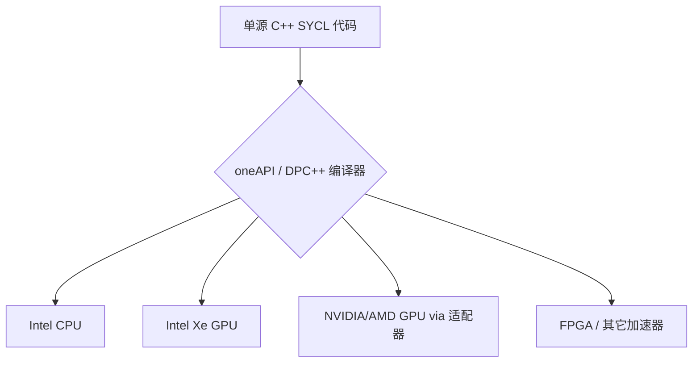

在上期折腾 **A770 16G** 的时候，我们吐槽了目前许多 AI 推理工具（比如 OpenVINO, llama.cpp sycl 等）在 I 卡上的性能释放差强人意。这些框架的底层很大程度上都依赖于 Intel 的 **oneAPI**。

既然如此，咱们干脆绕过那些封装好的上层库，直接从 oneAPI 及其核心的 C++ 异构计算标准 **SYCL** 入手。这期日志我们就来完成从“环境搭建”到“手写第一个 GPU 并行 Kernel”的初体验。

---

## oneAPI 简介

### 什么是 oneAPI？

简单来说，**oneAPI** 是 Intel 推出的一套跨架构、跨厂商的统一编程模型。它的愿景非常宏大：让开发者使用**同一种语言、同一种编程范式**，就能把代码无缝运行在 CPU、GPU、FPGA 以及各种 AI 加速器上。这显然是在向 NVIDIA 独占的 CUDA 生态发起正面挑战。



### 什么是 SYCL？

**SYCL**（发音为 /Sik-uhl/）是 Khronos Group 制定的一种基于标准 C++ 的异构计算规范。而 Intel 的 oneAPI 编译器（早期叫 DPC++，现在整合进 oneAPI Compiler）则是目前对 SYCL 标准支持最完备的实现。

SYCL 最迷人的地方在于其**单源（Single-source）特性**：
* 所有的 Host（主机 CPU）代码和 Device（加速器 GPU）代码都写在同一个 `.cpp` 文件里。
* 编译器会自动把 Device 代码编译成中间表示（如 SPIR-V），在运行时由显卡驱动加载并执行。
* 开发者不需要像写 OpenCL 那样去处理一堆繁琐的底层上下文初始化，也不需要像 CUDA 那样学习一套非标准的 `<<<...>>>` 语法。

---

## oneAPI Toolkit 安装

在编写代码之前，我们需要安装 **oneAPI Toolkit**（它包含了编译器 `icpx`/`icx`、SYCL 运行时、VTune 性能分析器等），原本应该是 **oneAPI Base Toolkit** 的，但是`2026.0`以后Intel改名了，把 **oneAPI Base Toolkit** 和 **oneAPI HPC Toolkit** 合并成了 **oneAPI Toolkit**。

### Windows

在 Windows 11 上安装 oneAPI 比较直观，但需要注意前置条件：

1. **安装 Visual Studio 2022**：在安装 Base Toolkit 之前，必须先装好 VS2022，并确保勾选了 **“使用 C++ 的桌面开发”**。
2. **下载 Toolkit**：前往 Intel 官网下载 oneAPI Toolkit 的 Windows 在线或离线安装包。
3. **集成与安装**：运行安装程序，它会自动检测到你系统中的 VS2022，并提示安装 VS 插件。建议全部勾选。
4. **环境激活**：在命令行中使用 oneAPI 编译器前，必须运行一次环境变量初始化脚本。在 Powershell 中用这条命令：
   ```powershell
   cmd /c '"C:\Program Files (x86)\Intel\oneAPI\setvars.bat" && set' | ForEach-Object { if ($_ -match '^([^=]+)=(.*)$') { [System.Environment]::SetEnvironmentVariable($matches[1], $matches[2], 'Process') } }; Write-Host ':: oneAPI environment initialized ::' -ForegroundColor Green
   ```
   如果看到绿色的 `:: oneAPI environment initialized ::` 字样，说明激活成功。
   
   至于为什么要用这么长一串，这得问问巨硬为什么把powershell的问题搞的那么多，我们需要用cmd跑那个bat以后把环境变量回传过来，不然在powershell下单跑bat相当于没跑。

### Linux

对于 Linux 环境，根据发行版不同有不同的安装姿势。

#### Ubuntu

Intel 官方维护了 Debian/APT 仓库，可以通过以下步骤配置安装：

```bash
# 下载并配置 Intel 的 GPG 密钥
wget -O- https://apt.repos.intel.com/intel-gpg-keys/GPG-PUB-KEY-INTEL-SW-PRODUCTS.key | gpg --dearmor | sudo tee /usr/share/keyrings/oneapi-archive-keyring.gpg > /dev/null

# 添加 APT 仓库
echo "deb [signed-by=/usr/share/keyrings/oneapi-archive-keyring.gpg] https://apt.repos.intel.com/oneapi all main" | sudo tee /etc/apt/sources.list.d/oneAPI.list

# 更新并安装 oneAPI Toolkit
sudo apt update
sudo apt install intel-oneapi-toolkit
```

**环境激活**：

```bash
source /opt/intel/oneapi/setvars.sh
```

#### Arch Linux

一个好消息是Arch这边把 oneAPI Base Toolkit 直接放进了官方`extra`源里，我们完全不需要引入外部源。但坏消息是它保持了Arch的滚动更新风格，你只能安装最新版本。

```bash
# 只能安装最新版本，在写文章的当下2026/07/10，最新版本是 2026.0.1
sudo pacman -Sy intel-oneapi-toolkit
# AUR 有比较旧的版本，如2025.3，可以用你喜欢的AUR helper下载
# paru
paru -Sy intel-oneapi-basekit-2025
# 或者yay
yay -Sy intel-oneapi-basekit-2025
```

**环境激活**：

```bash
source /opt/intel/oneapi/setvars.sh
```

---

## oneAPI SYCL 入门

准备工作做完，现在我们来写点真家伙。

### 获取设备信息

首先，我们写一段简短的代码来探测当前系统下都有哪些计算设备（CPU/GPU）。

新建文件 `sycl_info.cpp`：

```cpp title='sycl_info.cpp'
#include <sycl/sycl.hpp>
#include <iostream>

int main() {
    // 获取系统中所有的平台
    auto platforms = sycl::platform::get_platforms();

    std::cout << "========================================\n";
    std::cout << "       System SYCL Device List          \n";
    std::cout << "========================================\n";

    for (const auto& platform : platforms) {
        std::cout << "Platform: " << platform.get_info<sycl::info::platform::name>() << "\n";
        
        // 获取平台下的所有设备
        auto devices = platform.get_devices();
        for (const auto& device : devices) {
            std::cout << "  |- Device: " << device.get_info<sycl::info::device::name>() << "\n";
            std::cout << "  |   - Type: ";
            if (device.is_gpu()) std::cout << "GPU\n";
            else if (device.is_cpu()) std::cout << "CPU\n";
            else std::cout << "Other / Accelerator\n";
            
            std::cout << "  |   - Max Compute Units: " 
                      << device.get_info<sycl::info::device::max_compute_units>() << "\n";
            std::cout << "  |   - Global Memory Size: " 
                      << device.get_info<sycl::info::device::global_mem_size>() / (1024 * 1024) << " MB\n";
        }
    }
    std::cout << "========================================\n";
    return 0;
}
```

### Kernel 编写（向量相加）

接下来，我们写一个真正能够分发到 GPU 上运行的数据并行 Kernel。

在老版本的 SYCL（如 SYCL 1.2）中，数据拷贝主要通过 `sycl::buffer` 和 `sycl::accessor` 的生命周期来隐式管理，代码略显繁琐。
而在 **SYCL 2020** 中，引入了类似 CUDA 统一内存的 **USM（Unified Shared Memory，统一共享内存）** 模型。使用 `sycl::malloc_shared` 可以在 Host 和 Device 之间自动搬运数据，写起来非常清爽。

新建文件 `vector_add.cpp`：

```cpp title='vector_add.cpp'
#include <sycl/sycl.hpp>
#include <iostream>
#include <vector>

int main() {
    // 1. 创建队列。这里显式指定了 gpu_selector_v，如果找不到 GPU 则会抛出异常
    // 你也可以使用 default_selector_v 让运行时自动挑选设备
    sycl::queue q{sycl::gpu_selector_v};

    std::cout << "Running on device: " 
              << q.get_device().get_info<sycl::info::device::name>() << "\n";

    const size_t N = 1000000; // 向量长度：100万
    
    // 2. 使用 USM 共享内存分配
    // malloc_shared 分配的内存在 Host 和 Device 均可直接读写，运行时自动同步
    int* a = sycl::malloc_shared<int>(N, q);
    int* b = sycl::malloc_shared<int>(N, q);
    int* c = sycl::malloc_shared<int>(N, q);

    // 3. 在 Host 上初始化数据
    for (size_t i = 0; i < N; ++i) {
        a[i] = static_cast<int>(i);
        b[i] = static_cast<int>(i * 2);
    }

    // 4. 提交 Kernel 并行计算
    // parallel_for 会在 GPU 硬件的多计算单元上发射 N 个硬件线程执行 Lambda 表达式
    q.parallel_for(sycl::range<1>(N), [=](sycl::id<1> idx) {
        c[idx] = a[idx] + b[idx];
    }).wait(); // wait() 会阻塞 Host 线程，直到 GPU 计算任务全部完成

    // 5. 验证结果
    bool success = true;
    for (size_t i = 0; i < N; ++i) {
        if (c[i] != static_cast<int>(i * 3)) {
            success = false;
            std::cout << "Error at index " << i << ": Expected " << i * 3 << ", got " << c[i] << "\n";
            break;
        }
    }

    if (success) {
        std::cout << "Verification SUCCESS! 1,000,000 element vector add completed on GPU.\n";
    } else {
        std::cout << "Verification FAILED.\n";
    }

    // 6. 释放 USM 内存
    sycl::free(a, q);
    sycl::free(b, q);
    sycl::free(c, q);

    return 0;
}
```

### 编译

使用 oneAPI 提供的 C++ 编译器进行编译。这里注意，如果使用传统的 `g++` 是编译不了 SYCL 的，必须使用 `icpx` (Linux) 或 `icx` (Windows)。

#### Linux 编译命令
```bash
icpx -fsycl sycl_info.cpp -o sycl_info
icpx -fsycl vector_add.cpp -o vector_add
```

#### Windows 编译命令 (MSVC/oneAPI 命令行环境下)
```cmd
icx /Fsycl sycl_info.cpp /Fe:sycl_info.exe
icx /Fsycl vector_add.cpp /Fe:vector_add.exe
```
> [!NOTE]
> `/Fsycl` 选项（Linux 下为 `-fsycl`）是告诉编译器开启 SYCL 功能，进行设备端代码的分离编译和链接。

### 运行与设备选择

运行编译好的 `sycl_info`，终端会输出你的设备列表：
```text
========================================
       System SYCL Device List
========================================
Platform: Intel(R) oneAPI Unified Runtime over Level-Zero
  |- Device: Intel(R) Arc(TM) A770 Graphics
  |   - Type: GPU
  |   - Max Compute Units: 512
  |   - Global Memory Size: 15932 MB
Platform: Intel(R) OpenCL
  |- Device: Intel(R) Xeon(R) CPU E5-2696 v3 @ 2.30GHz
  |   - Type: CPU
  |   - Max Compute Units: 36
  |   - Global Memory Size: 49056 MB
========================================
```

如果你运行 `vector_add`，它默认会使用 `gpu_selector_v` 挑选 GPU。

#### 环境变量黑魔法：ONEAPI_DEVICE_SELECTOR
当你的系统上有多个计算平台或设备时，你可以通过设置 `ONEAPI_DEVICE_SELECTOR` 环境变量来强行指定运行在哪个平台上，而无需重新修改和编译代码：

* **Linux**:
  ```bash
  # 只使用 OpenCL 下的 CPU 运行
  ONEAPI_DEVICE_SELECTOR=opencl:cpu ./vector_add
  
  # 只使用 Level-Zero 下的 GPU 运行
  ONEAPI_DEVICE_SELECTOR=level_zero:gpu ./vector_add
  ```
* **Windows (PowerShell)**:
  ```powershell
  $env:ONEAPI_DEVICE_SELECTOR="opencl:cpu"
  .\vector_add.exe
  ```

---

## VTune Profiler 调试与调优

如果你只是写完 Kernel 运行成功就觉得结束了，那就太低估 oneAPI 的实力了。随 Toolkit 赠送的 **VTune Profiler** 才是它压箱底的杀手锏。

在编写大型异构计算 Kernel（比如矩阵乘法、卷积）时，你可能会遇到 GPU 算力跑不满的问题。此时可以启动 VTune 来进行硬件级分析：

1. **启动界面**：输入 `vtune-gui` (Linux) 或在 Windows 搜索框中搜索 `Intel VTune Profiler` 启动。
2. **新建分析**：选择你的编译产物 `vector_add` 可执行文件。
3. **选择分析类型**：在 GPU 分析栏中，选择 **“GPU Compute/Media Hotspots”**。
4. **运行与采样**：点击 Start。VTune 将会启动你的程序，并在硬件计数器层面采样 GPU 核心状态。

通过分析报告，你可以清晰地看到：
* **Kernel 瓶颈（Bottleneck）**：是受限于全局显存带宽（Memory Bound），还是受限于计算单元（Compute Bound）。
* **EU（Execution Unit）活跃度**：有多少 EU 在忙碌地进行运算，又有多少 EU 因为等待显存读写而在打瞌睡（Stall）。
* **XMX（Matrix Engine）利用率**：如果在跑 AI 或矩阵运算，是否充分利用了 Intel 显卡的硬件矩阵乘法单元。

---

## 总结

oneAPI 和 SYCL 的组合，为我们提供了一个不输于 CUDA 的现代 C++ 异构编程体验。通过现代的 USM 内存管理，开发者可以用非常自然的代码模式去榨干英特尔显卡（甚至是其他品牌的硬件）的性能。

下一篇日志，我们将继续了解 oneAPI Toolkit 中的其他组件，如`oneDPL`、`oneDAL`、`oneCCL`、`oneMKL`、`oneDNN`、`oneTBB`等等。