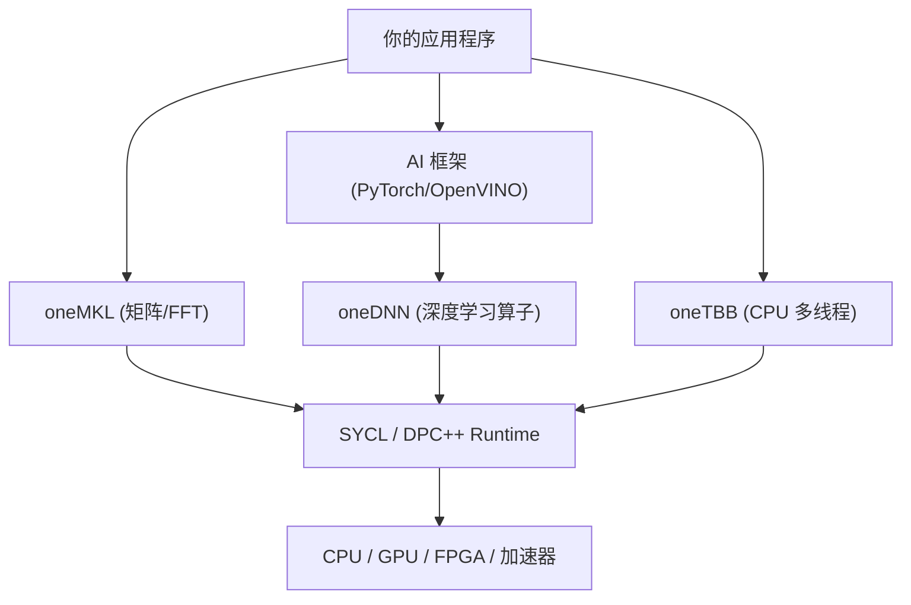

在上一期中，我们完成了 oneAPI 环境的搭建，并通过一个基于现代 SYCL 2020 USM 模型的向量相加 Kernel，初步体验了如何手写 GPU 代码。

但是在实际的高性能计算（HPC）或 AI 开发中，要是所有的算法和底层运算都靠我们手写并行 Kernel，那就太过于耗时费力了。更重要的是，我们手写的普通 Kernel 很难在性能上干过芯片原厂专门针对硬件微架构（如指令集、缓存大小、XMX 矩阵引擎）做过极限压榨的闭源/开源数学库。

为了不重复造轮子，本期我们就来盘点和体验 **oneAPI Base Toolkit** 中的其他几件核心组件，并给出 Windows 和 Linux 双系统下的编译运行方法。

---

## oneAPI 高性能加速组件概览

整个 oneAPI Base Toolkit 提供了一套非常丰富的库和工具，把计算领域的大多数常用需求都给包圆了。为了方便记忆，我们可以将它们归为以下几类：

| 库/组件名称 | 全称 | 主要加速领域 |
| :---: | :---: | :--- |
| **oneMKL** | oneAPI Math Kernel Library | 数学计算（矩阵、快速傅里叶变换、随机数等） |
| **oneDNN** | oneAPI Deep Neural Network Library | 深度学习底层算子（卷积、注意力机制、激活函数等） |
| **oneTBB** | oneAPI Threading Building Blocks | CPU 端的任务流和多线程高效并行管理 |
| **oneDAL** | oneAPI Data Analytics Library | 传统机器学习与数据分析算法加速 |
| **oneCCL** | oneAPI Collective Communications Library | 多卡与多节点集群间的高效通信（类似于 NCCL） |

> [!NOTE]
> 注意：在 2026.1 最新版本的 oneAPI Toolkit 中，原先的 oneDPL (oneAPI DPC++ Library) 已不再默认包含在 Base Toolkit 安装包中，故本篇不再对其展开示例。



接下来，我们挑选其中最核心、日常最容易接触到的三个组件进行剖析和代码实战。

---

## 1. oneMKL——高性能计算的数学心脏

熟悉 HPC 开发的同学绝对听过 Intel MKL 的大名。在 CPU 时代，MKL 就是线性代数和傅里叶变换领域的算力巨无霸。而 **oneMKL**，则是把这个巨无霸带到了 GPU 等异构平台上。

oneMKL 涵盖了：
* **BLAS**（基本线性代数子程序）：支持实数和复数的向量-向量、向量-矩阵、矩阵-矩阵运算（如最经典的 GEMM 矩阵乘法）。
* **LAPACK**：用于解线性方程组、奇异值分解、特征值计算等。
* **FFT**（快速傅里叶变换）：一维和多维的快速傅里叶变换。
* **VML**（向量数学库）：超越函数的向量化计算。

### oneMKL 矩阵乘法 (GEMM) 示例

我们来用 C++ 实现一个在 GPU 上运行的 \(4 \times 4\) 矩阵乘法。由于 MKL 的高度封装，我们不需要手写任何并行的多重循环 Kernel，直接调用 API 即可。

新建文件 `mkl_gemm.cpp`：

```cpp title='mkl_gemm.cpp'
#include <sycl/sycl.hpp>
#include <oneapi/mkl.hpp>
#include <iostream>

int main() {
    // 1. 指定在 GPU 上运行
    sycl::queue q{sycl::gpu_selector_v};
    std::cout << "Running MKL GEMM on: " 
              << q.get_device().get_info<sycl::info::device::name>() << "\n";

    // 矩阵维度：A(M, K) * B(K, N) = C(M, N)
    const int M = 4;
    const int N = 4;
    const int K = 4;

    // 2. 分配 USM 共享内存
    float* A = sycl::malloc_shared<float>(M * K, q);
    float* B = sycl::malloc_shared<float>(K * N, q);
    float* C = sycl::malloc_shared<float>(M * N, q);

    // 3. 初始化矩阵数据
    for (int i = 0; i < M * K; ++i) A[i] = 1.0f; // A 矩阵全 1.0
    for (int i = 0; i < K * N; ++i) B[i] = 2.0f; // B 矩阵全 2.0
    for (int i = 0; i < M * N; ++i) C[i] = 0.0f; // C 矩阵全 0.0

    // 4. 调用 oneMKL 的 GEMM 接口 (行优先布局)
    // 计算公式为: C = alpha * A * B + beta * C
    auto gemm_event = oneapi::mkl::blas::row_major::gemm(
        q, 
        oneapi::mkl::transpose::nontrans, // A 矩阵不转置
        oneapi::mkl::transpose::nontrans, // B 矩阵不转置
        M, N, K,
        1.0f,    // alpha
        A, K,    // A 指针，和它的 Leading Dimension (列数)
        B, N,    // B 指针，和它的 Leading Dimension (列数)
        0.0f,    // beta
        C, N     // C 指针，和它的 Leading Dimension (列数)
    );

    // 5. 等待 GPU 计算完成
    gemm_event.wait();

    // 6. 输出验证结果 (由于是全1矩阵乘全2矩阵，结果应全是 1*2*4 = 8.0)
    std::cout << "Result Matrix C:\n";
    for (int i = 0; i < M; ++i) {
        for (int j = 0; j < N; ++j) {
            std::cout << C[i * N + j] << " ";
        }
        std::cout << "\n";
    }

    // 7. 释放内存
    sycl::free(A, q);
    sycl::free(B, q);
    sycl::free(C, q);

    return 0;
}
```

### 编译与运行 (双系统)

在使用 oneAPI 编译器时，最方便的参数是开启 `-qmkl` (Linux) / `/Qmkl` (Windows)，编译器会自动处理好头文件包含路径与动态库链接。

* **Linux (bash)**:
  ```bash
  icpx -fsycl -qmkl mkl_gemm.cpp -o mkl_gemm
  ./mkl_gemm
  ```

* **Windows (PowerShell / CMD)**:
  ```powershell
  icx-cl /fsycl /Qmkl mkl_gemm.cpp /Fe:mkl_gemm.exe
  .\mkl_gemm.exe
  ```

---

## 2. oneDNN——深度学习神经网络加速库

目前 Intel 显卡在 OpenVINO、llama.cpp 以及 PyTorch（通过 Intel Extension for PyTorch，简称 IPEX）里的 AI 推理算子，全都是在 **oneDNN** 上搭建起来的。
它高度优化了：
* 各种精度的矩阵乘（GEMM）、卷积（Convolution）、激活（ReLU, GELU）、池化（Pooling）。
* 针对 Intel 硬件上独特的 **XMX (Xe Matrix Extensions)** 矩阵引擎进行了微架构级优化。

oneDNN 提供了 SYCL 交互接口（Interoperability），可以直接与 SYCL queue 和 USM 内存无缝集成。

### oneDNN ReLU 算子示例

我们来用 oneDNN SYCL API 实现一个在 GPU 上运行的元素级 ReLU 激活函数运算（把负数置 0，正数保留）。

新建文件 `dnn_relu.cpp`：

```cpp title='dnn_relu.cpp'
#include <sycl/sycl.hpp>
#include <oneapi/dnnl/dnnl.hpp>
#include <oneapi/dnnl/dnnl_sycl.hpp>
#include <iostream>

using namespace dnnl;

int main() {
    // 1. 创建 SYCL 队列 (指定 GPU)
    sycl::queue q{sycl::gpu_selector_v};
    std::cout << "Running oneDNN ReLU on: " 
              << q.get_device().get_info<sycl::info::device::name>() << "\n";

    // 2. 创建基于 SYCL 队列的 oneDNN engine 与 stream
    engine eng = dnnl::sycl_interop::make_engine(q.get_device(), q.get_context());
    stream strm = dnnl::sycl_interop::make_stream(eng, q);

    const int N = 8;
    // 3. 分配 USM 共享内存
    float* src_data = sycl::malloc_shared<float>(N, q);
    float* dst_data = sycl::malloc_shared<float>(N, q);

    // 初始化测试数据（包含正数和负数）
    float raw_src[] = {-3.0f, -1.5f, 0.0f, 2.0f, -0.5f, 4.0f, 1.0f, -2.0f};
    for (int i = 0; i < N; ++i) src_data[i] = raw_src[i];

    // 4. 创建 memory descriptor 和 memory 对象
    memory::dims dims = {N};
    memory::desc mem_d(dims, memory::data_type::f32, memory::format_tag::a);

    // 使用 SYCL interop 接口将 USM 内存封装为 oneDNN memory
    memory src_mem = dnnl::sycl_interop::make_memory(mem_d, eng, dnnl::sycl_interop::memory_kind::usm, src_data);
    memory dst_mem = dnnl::sycl_interop::make_memory(mem_d, eng, dnnl::sycl_interop::memory_kind::usm, dst_data);

    // 5. 创建 eltwise (ReLU) 算子描述符并实例化 Primitive
    auto eltwise_d = eltwise_forward::primitive_desc(
        eng, prop_kind::forward_inference, algorithm::eltwise_relu,
        mem_d, mem_d, 0.0f, 0.0f
    );
    auto eltwise_p = eltwise_forward(eltwise_d);

    // 6. 在 SYCL stream 上提交并执行算子
    eltwise_p.execute(strm, {{DNNL_ARG_SRC, src_mem}, {DNNL_ARG_DST, dst_mem}});
    strm.wait();

    // 7. 验证输出结果
    std::cout << "Input:  ";
    for (int i = 0; i < N; ++i) std::cout << raw_src[i] << "\t";
    std::cout << "\nReLU:   ";
    for (int i = 0; i < N; ++i) std::cout << dst_data[i] << "\t";
    std::cout << "\n";

    sycl::free(src_data, q);
    sycl::free(dst_data, q);
    return 0;
}
```

### 编译与运行 (双系统)

编译 oneDNN SYCL 代码时，需要启用 `-fsycl` (或 `/Fsycl`) 并链接 `dnnl` 库。

* **Linux (bash)**:
  ```bash
  icpx -fsycl dnn_relu.cpp -o dnn_relu -ldnnl
  ./dnn_relu
  ```

* **Windows (PowerShell / CMD)**:
  ```powershell
  icx-cl /fsycl dnn_relu.cpp /Fe:dnn_relu.exe dnnl.lib
  .\dnn_relu.exe
  ```

---

## 3. oneTBB——多线程任务流管理

**oneTBB**（全称 Threading Building Blocks）是 C++ CPU 多线程并发编程的标杆库。
在异构计算体系中，oneTBB 担任着 **Host 端任务分发和并发执行** 的底层引擎，确保在 GPU 全力运算的同时，CPU 多核心也能以最佳流水线形态去处理数据前处理、后处理和主控逻辑，实现 CPU 与 GPU 的极致协同。

### oneTBB 并发并行示例

新建文件 `tbb_parallel.cpp`：

```cpp title='tbb_parallel.cpp'
#include <tbb/parallel_for.h>
#include <tbb/blocked_range.h>
#include <iostream>
#include <vector>

int main() {
    const size_t N = 1000000;
    std::vector<int> vec(N);

    // 使用 oneTBB 的 parallel_for 在 CPU 多核心上自动切分区块并并行计算
    tbb::parallel_for(tbb::blocked_range<size_t>(0, N),
        [&](const tbb::blocked_range<size_t>& r) {
            for (size_t i = r.begin(); i != r.end(); ++i) {
                vec[i] = static_cast<int>(i * 2);
            }
        }
    );

    std::cout << "oneTBB parallel initialization done.\n";
    std::cout << "vec[0] = " << vec[0] 
              << ", vec[500000] = " << vec[500000] 
              << ", vec[N-1] = " << vec[N-1] << "\n";

    return 0;
}
```

### 编译与运行 (双系统)

由于 oneTBB 主要服务于 CPU 端的任务并发，编译时可以直接使用标准 C++ 编译模式（也可配合 SYCL 使用）：

* **Linux (bash)**:
  ```bash
  icpx tbb_parallel.cpp -o tbb_parallel -ltbb
  ./tbb_parallel
  ```

* **Windows (PowerShell / CMD)**:
  ```powershell
  icx-cl tbb_parallel.cpp /Fe:tbb_parallel.exe tbb.lib
  .\tbb_parallel.exe
  ```

---

## 总结

oneAPI 并不只是一个简单的 SYCL 编译器，它是一套涵盖了数学库、AI 算子、多线程并发和分布式通信在内的**完整生态系统**。

* 如果你需要做科学计算或矩阵运算，直接使用 **oneMKL** (`-qmkl` / `/Qmkl`)。
* 如果你从事深度学习算子开发或底层推理，**oneDNN** 提供了直接操控 XMX 和 GPU 硬件的极佳通道。
* 对于 CPU 端的异步任务管理与管线编排，**oneTBB** 则在幕后守护着多核协同的效率。

下期日志，我们将会用这些库来编写一个完整的“异构图像处理”项目，来看看在面对真实场景时，oneAPI 组件协同的实际吞吐表现到底如何！
