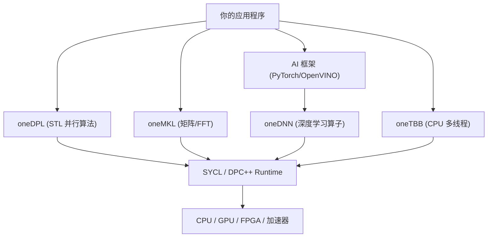

在上一期中，我们完成了 oneAPI 环境的搭建，并通过一个基于现代 SYCL 2020 USM 模型的向量相加 Kernel，初步体验了如何手写 GPU 代码。

但是在实际的高性能计算（HPC）或 AI 开发中，要是所有的算法和底层运算都靠我们手写并行 Kernel，那就太过于耗时费力了。更重要的是，我们手写的普通 Kernel 很难在性能上干过芯片原厂专门针对硬件微架构（如指令集、缓存大小、XMX 矩阵引擎）做过极限压榨的闭源/开源数学库。

为了不重复造轮子，本期我们就来盘点和体验 **oneAPI Toolkit** 中的其他几件核心组件。

---

## oneAPI 高性能加速组件概览

整个 oneAPI Toolkit 提供了一套非常丰富的库和工具，把计算领域的大多数常用需求都给包圆了。为了方便记忆，我们可以将它们归为以下几类：

| 库/组件名称 | 全称 | 主要加速领域 |
| :---: | :---: | :--- |
| **oneMKL** | oneAPI Math Kernel Library | 数学计算（矩阵、快速傅里叶变换、随机数等） |
| **oneDNN** | oneAPI Deep Neural Network Library | 深度学习底层算子（卷积、注意力机制等） |
| **oneTBB** | oneAPI Threading Building Blocks | CPU 端的任务流和多线程并行管理 |
| **oneDPL** | oneAPI DPC++ Library | 异构环境下的现代 C++ 并行标准模板库（STL） |
| **oneDAL** | oneAPI Data Analytics Library | 传统机器学习与数据分析算法加速 |
| **oneCCL** | oneAPI Collective Communications Library | 多卡与多节点集群间的高效通信（类似于 NCCL） |



接下来，我们挑其中最核心、日常最容易接触到的几个组件进行剖析和实践。

---

## oneMKL——高性能计算的数学心脏

熟悉 HPC 开发的同学绝对听过 Intel MKL 的大名。在 CPU 时代，MKL 就是线性代数和傅里叶变换领域的算力巨无霸。而 **oneMKL**，则是把这个巨无霸带到了 GPU 等异构平台上。

oneMKL 涵盖了：
* **BLAS**（基本线性代数子程序）：支持实数和复数的向量-向量、向量-矩阵、矩阵-矩阵运算（如最经典的 GEMM 矩阵乘法）。
* **LAPACK**：用于解线性方程组、奇异值分解、特征值计算等。
* **FFT**（快速傅里叶变换）：一维和多维的快速傅里叶变换。
* **VML**（向量数学库）：超越函数的向量化计算。

### oneMKL 矩阵乘法 (GEMM) 示例

我们来用 C++ 实现一个在 GPU 上运行的 \(4 \times 4\) 矩阵乘法。由于 MKL 的高度封装，我们不需要手写任何并行的多重循环 Kernel，直接调用 API 即可。

新建文件 `mkl_gemm.cpp`：

```cpp title='mkl_gemm.cpp'
#include <sycl/sycl.hpp>
#include <oneapi/mkl.hpp>
#include <iostream>

int main() {
    // 1. 指定在 GPU 上运行
    sycl::queue q{sycl::gpu_selector_v};
    std::cout << "Running MKL GEMM on: " 
              << q.get_device().get_info<sycl::info::device::name>() << "\n";

    // 矩阵维度：A(M, K) * B(K, N) = C(M, N)
    const int M = 4;
    const int N = 4;
    const int K = 4;

    // 2. 分配 USM 共享内存
    float* A = sycl::malloc_shared<float>(M * K, q);
    float* B = sycl::malloc_shared<float>(K * N, q);
    float* C = sycl::malloc_shared<float>(M * N, q);

    // 3. 初始化矩阵数据
    for (int i = 0; i < M * K; ++i) A[i] = 1.0f; // A 矩阵全 1.0
    for (int i = 0; i < K * N; ++i) B[i] = 2.0f; // B 矩阵全 2.0
    for (int i = 0; i < M * N; ++i) C[i] = 0.0f; // C 矩阵全 0.0

    // 4. 调用 oneMKL 的 GEMM 接口 (行优先布局)
    // 计算公式为: C = alpha * A * B + beta * C
    auto gemm_event = oneapi::mkl::blas::row_major::gemm(
        q, 
        oneapi::mkl::transpose::nontrans, // A 矩阵不转置
        oneapi::mkl::transpose::nontrans, // B 矩阵不转置
        M, N, K,
        1.0f,    // alpha
        A, K,    // A 指针，和它的 Leading Dimension (列数)
        B, N,    // B 指针，和它的 Leading Dimension (列数)
        0.0f,    // beta
        C, N     // C 指针，和它的 Leading Dimension (列数)
    );

    // 5. 等待 GPU 计算完成
    gemm_event.wait();

    // 6. 输出验证结果 (由于是全1矩阵乘全2矩阵，结果应全是 1*2*4 = 8.0)
    std::cout << "Result Matrix C:\n";
    for (int i = 0; i < M; ++i) {
        for (int j = 0; j < N; ++j) {
            std::cout << C[i * N + j] << " ";
        }
        std::cout << "\n";
    }

    // 7. 释放内存
    sycl::free(A, q);
    sycl::free(B, q);
    sycl::free(C, q);

    return 0;
}
```

**编译命令**：
由于链接 oneMKL 需要额外的编译参数，我们在 Linux 上可以使用 `pkg-config` 辅助，或者手动加上 `-lmkl_sycl`：
```bash
icpx -fsycl mkl_gemm.cpp -o mkl_gemm -lmkl_sycl -lmkl_intel_ilp64 -lmkl_sequential -lmkl_core
```

---

## oneDPL——GPU 上的并行标准库（STL）

作为一个写 C++ 的程序员，你肯定天天和 `std::sort`、`std::find` 打交道。但在传统的编程模式里，要对显存上的数组做排序，往往得先写一个复杂的并行 Radix Sort / Merge Sort 的 Kernel，或者老老实实把数据拷贝回 CPU 排序。

**oneDPL** 简直是懒人程序员的救星。它提供了一套符合 C++17 标准的异构并行模板库，让你只需要指定运行策略（Execution Policy），就可以在 GPU 上跑 STL 算法。

### oneDPL 异构并行排序示例

新建文件 `dpl_sort.cpp`：

```cpp title='dpl_sort.cpp'
#include <sycl/sycl.hpp>
#include <oneapi/dpl/execution>
#include <oneapi/dpl/algorithm>
#include <iostream>

int main() {
    sycl::queue q{sycl::gpu_selector_v};
    std::cout << "Running DPL Sort on: " 
              << q.get_device().get_info<sycl::info::device::name>() << "\n";

    const int N = 8;
    int* data = sycl::malloc_shared<int>(N, q);

    // 初始化一些无序的数据
    int raw_data[] = {9, 3, 2, 8, 4, 1, 7, 5};
    for (int i = 0; i < N; ++i) {
        data[i] = raw_data[i];
    }

    // 1. 创建 DPL 执行策略，绑定 to 我们的 GPU 队列上
    auto policy = oneapi::dpl::execution::make_device_policy(q);

    // 2. 调用 dpl::sort 进行排序。注意传入的是 policy 策略
    oneapi::dpl::sort(policy, data, data + N);

    // 3. 打印排序后的结果
    std::cout << "Sorted Data: ";
    for (int i = 0; i < N; ++i) {
        std::cout << data[i] << " ";
    }
    std::cout << "\n";

    sycl::free(data, q);
    return 0;
}
```

**编译命令**：
```bash
icpx -fsycl dpl_sort.cpp -o dpl_sort
```
仅需几行代码，就直接在 GPU 硬件上实现了并行的快速排序！

---

## oneDNN 与 oneTBB——AI 与高并发底层的无名英雄

这两个库我们在平时写应用层代码时通常不会直接去调，但它们却时时刻刻活跃在我们的日常工具里。

### oneDNN (深度学习神经网络加速库)

在上期中，我们聊到跑大模型 AI。目前 Intel 显卡在 OpenVINO、llama.cpp 以及 PyTorch（通过 Intel Extension for PyTorch，简称 IPEX）里的 AI 推理算子，全都是在 **oneDNN** 上搭建起来的。
它高度优化了：
* 各种精度的矩阵乘（GEMM）、卷积（Convolution）、激活（ReLU, GELU）、池化（Pooling）。
* 针对 Intel 硬件上独特的 **XMX (Xe Matrix Extensions)** 矩阵引擎进行了微架构级优化。这就是为什么上层框架可以跑得飞快的原因——因为底层是 oneDNN 直接在操作硬件寄存器。

### oneTBB (多线程任务流管理)

**oneTBB**（之前叫 Intel TBB）是 C++ CPU 多线程并发库的标杆，甚至很多游戏引擎（比如 Unreal 引擎）都在底层使用它来管理线程池。
而在 oneAPI 异构生态中，oneTBB 担任着 **Host 端任务分发和并发执行** 的底层引擎，确保在 GPU 全力运算的同时，CPU 多核心也能以最佳流水线形态去处理前处理、后处理和主控逻辑，实现真正的协同计算。

---

## 总结

oneAPI 并不只是一个简单的 SYCL 编译器，它是一套涵盖了数学库、AI 算子、多线程并发和分布式通信在内的**完整生态系统**。

* 如果你需要做科学计算，直接上 **oneMKL**。
* 如果你要处理大量的数组排序、筛选、变换，**oneDPL** 会让你的代码清爽又高效。
* 而对于更庞大复杂的应用，**oneTBB** 和 **oneDNN** 则在底层为你筑牢了算力的底座。

这使得我们在开发时不再需要从零手撕底层的 Kernel，真正做到“好钢用在刀刃上”。

下期日志，我们将会用这些库来编写一个完整的“图像卷积滤波器”项目，来看看在面对真实数据时，oneAPI 异构算力的实际吞吐表现到底如何！
