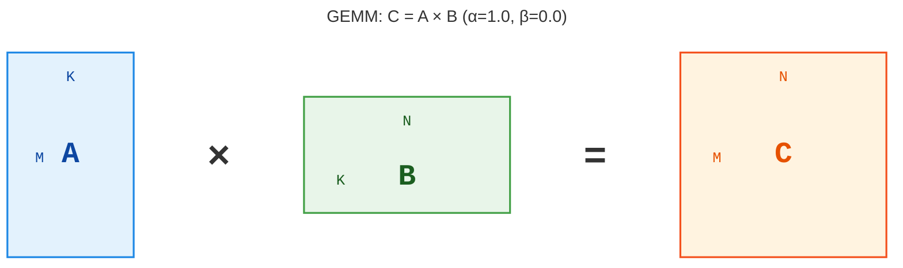

# XPU 调优技巧 01

因为 Intel GPU 的 kernel 开发缺乏文档，所以本系列会作为一个循序渐进的调优教程发布，我们会尝试调优常见算子的 kernel ，比如**GEMM**，**GEMV**，**MHA**等。

# GEMM

## 算法图解

GEMM（General Matrix Multiply，通用矩阵乘法）是最经典的算子之一，它的算法也是最简单的。

给定两个矩阵 $A$ 和 $B$，GEMM 的公式如下：

$$
C = \alpha (A \times B) + \beta C
$$

$C$ 是一个 $M \times N$ 的矩阵，$A$ 是一个 $M \times K$ 的矩阵，$B$ 是一个 $K \times N$ 的矩阵，$\alpha$ 和 $\beta$ 是标量。

为了降低复杂度，专注于底层交互，我们实现的时候取 $\alpha = 1.0$，$\beta = 0.0$，也就是 $ C = A \times B $。

那么运算过程就可以用下图来表示：



## Naive（朴素）实现

我们用 SYCL 来写，在 Intel Arc A770 上运行，为了方便后续优化，$A$ 和 $B$ 是 `bfloat16` 类型的，$C$ 是 `float` 类型的。

```cpp
#include <iostream>
#include <chrono>
#include <sycl/sycl.hpp>

using namespace sycl;
using bf16 = sycl::ext::oneapi::bfloat16;

// Device Kernel 代码
void gemm(size_t M, size_t N, size_t K, bf16* A, bf16* B, float* C, queue q)
{
    q.parallel_for(range{M,N}, [=](id<2> idx) {
        int row = idx[0];
        int col = idx[1];
        float sum = 0.0f;
        for (int k = 0; k < K; ++k) {
            float a_val = static_cast<float>(A[row * K + k]);
            float b_val = static_cast<float>(B[k * N + col]);
            sum += a_val * b_val;
        }
        C[row * N + col] = sum;
    });
}

int main()
{
    // 创建 SYCL 队列，选择 GPU 作为运行设备
    queue q{gpu_selector_v};

    // 定义 MNK 大小
    constexpr size_t M = 1024;
    constexpr size_t N = 1536;
    constexpr size_t K = 512;
    
    // 迭代次数
    constexpr size_t warmup_iters = 100;
    constexpr size_t run_iters = 1000;

    // 为 ABC 矩阵申请 USM 内存
    auto A = malloc_shared<bf16>(M * K, q);
    auto B = malloc_shared<bf16>(K * N, q);
    auto C = malloc_shared<float>(M * N, q);
    
    // Host 初始化 ABC 矩阵
    for (size_t i = 0; i < M * K; ++i) A[i] = 1.0f;
    for (size_t i = 0; i < K * N; ++i) B[i] = 2.0f;
    for (size_t i = 0; i < M * N; ++i) C[i] = 0.0f;

    // 预热
    for(size_t i = 0; i < warmup_iters; i++)
    {
        // 预热 kernel
        gemm(M,N,K,A,B,C,q);
    }
    q.wait();

    auto run_start = std::chrono::high_resolution_clock::now();
    // 正式测试
    for(size_t i = 0; i < run_iters; i++)
    {
        // 实际运行
        gemm(M,N,K,A,B,C,q);
    }
    q.wait();
    auto run_end = std::chrono::high_resolution_clock::now();
    double run_total = std::chrono::duration<double, std::milli>(run_end - run_start).count();

    std::cout << "Naive spent " << run_total << " ms\n" << run_total/run_iters <<" ms per Run\n";

    std::cout << "C[0] = " << C[0] << " (Expected: " << K * 2.0f << ")" << std::endl;
    
    // 释放 USM 内存
    free(A,q);
    free(B,q);
    free(C,q);

    return 0;
}
```

结果差不多长这个样子：

```
Naive spent 1951.73 ms
1.95174 ms per Run
C[0] = 1024 (Expected: 1024)
```

跑一次迭代要差不多 **2ms** 这样子，但是显然这不是极限速度。

## oneMKL 基线

我们可以看一下 **oneMKL** 库的 **GEMM** 算的有多快。

```cpp
#include <iostream>
#include <chrono>
#include <sycl/sycl.hpp>
#include <oneapi/mkl.hpp>
using namespace sycl;
using bf16 = oneapi::mkl::bfloat16;

int main() {
    // 创建 SYCL 队列
    queue q{gpu_selector_v};

    // 定义矩阵维度与标量参数
    constexpr size_t M = 1024;
    constexpr size_t N = 1536;
    constexpr size_t K = 512;

    constexpr float alpha = 1.0f;
    constexpr float beta  = 0.0f;

    // 行主序 (Row-Major) 下的 Leading Dimensions
    constexpr size_t lda = K;
    constexpr size_t ldb = N;
    constexpr size_t ldc = N;

    constexpr size_t warmup_iters = 100;
    constexpr size_t run_iters = 1000;

    // 分配 USM 内存

    bf16*  A = malloc_shared<bf16>(M * K, q);
    bf16*  B = malloc_shared<bf16>(K * N, q);
    float* C = malloc_shared<float>(M * N, q);

    // 初始化矩阵数据
    for (int i = 0; i < M * K; ++i) A[i] = bf16(1.0f);
    for (int i = 0; i < K * N; ++i) B[i] = bf16(2.0f);
    for (int i = 0; i < M * N; ++i) C[i] = 0.0f;

    // 预热
    for(size_t i = 0; i < warmup_iters; i++)
    {
        // 预热
        oneapi::mkl::blas::row_major::gemm(
            q,
            oneapi::mkl::transpose::nontrans, // A 不转置
            oneapi::mkl::transpose::nontrans, // B 不转置
            M, N, K,
            alpha,
            A, lda,
            B, ldb,
            beta,
            C, ldc
        );
    }

    // 6. 等待 GPU/计算设备执行完成
    q.wait();

    // 正式测试
    auto run_start = std::chrono::high_resolution_clock::now();
    for(size_t i = 0; i < run_iters; i++)
    {
        // 实际运行
        oneapi::mkl::blas::row_major::gemm(
            q,
            oneapi::mkl::transpose::nontrans, // A 不转置
            oneapi::mkl::transpose::nontrans, // B 不转置
            M, N, K,
            alpha,
            A, lda,
            B, ldb,
            beta,
            C, ldc
        );
    }
    q.wait();

    auto run_end = std::chrono::high_resolution_clock::now();
    double run_total = std::chrono::duration<double, std::milli>(run_end - run_start).count();

    std::cout << "oneMKL spent " << run_total << " ms\n" << run_total/run_iters <<" ms per Run\n";

    std::cout << "C[0] = " << C[0] << " (Expected: " << K * 2.0f << ")" << std::endl;

    // 8. 释放内存
    free(A, q);
    free(B, q);
    free(C, q);

    return 0;
}
```

输出是长这个样子的：

```
oneMKL spent 53.6976 ms
0.0536976 ms per Run
C[0] = 1024 (Expected: 1024)
```

## 对比 Naive 和 oneMKL

我们放到一起看一下：

||Naive实现|oneMKL|
|:-:|:-:|:-:|
|总耗时|1951.73 ms|53.6976 ms|
|单次耗时|1.95174 ms|0.0536976 ms|
|相对效率|2.75%|100%|

可以看到差距非常之大，有30多倍的性能差距，那么原因是什么呢？

Naive 实现目前从global memory，也就是我们常说的显存读写数据，所以非常慢，我们可以用 **Tiling（分块）** 运算来缓解。

## Tiling（分块）实现

```cpp
// ···
// 定义 Tile 大小（如 16x16）
constexpr size_t TILE_SIZE = 16;

// Tiling 优化的 GEMM Kernel 代码
void gemm_tiled(size_t M, size_t N, size_t K, bf16* A, bf16* B, float* C, queue q)
{
    // 定义 Global 与 Local 工作空间维度
    range<2> global_size{M, N};
    range<2> local_size{TILE_SIZE, TILE_SIZE};

    q.submit([&](handler& h) {
        // 1. 申请 Local Memory (共享内存) 用于缓存 Tile 块
        local_accessor<bf16, 2> tileA(range<2>{TILE_SIZE, TILE_SIZE}, h);
        local_accessor<bf16, 2> tileB(range<2>{TILE_SIZE, TILE_SIZE}, h);

        h.parallel_for(nd_range<2>(global_size, local_size), [=](nd_item<2> item) {
            int row = item.get_global_id(0);
            int col = item.get_global_id(1);

            int local_row = item.get_local_id(0);
            int local_col = item.get_local_id(1);

            float sum = 0.0f;

            // 2. 沿着 K 维度分块迭代
            for (size_t bk = 0; bk < K; bk += TILE_SIZE) {
                // 协作加载 A 矩阵 Tile
                if (row < M && (bk + local_col) < K) {
                    tileA[local_row][local_col] = A[row * K + (bk + local_col)];
                } else {
                    tileA[local_row][local_col] = static_cast<bf16>(0.0f);
                }

                // 协作加载 B 矩阵 Tile
                if ((bk + local_row) < K && col < N) {
                    tileB[local_row][local_col] = B[(bk + local_row) * N + col];
                } else {
                    tileB[local_row][local_col] = static_cast<bf16>(0.0f);
                }

                // 3. 屏障同步：确保 Work-Group 内所有线程都已经完成了 Tile 加载
                item.barrier(access::fence_space::local_space);

                // 4. 从 Local Memory 中读取并计算局部点积
                for (size_t k = 0; k < TILE_SIZE; ++k) {
                    float a_val = static_cast<float>(tileA[local_row][k]);
                    float b_val = static_cast<float>(tileB[k][local_col]);
                    sum += a_val * b_val;
                }

                // 5. 屏障同步：确保局部计算全部完成，防止后续读取覆盖当前数据
                item.barrier(access::fence_space::local_space);
            }

            // 6. 结果写回全局内存
            if (row < M && col < N) {
                C[row * N + col] = sum;
            }
        });
    });
}
// ···
```

结果如下：

```
Tiling spent 1492.31 ms
1.49231 ms per Run
C[0] = 1024 (Expected: 1024)
```

可以看到性能提升了一些：

||Naive实现|Tiling实现|oneMKL|
|:-:|:-:|:-:|:-:|
|总耗时|1951.73 ms|1492.32 ms|53.6976 ms|
|单次耗时|1.95174 ms|1.49231 ms|0.0536976 ms|
|相对效率|2.75%|3.59%|100%|

## Register Tiling 实现

普通的 Tiling 实现依然大量的向 global memory 进行内存访问，计算速度依然被访存速度拖慢，我们可以使用 **Blocking（切片）** 来尽量提高寄存器及其缓存的利用率，来进一步缓解 Tiling 实现的访存瓶颈。

```cpp
// ···
// Work-Group 级别的 Tile 尺寸
constexpr size_t BM = 64;
constexpr size_t BN = 64;
constexpr size_t BK = 16;

// Work-Item 级别的 Thread Tile 尺寸 (寄存器分块)
constexpr size_t TM = 4;
constexpr size_t TN = 4;

// Register Tiling GEMM Kernel
void gemm_register_tiled(size_t M, size_t N, size_t K, bf16* A, bf16* B, float* C, queue q)
{
    // 每个 Work-Group 包含的线程数为 (BM/TM) x (BN/TN) = 16 x 16 = 256 个线程
    range<2> global_size{M / TM, N / TN};
    range<2> local_size{BM / TM, BN / TN};

    q.submit([&](handler& h) {
        // 1. 声明 Work-Group 共享的 Local Memory
        local_accessor<bf16, 2> tileA(range<2>{BM, BK}, h);
        local_accessor<bf16, 2> tileB(range<2>{BK, BN}, h);

        h.parallel_for(nd_range<2>(global_size, local_size), [=](nd_item<2> item) {
            int wg_row = item.get_group(0);
            int wg_col = item.get_group(1);

            int local_row = item.get_local_id(0); // 范围: 0 ~ (BM/TM - 1)
            int local_col = item.get_local_id(1); // 范围: 0 ~ (BN/TN - 1)

            // 2. 在寄存器 (Private Memory) 中分配每个线程专属的累加器
            float acc[TM][TN] = {0.0f};

            // 计算该线程在 Work-Group 内的扁平化 ID，用于协作加载
            int tid = local_row * (BN / TN) + local_col;
            int threads_per_group = (BM / TM) * (BN / TN); // 256 个线程

            // 沿着 K 维度按 BK 步进
            for (size_t bk = 0; bk < K; bk += BK) {
                
                // --- A. Work-Group 协同加载 tileA (BM x BK) ---
                for (int i = tid; i < BM * BK; i += threads_per_group) {
                    int a_r = i / BK;
                    int a_c = i % BK;
                    int g_r = wg_row * BM + a_r;
                    int g_c = bk + a_c;
                    tileA[a_r][a_c] = (g_r < M && g_c < K) ? A[g_r * K + g_c] : static_cast<bf16>(0.0f);
                }

                // --- B. Work-Group 协同加载 tileB (BK x BN) ---
                for (int i = tid; i < BK * BN; i += threads_per_group) {
                    int b_r = i / BN;
                    int b_c = i % BN;
                    int g_r = bk + b_r;
                    int g_c = wg_col * BN + b_c;
                    tileB[b_r][b_c] = (g_r < K && g_c < N) ? B[g_r * N + g_c] : static_cast<bf16>(0.0f);
                }

                // 屏障同步：等待共享数据加载完毕
                item.barrier(access::fence_space::local_space);

                // --- C. 从 Local Memory 读入寄存器并进行 2D 计算 ---
                for (int k = 0; k < BK; ++k) {
                    // 局部临时寄存器数组，用于暂存当前的 A 和 B 向量
                    float regA[TM];
                    float regB[TN];

                    // 加载 TM 个 A 元素到寄存器
                    for (int m = 0; m < TM; ++m) {
                        regA[m] = static_cast<float>(tileA[local_row * TM + m][k]);
                    }
                    // 加载 TN 个 B 元素到寄存器
                    for (int n = 0; n < TN; ++n) {
                        regB[n] = static_cast<float>(tileB[k][local_col * TN + n]);
                    }

                    // 外积展开计算并累加到 acc[TM][TN]
                    for (int m = 0; m < TM; ++m) {
                        for (int n = 0; n < TN; ++n) {
                            acc[m][n] += regA[m] * regB[n];
                        }
                    }
                }

                // 屏障同步：防止下一轮加载覆盖未用完的数据
                item.barrier(access::fence_space::local_space);
            }

            // --- D. 将寄存器的计算结果写回全局内存 C ---
            for (int m = 0; m < TM; ++m) {
                for (int n = 0; n < TN; ++n) {
                    int g_r = wg_row * BM + local_row * TM + m;
                    int g_c = wg_col * BN + local_col * TN + n;
                    if (g_r < M && g_c < N) {
                        C[g_r * N + g_c] = acc[m][n];
                    }
                }
            }
        });
    });
}
// ···
```

结果如下：
```
Register Tiling spent 430.648 ms
0.430648 ms per Run
C[0] = 1024 (Expected: 1024)
```

可以看到性能有比较明显的提升：

||Naive实现|Tiling实现|Register Tiling实现|oneMKL|
|:-:|:-:|:-:|:-:|:-:|
|总耗时|1951.73 ms|1492.32 ms|430.648 ms|53.6976 ms|
|单次耗时|1.95174 ms|1.49231 ms|0.430648 ms|0.0536976 ms|
|相对效率|2.75%|3.59%|12.46%|100%|

## SIMD 向量化读写

```cpp
// ···
constexpr size_t BM = 64;
constexpr size_t BN = 64;
constexpr size_t BK = 16;

constexpr size_t TM = 4;
constexpr size_t TN = 4;

// 定义向量大小（每次连续读写 4 个元素，对应 64-bit bf16 或 128-bit float）
constexpr size_t VEC_SIZE = 4;

// SIMD 向量化 Register Tiling GEMM
void gemm_simd_vectorized(size_t M, size_t N, size_t K, bf16* A, bf16* B, float* C, queue q)
{
    range<2> global_size{M / TM, N / TN};
    range<2> local_size{BM / TM, BN / TN};

    q.submit([&](handler& h) {
        local_accessor<bf16, 2> tileA(range<2>{BM, BK}, h);
        local_accessor<bf16, 2> tileB(range<2>{BK, BN}, h);

        h.parallel_for(nd_range<2>(global_size, local_size), [=](nd_item<2> item) {
            int wg_row = item.get_group(0);
            int wg_col = item.get_group(1);

            int local_row = item.get_local_id(0);
            int local_col = item.get_local_id(1);

            float acc[TM][TN] = {0.0f};

            int tid = local_row * (BN / TN) + local_col;
            int threads_per_group = (BM / TM) * (BN / TN); // 256 个线程

            for (size_t bk = 0; bk < K; bk += BK) {
                
                // --- A. 向量化从 Global Memory 加载到 Local Memory ---
                // 协同加载 tileA
                for (int i = tid * VEC_SIZE; i < BM * BK; i += threads_per_group * VEC_SIZE) {
                    int a_r = i / BK;
                    int a_c = i % BK;
                    int g_r = wg_row * BM + a_r;
                    int g_c = bk + a_c;

                    if (g_r < M && (g_c + VEC_SIZE - 1) < K) {
                        // 使用 reinterpret_cast 触发向量化 64-bit Load/Store
                        auto vec_a = *reinterpret_cast<const vec<bf16, VEC_SIZE>*>(&A[g_r * K + g_c]);
                        *reinterpret_cast<vec<bf16, VEC_SIZE>*>(&tileA[a_r][a_c]) = vec_a;
                    }
                }

                // 协同加载 tileB
                for (int i = tid * VEC_SIZE; i < BK * BN; i += threads_per_group * VEC_SIZE) {
                    int b_r = i / BN;
                    int b_c = i % BN;
                    int g_r = bk + b_r;
                    int g_c = wg_col * BN + b_c;

                    if (g_r < K && (g_c + VEC_SIZE - 1) < N) {
                        auto vec_b = *reinterpret_cast<const vec<bf16, VEC_SIZE>*>(&B[g_r * N + g_c]);
                        *reinterpret_cast<vec<bf16, VEC_SIZE>*>(&tileB[b_r][b_c]) = vec_b;
                    }
                }

                item.barrier(access::fence_space::local_space);

                // --- B. 从 Local Memory 向量化装载到寄存器并计算 ---
                for (int k = 0; k < BK; ++k) {
                    float regA[TM];
                    for (int m = 0; m < TM; ++m) {
                        regA[m] = static_cast<float>(tileA[local_row * TM + m][k]);
                    }

                    // 向量化读取 tileB 中连续的 TN 个元素
                    auto vec_tileB = *reinterpret_cast<const vec<bf16, VEC_SIZE>*>(&tileB[k][local_col * TN]);

                    for (int m = 0; m < TM; ++m) {
                        for (int n = 0; n < TN; ++n) {
                            acc[m][n] += regA[m] * static_cast<float>(vec_tileB[n]);
                        }
                    }
                }

                item.barrier(access::fence_space::local_space);
            }

            // --- C. 向量化写回全局内存 C ---
            for (int m = 0; m < TM; ++m) {
                int g_r = wg_row * BM + local_row * TM + m;
                int g_c = wg_col * BN + local_col * TN;

                if (g_r < M && (g_c + VEC_SIZE - 1) < N) {
                    vec<float, VEC_SIZE> vec_out;
                    for (int n = 0; n < TN; ++n) {
                        vec_out[n] = acc[m][n];
                    }
                    // 触发 128-bit 向量化写入 (4 x float)
                    *reinterpret_cast<vec<float, VEC_SIZE>*>(&C[g_r * N + g_c]) = vec_out;
                }
            }
        });
    });
}
// ···
```

结果如下：
```
SIMD Vectorized spent 273.737 ms
0.273737 ms per Run
C[0] = 1024 (Expected: 1024)
```

访存模式对速度提升也很明显：

||Naive实现|Tiling实现|Register Tiling实现|SIMD 向量化读写|oneMKL|
|:-:|:-:|:-:|:-:|:-:|:-:|
|总耗时|1951.73 ms|1492.32 ms|430.648 ms|273.737ms|53.6976 ms|
|单次耗时|1.95174 ms|1.49231 ms|0.430648 ms|0.273737 ms|0.0536976 ms|
|相对效率|2.75%|3.59%|12.46%|19.61%|100%|

## Joint Matrix 实现

我们已经基本达到 ALU 向量运算的极限了，要想继续提高性能，那就应该使用运算更快的硬件单元，对于 A770 来说，那就是大名鼎鼎的 XMX（Xe Matrix Extension）。

```cpp
// ···
// 记得导入扩展
using namespace sycl::ext::oneapi::experimental::matrix;

// A770 的 XMX 支持 bf16: M=8, N=8, K=16
constexpr int TM = 8;
constexpr int TN = 8;
constexpr int TK = 16;

void gemm_joint_matrix(size_t M, size_t N, size_t K, bf16* A, bf16* B, float* C, queue q)
{
    constexpr size_t SG_SIZE = 16;
    range<2> global_size{M / TM, (N / TN) * SG_SIZE};
    range<2> local_size{1, SG_SIZE}; 

    q.submit([&](handler& h) {
        h.parallel_for(nd_range<2>(global_size, local_size), [=](nd_item<2> item) {
            auto sg = item.get_sub_group();

            int sg_row = item.get_group(0);
            int sg_col = item.get_group(1);

            // 1. 将原生 USM 指针转换为 global_space 地址空间的 multi_ptr
            auto pA = sycl::address_space_cast<sycl::access::address_space::global_space, sycl::access::decorated::no>(A);
            auto pB = sycl::address_space_cast<sycl::access::address_space::global_space, sycl::access::decorated::no>(B);
            auto pC = sycl::address_space_cast<sycl::access::address_space::global_space, sycl::access::decorated::no>(C);

            // 2. 声明硬件矩阵
            joint_matrix<sub_group, bf16, use::a, TM, TK, layout::row_major> sub_a;
            joint_matrix<sub_group, bf16, use::b, TK, TN, layout::row_major> sub_b;
            joint_matrix<sub_group, float, use::accumulator, TM, TN> sub_c;

            joint_matrix_fill(sg, sub_c, 0.0f);

            for (size_t k = 0; k < K; k += TK) {
                // 3. 使用转换后的 multi_ptr 进行 load
                joint_matrix_load(sg, sub_a, pA + (sg_row * TM) * K + k, K);
                joint_matrix_load(sg, sub_b, pB + k * N + (sg_col * TN), N);

                joint_matrix_mad(sg, sub_c, sub_a, sub_b, sub_c);
            }

            // 4. 使用转换后的 multi_ptr 进行 store
            joint_matrix_store(sg, sub_c, pC + (sg_row * TM) * N + (sg_col * TN), N, layout::row_major);
        });
    });
}
// ···
```

结果如下：

```
Joint Matrix spent: 430.931 ms
0.430931 ms per Run
C[0] = 1024 (Expected: 1024)
```

比较一下：

||Naive实现|Tiling实现|Register Tiling实现|SIMD 向量化读写|Joint Matrix 实现|oneMKL|
|:-:|:-:|:-:|:-:|:-:|:-:|:-:|
|总耗时|1951.73 ms|1492.32 ms|430.648 ms|273.737ms|430.931 ms|53.6976 ms|
|单次耗时|1.95174 ms|1.49231 ms|0.430648 ms|0.273737 ms|0.430931 ms|0.0536976 ms|
|相对效率|2.75%|3.59%|12.46%|19.61%|12.46%|100%|

## Joint Matrix + SLM 读写实现

```cpp
// ···
// 针对 Intel Arc A770 优化的硬件块尺寸 (8x8x16)
constexpr int TM = 8;
constexpr int TN = 8;
constexpr int TK = 16;

// Work-Group 级 SLM Tile 尺寸
constexpr int BM = 32;
constexpr int BN = 32;
constexpr int BK = 16;

void gemm_joint_matrix_slm(size_t M, size_t N, size_t K, bf16* A, bf16* B, float* C, queue q)
{
    constexpr size_t SG_SIZE = 16;

    // 每个 Work-Group 内部包含 (BM/TM) x (BN/TN) = 4 x 4 = 16 个 Sub-Group
    // 每个 Sub-Group 包含 SG_SIZE(16) 个线程，因此 Work-Group 内总线程数为 4 x 64 = 256
    range<2> global_size{(M / BM) * (BM / TM), (N / BN) * (BN / TN) * SG_SIZE};
    range<2> local_size{BM / TM, (BN / TN) * SG_SIZE};

    q.submit([&](handler& h) {
        // 1. 分配 Work-Group 共享内存 (SLM)
        local_accessor<bf16, 2> tileA(range<2>{BM, BK}, h);
        local_accessor<bf16, 2> tileB(range<2>{BK, BN}, h);

        h.parallel_for(nd_range<2>(global_size, local_size), [=](nd_item<2> item) {
            auto sg = item.get_sub_group();

            // Work-Group ID
            int wg_row = item.get_group(0);
            int wg_col = item.get_group(1);

            // Sub-Group 在 Work-Group 内部的 2D 坐标 (范围均为 0~3)
            int sg_row_in_wg = item.get_local_id(0);
            int sg_col_in_wg = item.get_local_id(1) / SG_SIZE;

            // 线程在 Work-Group 内的线性 ID，用于协同加载数据到 SLM
            int local_tid = item.get_local_id(0) * (BN / TN * SG_SIZE) + item.get_local_id(1);
            int threads_per_wg = (BM / TM) * (BN / TN) * SG_SIZE; // 256

            // 全局内存 Global Pointer
            auto pA_global = sycl::address_space_cast<access::address_space::global_space, access::decorated::no>(A);
            auto pB_global = sycl::address_space_cast<access::address_space::global_space, access::decorated::no>(B);
            auto pC_global = sycl::address_space_cast<access::address_space::global_space, access::decorated::no>(C);

            // 声明 Joint Matrix 累加器与输入块
            joint_matrix<sub_group, bf16, use::a, TM, TK, layout::row_major> sub_a;
            joint_matrix<sub_group, bf16, use::b, TK, TN, layout::row_major> sub_b;
            joint_matrix<sub_group, float, use::accumulator, TM, TN> sub_c;

            joint_matrix_fill(sg, sub_c, 0.0f);

            // 2. 沿着 K 维度按 BK(16) 步进
            for (size_t bk = 0; bk < K; bk += BK) {

                // --- 阶段 A：协同从 Global Memory 加载数据到 SLM ---
                for (int i = local_tid; i < BM * BK; i += threads_per_wg) {
                    int r = i / BK;
                    int c = i % BK;
                    int g_r = wg_row * BM + r;
                    int g_c = bk + c;
                    tileA[r][c] = (g_r < M && g_c < K) ? A[g_r * K + g_c] : static_cast<bf16>(0.0f);
                }

                for (int i = local_tid; i < BK * BN; i += threads_per_wg) {
                    int r = i / BN;
                    int c = i % BN;
                    int g_r = bk + r;
                    int g_c = wg_col * BN + c;
                    tileB[r][c] = (g_r < K && g_c < N) ? B[g_r * N + g_c] : static_cast<bf16>(0.0f);
                }

                // 屏障同步：等待 Work-Group 协作加载 SLM 完成
                item.barrier(access::fence_space::local_space);

                // --- 阶段 B：从 SLM 加载到 Joint Matrix 寄存器 ---
                // 获取指向 SLM 中当前 Sub-Group 负责切片的指针，注意地址空间设为 local_space
                auto pA_slm = sycl::address_space_cast<access::address_space::local_space, access::decorated::no>(&tileA[sg_row_in_wg * TM][0]);
                auto pB_slm = sycl::address_space_cast<access::address_space::local_space, access::decorated::no>(&tileB[0][sg_col_in_wg * TN]);

                // 从 SLM 中加载到 sub_a 和 sub_b (stride 分别为 BK 和 BN)
                joint_matrix_load(sg, sub_a, pA_slm, BK);
                joint_matrix_load(sg, sub_b, pB_slm, BN);

                // --- 阶段 C：XMX 硬件计算 ---
                joint_matrix_mad(sg, sub_c, sub_a, sub_b, sub_c);

                // 屏障同步：防止下一轮循环提前覆盖 SLM
                item.barrier(access::fence_space::local_space);
            }

            // 3. 将计算结果直接写回 Global Memory
            int global_r = wg_row * BM + sg_row_in_wg * TM;
            int global_c = wg_col * BN + sg_col_in_wg * TN;
            joint_matrix_store(sg, sub_c, pC_global + global_r * N + global_c, N, layout::row_major);
        });
    });
}
// ···
```

结果反而变慢：
```
Joint Matrix with SLM spent: 629.883 ms
0.629883 ms per Run
C[0] = 1024 (Expected: 1024)
```

对比结果：
||Naive实现|Tiling实现|Register Tiling实现|SIMD 向量化读写|Joint Matrix 实现|Joint Matrix + 基础SLM|oneMKL|
|:-:|:-:|:-:|:-:|:-:|:-:|:-:|:-:|
|总耗时|1951.73 ms|1492.32 ms|430.648 ms|273.737ms|430.931 ms|629.883 ms|53.6976 ms|
|单次耗时|1.95174 ms|1.49231 ms|0.430648 ms|0.273737 ms|0.430931 ms|0.629883 ms|0.0536976 ms|
|相对效率|2.75%|3.59%|12.46%|19.61%|12.46%|8.52%|100%|

## Joint Matrix + SLM + Prefetch 实现

`gemm_jm_slm.cpp` 复制成 `gemm_jm_prefetch.cpp` 后，我们使用 `sycl::ext::oneapi::experimental::prefetch` 给 SLM 版本加上软件预取：在计算当前 K 块之前，先按行把下一个 K 块的 `tileA`/`tileB` 从 global memory 预取到 L2，让访存延迟和 XMX 计算尽量重叠。预取指令放在每一轮 K 循环的开头，这样下一个块有整整一轮“加载 SLM + 计算”的时间窗口可以落进 L2。

```cpp
// ···
// 记得引入 prefetch 扩展头文件
#include <sycl/ext/oneapi/experimental/prefetch.hpp>

// 针对 Intel Arc A770 优化的硬件块尺寸 (8x8x16)
constexpr int TM = 8;
constexpr int TN = 8;
constexpr int TK = 16;

// Work-Group 级 SLM Tile 尺寸
constexpr int BM = 32;
constexpr int BN = 32;
constexpr int BK = 16;
// ···
void gemm_joint_matrix_prefetch(size_t M, size_t N, size_t K, bf16* A, bf16* B, float* C, queue q)
{
    constexpr size_t SG_SIZE = 16;

    range<2> global_size{(M / BM) * (BM / TM), (N / BN) * (BN / TN) * SG_SIZE};
    range<2> local_size{BM / TM, (BN / TN) * SG_SIZE};

    q.submit([&](handler& h) {
        local_accessor<bf16, 2> tileA(range<2>{BM, BK}, h);
        local_accessor<bf16, 2> tileB(range<2>{BK, BN}, h);

        h.parallel_for(nd_range<2>(global_size, local_size), [=](nd_item<2> item) {
            auto sg = item.get_sub_group();

            int wg_row = item.get_group(0);
            int wg_col = item.get_group(1);

            int sg_row_in_wg = item.get_local_id(0);
            int sg_col_in_wg = item.get_local_id(1) / SG_SIZE;

            int local_tid = item.get_local_id(0) * (BN / TN * SG_SIZE) + item.get_local_id(1);
            int threads_per_wg = (BM / TM) * (BN / TN) * SG_SIZE; // 256

            auto pA_global = sycl::address_space_cast<access::address_space::global_space, access::decorated::no>(A);
            auto pB_global = sycl::address_space_cast<access::address_space::global_space, access::decorated::no>(B);
            auto pC_global = sycl::address_space_cast<access::address_space::global_space, access::decorated::no>(C);

            // 预取下一个 K 块：提前把下一轮要读的 tileA/tileB 拉到 L2
            auto prefetch_next_block = [&](size_t next_bk) {
                if (next_bk >= K) return;

                // tileA 的 BM 行，每行连续 BK 个元素，由前 BM 个线程各预取一行
                if (local_tid < BM) {
                    int r = local_tid;
                    auto p_next_a = pA_global + (wg_row * BM + r) * K + next_bk;
                    sycl::ext::oneapi::experimental::prefetch(p_next_a, BK,
                        sycl::ext::oneapi::experimental::properties(
                            sycl::ext::oneapi::experimental::prefetch_hint_L2));
                }

                // tileB 的 BK 行，每行连续 BN 个元素，由前 BK 个线程各预取一行
                if (local_tid < BK) {
                    int r = local_tid;
                    auto p_next_b = pB_global + (next_bk + r) * N + wg_col * BN;
                    sycl::ext::oneapi::experimental::prefetch(p_next_b, BN,
                        sycl::ext::oneapi::experimental::properties(
                            sycl::ext::oneapi::experimental::prefetch_hint_L2));
                }
            };

            joint_matrix<sub_group, bf16, use::a, TM, TK, layout::row_major> sub_a;
            joint_matrix<sub_group, bf16, use::b, TK, TN, layout::row_major> sub_b;
            joint_matrix<sub_group, float, use::accumulator, TM, TN> sub_c;

            joint_matrix_fill(sg, sub_c, 0.0f);

            // 进入循环前先预取第 0 个块
            prefetch_next_block(0);

            for (size_t bk = 0; bk < K; bk += BK) {

                // 本轮开始时预取下一个 K 块，让它有整整一轮加载+计算的提前量
                prefetch_next_block(bk + BK);

                // --- 阶段 A：协同从 Global Memory 加载数据到 SLM ---
                for (int i = local_tid; i < BM * BK; i += threads_per_wg) {
                    int r = i / BK;
                    int c = i % BK;
                    int g_r = wg_row * BM + r;
                    int g_c = bk + c;
                    tileA[r][c] = (g_r < M && g_c < K) ? A[g_r * K + g_c] : static_cast<bf16>(0.0f);
                }

                for (int i = local_tid; i < BK * BN; i += threads_per_wg) {
                    int r = i / BN;
                    int c = i % BN;
                    int g_r = bk + r;
                    int g_c = wg_col * BN + c;
                    tileB[r][c] = (g_r < K && g_c < N) ? B[g_r * N + g_c] : static_cast<bf16>(0.0f);
                }

                item.barrier(access::fence_space::local_space);

                // --- 阶段 B：从 SLM 加载到 Joint Matrix 寄存器 ---
                auto pA_slm = sycl::address_space_cast<access::address_space::local_space, access::decorated::no>(&tileA[sg_row_in_wg * TM][0]);
                auto pB_slm = sycl::address_space_cast<access::address_space::local_space, access::decorated::no>(&tileB[0][sg_col_in_wg * TN]);

                joint_matrix_load(sg, sub_a, pA_slm, BK);
                joint_matrix_load(sg, sub_b, pB_slm, BN);

                // --- 阶段 C：XMX 硬件计算 ---
                joint_matrix_mad(sg, sub_c, sub_a, sub_b, sub_c);

                item.barrier(access::fence_space::local_space);
            }

            // 3. 将计算结果直接写回 Global Memory
            int global_r = wg_row * BM + sg_row_in_wg * TM;
            int global_c = wg_col * BN + sg_col_in_wg * TN;
            joint_matrix_store(sg, sub_c, pC_global + global_r * N + global_c, N, layout::row_major);
        });
    });
}
// ···
```

结果如下：
```
Joint Matrix with Prefetch Spent: 660.607 ms
Joint Matrix with Prefetch GEMM average time: 0.660607 ms per Run
C[0] = 1024 (Expected: 1024)
```

对比结果：
||Naive实现|Tiling实现|Register Tiling实现|SIMD 向量化读写|Joint Matrix 实现|Joint Matrix + 基础SLM|Joint Matrix + SLM + Prefetch|oneMKL|
|:-:|:-:|:-:|:-:|:-:|:-:|:-:|:-:|:-:|
|总耗时|1951.73 ms|1492.32 ms|430.648 ms|273.737ms|430.931 ms|629.883 ms|660.607 ms|53.6976 ms|
|单次耗时|1.95174 ms|1.49231 ms|0.430648 ms|0.273737 ms|0.430931 ms|0.629883 ms|0.660607 ms|0.0536976 ms|
|相对效率|2.75%|3.59%|12.46%|19.61%|12.46%|8.52%|8.13%|100%|

可以看到 prefetch 没有带来收益，反而比基础 SLM 版本慢了约 5%（同一会话中重新测量基础 SLM 版本约为 640 ms，结论一致）。原因在于这个测试规模太小：A（1024x512）和 B（512x1536）都是 bf16，加起来只有约 2.5MB，而 A770 的 L2 有 16MB，预热之后全部数据本来就常驻 L2，DRAM 延迟已经不是主要瓶颈，多出来的 prefetch 指令反而增加了指令开销。要让 prefetch 真正发挥作用，要么把矩阵规模放大到远超 L2 容量，要么改用 **Double Buffering + 软件流水线**，把下一个 K 块的 SLM 加载与当前块的计算彻底重叠。

## Joint Matrix + SLM + Double Buffering（软件流水线）实现

这一节把 SLM 改成双缓冲，并使用软件流水线让“下一个 K 块的 global → SLM 加载”与“当前块的 XMX 计算”重叠：一组缓冲负责计算，另一组缓冲同时接收下一块数据，每轮循环只保留一个屏障。

```cpp
// ···
// 针对 Intel Arc A770 优化的硬件块尺寸 (8x8x16)
constexpr int TM = 8;
constexpr int TN = 8;
constexpr int TK = 16;

// Work-Group 级 SLM Tile 尺寸
constexpr int BM = 32;
constexpr int BN = 32;
constexpr int BK = 16;

void gemm_joint_matrix_double_buffer(size_t M, size_t N, size_t K, bf16* A, bf16* B, float* C, queue q)
{
    constexpr size_t SG_SIZE = 16;

    range<2> global_size{(M / BM) * (BM / TM), (N / BN) * (BN / TN) * SG_SIZE};
    range<2> local_size{BM / TM, (BN / TN) * SG_SIZE};

    q.submit([&](handler& h) {
        // 1. 分配双缓冲 SLM：两组 tile 交替作为计算缓冲与加载缓冲
        local_accessor<bf16, 3> tileA(range<3>{2, BM, BK}, h);
        local_accessor<bf16, 3> tileB(range<3>{2, BK, BN}, h);

        h.parallel_for(nd_range<2>(global_size, local_size), [=](nd_item<2> item) {
            auto sg = item.get_sub_group();

            int wg_row = item.get_group(0);
            int wg_col = item.get_group(1);

            int sg_row_in_wg = item.get_local_id(0);
            int sg_col_in_wg = item.get_local_id(1) / SG_SIZE;

            int local_tid = item.get_local_id(0) * (BN / TN * SG_SIZE) + item.get_local_id(1);
            int threads_per_wg = (BM / TM) * (BN / TN) * SG_SIZE; // 256

            auto pA_global = sycl::address_space_cast<access::address_space::global_space, access::decorated::no>(A);
            auto pB_global = sycl::address_space_cast<access::address_space::global_space, access::decorated::no>(B);
            auto pC_global = sycl::address_space_cast<access::address_space::global_space, access::decorated::no>(C);

            // 协同加载指定 K 块到指定缓冲
            auto load_block = [&](int buf, size_t bk) {
                for (int i = local_tid; i < BM * BK; i += threads_per_wg) {
                    int r = i / BK;
                    int c = i % BK;
                    int g_r = wg_row * BM + r;
                    int g_c = bk + c;
                    tileA[buf][r][c] = (g_r < M && g_c < K) ? A[g_r * K + g_c] : static_cast<bf16>(0.0f);
                }

                for (int i = local_tid; i < BK * BN; i += threads_per_wg) {
                    int r = i / BN;
                    int c = i % BN;
                    int g_r = bk + r;
                    int g_c = wg_col * BN + c;
                    tileB[buf][r][c] = (g_r < K && g_c < N) ? B[g_r * N + g_c] : static_cast<bf16>(0.0f);
                }
            };

            joint_matrix<sub_group, bf16, use::a, TM, TK, layout::row_major> sub_a;
            joint_matrix<sub_group, bf16, use::b, TK, TN, layout::row_major> sub_b;
            joint_matrix<sub_group, float, use::accumulator, TM, TN> sub_c;

            joint_matrix_fill(sg, sub_c, 0.0f);

            // 2. 软件流水线前奏：先把第 0 个 K 块加载进缓冲 0
            load_block(0, 0);
            item.barrier(access::fence_space::local_space);

            // 3. 主循环：计算当前块的同时，把下一个 K 块加载进另一个缓冲
            for (size_t bk = 0; bk < K; bk += BK) {
                int cur = (bk / BK) % 2;
                int nxt = cur ^ 1;

                // --- 阶段 A：把下一个 K 块加载到备用缓冲，与下面的 XMX 计算重叠 ---
                if (bk + BK < K) {
                    load_block(nxt, bk + BK);
                }

                // --- 阶段 B：从当前缓冲加载到 Joint Matrix 寄存器 ---
                auto pA_slm = sycl::address_space_cast<access::address_space::local_space, access::decorated::no>(&tileA[cur][sg_row_in_wg * TM][0]);
                auto pB_slm = sycl::address_space_cast<access::address_space::local_space, access::decorated::no>(&tileB[cur][0][sg_col_in_wg * TN]);

                joint_matrix_load(sg, sub_a, pA_slm, BK);
                joint_matrix_load(sg, sub_b, pB_slm, BN);

                // --- 阶段 C：XMX 硬件计算 ---
                joint_matrix_mad(sg, sub_c, sub_a, sub_b, sub_c);

                // 屏障同步：当前块计算完毕，旧的当前缓冲可被覆盖；下一个块加载对全部线程可见
                item.barrier(access::fence_space::local_space);
            }

            // 4. 将计算结果直接写回 Global Memory
            int global_r = wg_row * BM + sg_row_in_wg * TM;
            int global_c = wg_col * BN + sg_col_in_wg * TN;
            joint_matrix_store(sg, sub_c, pC_global + global_r * N + global_c, N, layout::row_major);
        });
    });
}
// ···
```

结果如下：
```
Joint Matrix with Double Buffer Spent: 669.505 ms
Joint Matrix with Double Buffer GEMM average time: 0.669505 ms per Run
C[0] = 1024 (Expected: 1024)
```

对比结果：
||Naive实现|Tiling实现|Register Tiling实现|SIMD 向量化读写|Joint Matrix 实现|Joint Matrix + 基础SLM|Joint Matrix + SLM + Prefetch|Joint Matrix + SLM + Double Buffer|oneMKL|
|:-:|:-:|:-:|:-:|:-:|:-:|:-:|:-:|:-:|:-:|
|总耗时|1951.73 ms|1492.32 ms|430.648 ms|273.737ms|430.931 ms|629.883 ms|660.607 ms|669.505 ms|53.6976 ms|
|单次耗时|1.95174 ms|1.49231 ms|0.430648 ms|0.273737 ms|0.430931 ms|0.629883 ms|0.660607 ms|0.669505 ms|0.0536976 ms|
|相对效率|2.75%|3.59%|12.46%|19.61%|12.46%|8.52%|8.13%|8.02%|100%|

双缓冲 + 软件流水线在这个配置下同样没有带来提升（多次运行稳定在 669.5 ~ 671.6 ms，同一会话中基础 SLM 约为 639.7 ms）。原因是 `BM = BN = 32` 的 tile 太小：每个 Work-Group 每个 K 块只有 16 个 Sub-Group 各做一次 8x8x16 的 XMX 计算，计算时间太短，加载指令、SLM 读写和屏障开销依然是主导；双缓冲只是把加载和这段很短的计算重叠，屏障仍然要等最慢的加载完成，双份 SLM 与 3D 寻址还带来了额外开销。要让流水线真正吃饱，下一步应该增大 `BM`/`BN`（例如 64x64 或 128x128），提高每次加载对应的 XMX 计算量，或者把协作加载改成向量化读写。

## Joint Matrix + SLM + 大 Tile + GRF 实现

上一节的结论是 `BM = BN = 32` 太小。这一节把 Work-Group 级 tile 增大到 64x64，并让每个 Sub-Group 使用 GRF（General Register File）持有 16x16 的输出块：也就是 2x2 个 8x8 joint matrix 累加器，配合 2 个 A 切片和 2 个 B 切片，每个 K 块执行 4 次 XMX MAD。这样从 SLM 读入的 A/B 数据会在 GRF 中被复用 4 次，计算/加载比直接翻倍，双缓冲 + 软件流水线保持不变。

```cpp
// ···
// 针对 Intel Arc A770 优化的硬件块尺寸 (8x8x16)
constexpr int TM = 8;
constexpr int TN = 8;
constexpr int TK = 16;

// Sub-Group 级 GRF 寄存器块：16x16 = 2x2 个 8x8 joint matrix 累加器
constexpr int TM_SG = 16;
constexpr int TN_SG = 16;

// Work-Group 级 SLM Tile 尺寸
constexpr int BM = 64;
constexpr int BN = 64;
constexpr int BK = 16;

void gemm_joint_matrix_grf(size_t M, size_t N, size_t K, bf16* A, bf16* B, float* C, queue q)
{
    constexpr size_t SG_SIZE = 16;

    // 每个 Work-Group 内部包含 (BM/TM_SG) x (BN/TN_SG) = 4 x 4 = 16 个 Sub-Group
    // 每个 Sub-Group 包含 SG_SIZE(16) 个线程，因此 Work-Group 内总线程数为 4 x 64 = 256
    range<2> global_size{(M / BM) * (BM / TM_SG), (N / BN) * (BN / TN_SG) * SG_SIZE};
    range<2> local_size{BM / TM_SG, (BN / TN_SG) * SG_SIZE};

    q.submit([&](handler& h) {
        // 1. 分配双缓冲 SLM：两组 tile 交替作为计算缓冲与加载缓冲
        local_accessor<bf16, 3> tileA(range<3>{2, BM, BK}, h);
        local_accessor<bf16, 3> tileB(range<3>{2, BK, BN}, h);

        h.parallel_for(nd_range<2>(global_size, local_size), [=](nd_item<2> item) {
            auto sg = item.get_sub_group();

            int wg_row = item.get_group(0);
            int wg_col = item.get_group(1);

            // Sub-Group 在 Work-Group 内部的 2D 坐标 (范围均为 0~3)
            int sg_row_in_wg = item.get_local_id(0);
            int sg_col_in_wg = item.get_local_id(1) / SG_SIZE;

            int local_tid = item.get_local_id(0) * (BN / TN_SG * SG_SIZE) + item.get_local_id(1);
            int threads_per_wg = (BM / TM_SG) * (BN / TN_SG) * SG_SIZE; // 256

            auto pA_global = sycl::address_space_cast<access::address_space::global_space, access::decorated::no>(A);
            auto pB_global = sycl::address_space_cast<access::address_space::global_space, access::decorated::no>(B);
            auto pC_global = sycl::address_space_cast<access::address_space::global_space, access::decorated::no>(C);

            // 协同加载指定 K 块到指定缓冲
            auto load_block = [&](int buf, size_t bk) {
                for (int i = local_tid; i < BM * BK; i += threads_per_wg) {
                    int r = i / BK;
                    int c = i % BK;
                    int g_r = wg_row * BM + r;
                    int g_c = bk + c;
                    tileA[buf][r][c] = (g_r < M && g_c < K) ? A[g_r * K + g_c] : static_cast<bf16>(0.0f);
                }

                for (int i = local_tid; i < BK * BN; i += threads_per_wg) {
                    int r = i / BN;
                    int c = i % BN;
                    int g_r = bk + r;
                    int g_c = wg_col * BN + c;
                    tileB[buf][r][c] = (g_r < K && g_c < N) ? B[g_r * N + g_c] : static_cast<bf16>(0.0f);
                }
            };

            // 声明 Joint Matrix 累加器与输入块：每个 Sub-Group 用 GRF 持有 16x16 输出块
            joint_matrix<sub_group, bf16, use::a, TM, TK, layout::row_major> sub_a0;
            joint_matrix<sub_group, bf16, use::a, TM, TK, layout::row_major> sub_a1;
            joint_matrix<sub_group, bf16, use::b, TK, TN, layout::row_major> sub_b0;
            joint_matrix<sub_group, bf16, use::b, TK, TN, layout::row_major> sub_b1;
            joint_matrix<sub_group, float, use::accumulator, TM, TN> sub_c00;
            joint_matrix<sub_group, float, use::accumulator, TM, TN> sub_c01;
            joint_matrix<sub_group, float, use::accumulator, TM, TN> sub_c10;
            joint_matrix<sub_group, float, use::accumulator, TM, TN> sub_c11;

            joint_matrix_fill(sg, sub_c00, 0.0f);
            joint_matrix_fill(sg, sub_c01, 0.0f);
            joint_matrix_fill(sg, sub_c10, 0.0f);
            joint_matrix_fill(sg, sub_c11, 0.0f);

            // 2. 软件流水线前奏：先把第 0 个 K 块加载进缓冲 0
            load_block(0, 0);
            item.barrier(access::fence_space::local_space);

            // 3. 主循环：计算当前块的同时，把下一个 K 块加载进另一个缓冲
            for (size_t bk = 0; bk < K; bk += BK) {
                int cur = (bk / BK) % 2;
                int nxt = cur ^ 1;

                // --- 阶段 A：把下一个 K 块加载到备用缓冲，与下面的 XMX 计算重叠 ---
                if (bk + BK < K) {
                    load_block(nxt, bk + BK);
                }

                // --- 阶段 B：从当前缓冲加载 A/B 切片到 GRF 寄存器 ---
                auto pA_slm0 = sycl::address_space_cast<access::address_space::local_space, access::decorated::no>(&tileA[cur][sg_row_in_wg * TM_SG][0]);
                auto pA_slm1 = sycl::address_space_cast<access::address_space::local_space, access::decorated::no>(&tileA[cur][sg_row_in_wg * TM_SG + TM][0]);
                auto pB_slm0 = sycl::address_space_cast<access::address_space::local_space, access::decorated::no>(&tileB[cur][0][sg_col_in_wg * TN_SG]);
                auto pB_slm1 = sycl::address_space_cast<access::address_space::local_space, access::decorated::no>(&tileB[cur][0][sg_col_in_wg * TN_SG + TN]);

                joint_matrix_load(sg, sub_a0, pA_slm0, BK);
                joint_matrix_load(sg, sub_a1, pA_slm1, BK);
                joint_matrix_load(sg, sub_b0, pB_slm0, BN);
                joint_matrix_load(sg, sub_b1, pB_slm1, BN);

                // --- 阶段 C：4 次 8x8x16 XMX 计算，A/B 数据在 GRF 中复用 ---
                joint_matrix_mad(sg, sub_c00, sub_a0, sub_b0, sub_c00);
                joint_matrix_mad(sg, sub_c01, sub_a0, sub_b1, sub_c01);
                joint_matrix_mad(sg, sub_c10, sub_a1, sub_b0, sub_c10);
                joint_matrix_mad(sg, sub_c11, sub_a1, sub_b1, sub_c11);

                // 屏障同步：当前块计算完毕，旧的当前缓冲可被覆盖；下一个块加载对全部线程可见
                item.barrier(access::fence_space::local_space);
            }

            // 4. 将 16x16 GRF 寄存器块写回 Global Memory
            int global_r = wg_row * BM + sg_row_in_wg * TM_SG;
            int global_c = wg_col * BN + sg_col_in_wg * TN_SG;
            joint_matrix_store(sg, sub_c00, pC_global + global_r * N + global_c, N, layout::row_major);
            joint_matrix_store(sg, sub_c01, pC_global + global_r * N + global_c + TN, N, layout::row_major);
            joint_matrix_store(sg, sub_c10, pC_global + (global_r + TM) * N + global_c, N, layout::row_major);
            joint_matrix_store(sg, sub_c11, pC_global + (global_r + TM) * N + global_c + TN, N, layout::row_major);
        });
    });
}
// ···
```

结果如下：
```
Joint Matrix with GRF Spent: 356.372 ms
Joint Matrix with GRF GEMM average time: 0.356372 ms per Run
C[0] = 1024 (Expected: 1024)
```

对比结果：
||Naive实现|Tiling实现|Register Tiling实现|SIMD 向量化读写|Joint Matrix 实现|Joint Matrix + 基础SLM|Joint Matrix + SLM + Prefetch|Joint Matrix + SLM + Double Buffer|Joint Matrix + SLM + 大Tile + GRF|oneMKL|
|:-:|:-:|:-:|:-:|:-:|:-:|:-:|:-:|:-:|:-:|:-:|
|总耗时|1951.73 ms|1492.32 ms|430.648 ms|273.737ms|430.931 ms|629.883 ms|660.607 ms|669.505 ms|356.372 ms|53.6976 ms|
|单次耗时|1.95174 ms|1.49231 ms|0.430648 ms|0.273737 ms|0.430931 ms|0.629883 ms|0.660607 ms|0.669505 ms|0.356372 ms|0.0536976 ms|
|相对效率|2.75%|3.59%|12.46%|19.61%|12.46%|8.52%|8.13%|8.02%|15.07%|100%|

这次提升非常明显（多次运行稳定在 356 ~ 358 ms）：相比纯 Joint Matrix（430.931 ms）快约 21%，相比基础 SLM（629.883 ms）快约 77%，相比双缓冲版本（669.505 ms）快约 88%。原因有两方面：`BM/BN` 从 32 增大到 64 后，每个 K 块的加载量只翻倍，但每个 Sub-Group 的 XMX 计算量翻了 4 倍（4 次 8x8x16 MAD），计算/加载比提升；同时 16x16 的 GRF 寄存器块让 A/B 切片被复用 4 次，大幅摊薄了 SLM 读取和屏障开销。这也验证了上一节的判断：小 tile 下 SLM 和双缓冲的收益被过小的计算量掩盖了。

## Joint Matrix + SLM + 按 A770 硬件规格调参实现

A770 的关键硬件规格：

|硬件规格|数值|
|:-:|:-:|
|Hardware Thread Count|4096|
|Number of General Register File per Thread|128|
|Register Width|256 bits (32B)|

根据这些规格，一个 8x8 的 float 累加器占 `64 floats x 4B = 256B = 8` 个 GRF，一个 8x16 的 bf16 A 切片和 16x8 的 bf16 B 切片各占 8 个 GRF。我们按 GRF 预算做了三组调参：

1. **16x32 寄存器块**：8 个累加器 + 2 个 A 切片 + 4 个 B 切片，数据占用约 `112/128` GRF，实测 444.701 ms，接近上限后寄存器压力反而拖慢性能。
2. **16x16 + BK=32**：4 个累加器 + 8 个 A/B 切片，数据占用约 `96/128` GRF，实测 455.252 ms，SLM 占用翻倍到 16KB/Work-Group，也没有提升。
3. **最终方案**：保持 16x16 寄存器块（约 `64/128` GRF，留足余量），把 `BM` 增大到 128、`BN` 保持 64，Work-Group 为 512 线程；总线程数 `8 x 24 x 512 = 98304 = 24 x 4096`，正好是硬件线程数的整数倍（24 个满波次），实测最快。

```cpp
// ···
// 针对 Intel Arc A770 优化的硬件块尺寸 (8x8x16)
constexpr int TM = 8;
constexpr int TN = 8;
constexpr int TK = 16;

// Sub-Group 级 GRF 寄存器块：16x16 = 2x2 个 8x8 joint matrix 累加器
// 4 个 float 累加器（1KB）+ 2 个 A 切片 + 2 个 B 切片（bf16 共 1KB）
// 合计约 2KB = 64 个 256-bit GRF，留出余量避免寄存器溢出
constexpr int TM_SG = 16;
constexpr int TN_SG = 16;

// Work-Group 级 SLM Tile 尺寸
constexpr int BM = 128;
constexpr int BN = 64;
constexpr int BK = 16;

void gemm_joint_matrix_tuned(size_t M, size_t N, size_t K, bf16* A, bf16* B, float* C, queue q)
{
    constexpr size_t SG_SIZE = 16;

    // 每个 Work-Group 内部包含 (BM/TM_SG) x (BN/TN_SG) = 8 x 4 = 32 个 Sub-Group
    // 每个 Sub-Group 包含 SG_SIZE(16) 个线程，因此 Work-Group 内总线程数为 32 x 16 = 512
    range<2> global_size{(M / BM) * (BM / TM_SG), (N / BN) * (BN / TN_SG) * SG_SIZE};
    range<2> local_size{BM / TM_SG, (BN / TN_SG) * SG_SIZE};

    q.submit([&](handler& h) {
        // 1. 分配双缓冲 SLM：两组 tile 交替作为计算缓冲与加载缓冲
        local_accessor<bf16, 3> tileA(range<3>{2, BM, BK}, h);
        local_accessor<bf16, 3> tileB(range<3>{2, BK, BN}, h);

        h.parallel_for(nd_range<2>(global_size, local_size), [=](nd_item<2> item) {
            auto sg = item.get_sub_group();

            int wg_row = item.get_group(0);
            int wg_col = item.get_group(1);

            // Sub-Group 在 Work-Group 内部的 2D 坐标 (范围均为 0~3)
            int sg_row_in_wg = item.get_local_id(0);
            int sg_col_in_wg = item.get_local_id(1) / SG_SIZE;

            int local_tid = item.get_local_id(0) * (BN / TN_SG * SG_SIZE) + item.get_local_id(1);
            int threads_per_wg = (BM / TM_SG) * (BN / TN_SG) * SG_SIZE; // 512

            auto pA_global = sycl::address_space_cast<access::address_space::global_space, access::decorated::no>(A);
            auto pB_global = sycl::address_space_cast<access::address_space::global_space, access::decorated::no>(B);
            auto pC_global = sycl::address_space_cast<access::address_space::global_space, access::decorated::no>(C);

            // 协同加载指定 K 块到指定缓冲
            auto load_block = [&](int buf, size_t bk) {
                for (int i = local_tid; i < BM * BK; i += threads_per_wg) {
                    int r = i / BK;
                    int c = i % BK;
                    int g_r = wg_row * BM + r;
                    int g_c = bk + c;
                    tileA[buf][r][c] = (g_r < M && g_c < K) ? A[g_r * K + g_c] : static_cast<bf16>(0.0f);
                }

                for (int i = local_tid; i < BK * BN; i += threads_per_wg) {
                    int r = i / BN;
                    int c = i % BN;
                    int g_r = bk + r;
                    int g_c = wg_col * BN + c;
                    tileB[buf][r][c] = (g_r < K && g_c < N) ? B[g_r * N + g_c] : static_cast<bf16>(0.0f);
                }
            };

            // 声明 Joint Matrix 累加器与输入块：每个 Sub-Group 用 GRF 持有 16x16 输出块
            joint_matrix<sub_group, bf16, use::a, TM, TK, layout::row_major> sub_a0;
            joint_matrix<sub_group, bf16, use::a, TM, TK, layout::row_major> sub_a1;
            joint_matrix<sub_group, bf16, use::b, TK, TN, layout::row_major> sub_b0;
            joint_matrix<sub_group, bf16, use::b, TK, TN, layout::row_major> sub_b1;
            joint_matrix<sub_group, float, use::accumulator, TM, TN> sub_c00;
            joint_matrix<sub_group, float, use::accumulator, TM, TN> sub_c01;
            joint_matrix<sub_group, float, use::accumulator, TM, TN> sub_c10;
            joint_matrix<sub_group, float, use::accumulator, TM, TN> sub_c11;

            joint_matrix_fill(sg, sub_c00, 0.0f);
            joint_matrix_fill(sg, sub_c01, 0.0f);
            joint_matrix_fill(sg, sub_c10, 0.0f);
            joint_matrix_fill(sg, sub_c11, 0.0f);

            // 2. 软件流水线前奏：先把第 0 个 K 块加载进缓冲 0
            load_block(0, 0);
            item.barrier(access::fence_space::local_space);

            // 3. 主循环：计算当前块的同时，把下一个 K 块加载进另一个缓冲
            for (size_t bk = 0; bk < K; bk += BK) {
                int cur = (bk / BK) % 2;
                int nxt = cur ^ 1;

                // --- 阶段 A：把下一个 K 块加载到备用缓冲，与下面的 XMX 计算重叠 ---
                if (bk + BK < K) {
                    load_block(nxt, bk + BK);
                }

                // --- 阶段 B：从当前缓冲加载 A/B 切片到 GRF 寄存器 ---
                auto pA_slm0 = sycl::address_space_cast<access::address_space::local_space, access::decorated::no>(&tileA[cur][sg_row_in_wg * TM_SG][0]);
                auto pA_slm1 = sycl::address_space_cast<access::address_space::local_space, access::decorated::no>(&tileA[cur][sg_row_in_wg * TM_SG + TM][0]);
                auto pB_slm0 = sycl::address_space_cast<access::address_space::local_space, access::decorated::no>(&tileB[cur][0][sg_col_in_wg * TN_SG]);
                auto pB_slm1 = sycl::address_space_cast<access::address_space::local_space, access::decorated::no>(&tileB[cur][0][sg_col_in_wg * TN_SG + TN]);

                joint_matrix_load(sg, sub_a0, pA_slm0, BK);
                joint_matrix_load(sg, sub_a1, pA_slm1, BK);
                joint_matrix_load(sg, sub_b0, pB_slm0, BN);
                joint_matrix_load(sg, sub_b1, pB_slm1, BN);

                // --- 阶段 C：4 次 8x8x16 XMX 计算，A/B 数据在 GRF 中复用 ---
                joint_matrix_mad(sg, sub_c00, sub_a0, sub_b0, sub_c00);
                joint_matrix_mad(sg, sub_c01, sub_a0, sub_b1, sub_c01);
                joint_matrix_mad(sg, sub_c10, sub_a1, sub_b0, sub_c10);
                joint_matrix_mad(sg, sub_c11, sub_a1, sub_b1, sub_c11);

                // 屏障同步：当前块计算完毕，旧的当前缓冲可被覆盖；下一个块加载对全部线程可见
                item.barrier(access::fence_space::local_space);
            }

            // 4. 将 16x16 GRF 寄存器块写回 Global Memory
            int global_r = wg_row * BM + sg_row_in_wg * TM_SG;
            int global_c = wg_col * BN + sg_col_in_wg * TN_SG;
            joint_matrix_store(sg, sub_c00, pC_global + global_r * N + global_c, N, layout::row_major);
            joint_matrix_store(sg, sub_c01, pC_global + global_r * N + global_c + TN, N, layout::row_major);
            joint_matrix_store(sg, sub_c10, pC_global + (global_r + TM) * N + global_c, N, layout::row_major);
            joint_matrix_store(sg, sub_c11, pC_global + (global_r + TM) * N + global_c + TN, N, layout::row_major);
        });
    });
}
// ···
```

结果如下：
```
Joint Matrix Tuned Spent: 307.633 ms
Joint Matrix Tuned GEMM average time: 0.307633 ms per Run
C[0] = 1024 (Expected: 1024)
```

对比结果：
||Naive实现|Tiling实现|Register Tiling实现|SIMD 向量化读写|Joint Matrix 实现|Joint Matrix + 基础SLM|Joint Matrix + SLM + Prefetch|Joint Matrix + SLM + Double Buffer|Joint Matrix + SLM + 大Tile + GRF|Joint Matrix + SLM + 硬件调参|oneMKL|
|:-:|:-:|:-:|:-:|:-:|:-:|:-:|:-:|:-:|:-:|:-:|:-:|
|总耗时|1951.73 ms|1492.32 ms|430.648 ms|273.737ms|430.931 ms|629.883 ms|660.607 ms|669.505 ms|356.372 ms|307.633 ms|53.6976 ms|
|单次耗时|1.95174 ms|1.49231 ms|0.430648 ms|0.273737 ms|0.430931 ms|0.629883 ms|0.660607 ms|0.669505 ms|0.356372 ms|0.307633 ms|0.0536976 ms|
|相对效率|2.75%|3.59%|12.46%|19.61%|12.46%|8.52%|8.13%|8.02%|15.07%|17.46%|100%|

最终调参结果稳定在 305 ~ 308 ms，比上一版 16x16 + 64x64（356.372 ms）再快约 16%，相对 oneMKL 的效率也来到了 17.46%。这次实验说明：匹配硬件规格的关键是两点，一是让总线程数是 4096 硬件线程数的整数倍（本配置为 24 个满波次），二是 GRF 占用要留出余量（64/128）；一味把寄存器块撑到 96 ~ 112 个 GRF 反而会因寄存器压力和 SLM 占用上升而变慢。

## Joint Matrix + SLM + VNNI Packed Data 实现

VNNI（Vector Neural Network Instructions）的 Packed Data 格式是 XMX 硬件直接消费的数据布局。查了 Intel 官方资料和 [intel/llvm](https://github.com/intel/llvm/blob/sycl/sycl/test-e2e/Matrix/joint_matrix_bfloat16.cpp) 的测试代码后确认：对于 Arc（DG2）上的 bf16，XMX DPAS 的 **B 操作数**需要按 VNNI 打包（VNNI factor = 2），也就是把同一列相邻两行 K 的两个 bf16 塞进一个 32-bit 字（低 16 位 = `B[2k][n]`，高 16 位 = `B[2k+1][n]`）；**A 保持 row-major**。SYCL 里通过 `layout::ext_intel_packed` 声明 B 的 `joint_matrix`，`joint_matrix_load` 就会按 packed 布局读取。

实现上，主机端先把 B 预打包成 `uint32_t B_packed[K/2][N]`（打包成本只算一次，不计入 kernel 计时），kernel 的 SLM B tile 也改成 `uint32_t` 存储，`load_block` 直接做 32-bit 整字拷贝；`sub_b` 声明为 `layout::ext_intel_packed`，加载时以 bf16 视角指向 packed 切片、行距传 `BN * 2`。

```cpp
// ···
#include <cstdint>
// ···
// 针对 Intel Arc A770 优化的硬件块尺寸 (8x8x16)
constexpr int TM = 8;
constexpr int TN = 8;
constexpr int TK = 16;

constexpr int TM_SG = 16;
constexpr int TN_SG = 16;

constexpr int BM = 128;
constexpr int BN = 64;
constexpr int BK = 16;

// B 使用 VNNI Packed 布局：bf16 按 K 两两打包进 32-bit（VF=2），A 保持 row-major
void gemm_joint_matrix_vnni(size_t M, size_t N, size_t K, bf16* A, uint32_t* B_packed, float* C, queue q)
{
    constexpr size_t SG_SIZE = 16;

    range<2> global_size{(M / BM) * (BM / TM_SG), (N / BN) * (BN / TN_SG) * SG_SIZE};
    range<2> local_size{BM / TM_SG, (BN / TN_SG) * SG_SIZE};

    q.submit([&](handler& h) {
        // A 保持 row-major，B 按 VNNI 打包存成 uint32（每字 = 2 个 bf16）
        local_accessor<bf16, 3> tileA(range<3>{2, BM, BK}, h);
        local_accessor<uint32_t, 3> tileB(range<3>{2, BK / 2, BN}, h);

        h.parallel_for(nd_range<2>(global_size, local_size), [=](nd_item<2> item) {
            auto sg = item.get_sub_group();

            int wg_row = item.get_group(0);
            int wg_col = item.get_group(1);

            int sg_row_in_wg = item.get_local_id(0);
            int sg_col_in_wg = item.get_local_id(1) / SG_SIZE;

            int local_tid = item.get_local_id(0) * (BN / TN_SG * SG_SIZE) + item.get_local_id(1);
            int threads_per_wg = (BM / TM_SG) * (BN / TN_SG) * SG_SIZE; // 512

            auto pA_global = sycl::address_space_cast<access::address_space::global_space, access::decorated::no>(A);
            auto pC_global = sycl::address_space_cast<access::address_space::global_space, access::decorated::no>(C);

            // 协同加载指定 K 块到指定缓冲
            auto load_block = [&](int buf, size_t bk) {
                for (int i = local_tid; i < BM * BK; i += threads_per_wg) {
                    int r = i / BK;
                    int c = i % BK;
                    int g_r = wg_row * BM + r;
                    int g_c = bk + c;
                    tileA[buf][r][c] = (g_r < M && g_c < K) ? A[g_r * K + g_c] : static_cast<bf16>(0.0f);
                }

                // B 已由主机端按 VNNI 打包：packed 行数只有 BK/2，每行 BN 个 uint32
                for (int i = local_tid; i < (BK / 2) * BN; i += threads_per_wg) {
                    int r = i / BN;
                    int c = i % BN;
                    int g_r = bk / 2 + r;
                    int g_c = wg_col * BN + c;
                    tileB[buf][r][c] = (g_r < K / 2 && g_c < N) ? B_packed[g_r * N + g_c] : 0u;
                }
            };

            joint_matrix<sub_group, bf16, use::a, TM, TK, layout::row_major> sub_a0;
            joint_matrix<sub_group, bf16, use::a, TM, TK, layout::row_major> sub_a1;
            joint_matrix<sub_group, bf16, use::b, TK, TN, layout::ext_intel_packed> sub_b0;
            joint_matrix<sub_group, bf16, use::b, TK, TN, layout::ext_intel_packed> sub_b1;
            joint_matrix<sub_group, float, use::accumulator, TM, TN> sub_c00;
            joint_matrix<sub_group, float, use::accumulator, TM, TN> sub_c01;
            joint_matrix<sub_group, float, use::accumulator, TM, TN> sub_c10;
            joint_matrix<sub_group, float, use::accumulator, TM, TN> sub_c11;

            joint_matrix_fill(sg, sub_c00, 0.0f);
            joint_matrix_fill(sg, sub_c01, 0.0f);
            joint_matrix_fill(sg, sub_c10, 0.0f);
            joint_matrix_fill(sg, sub_c11, 0.0f);

            load_block(0, 0);
            item.barrier(access::fence_space::local_space);

            for (size_t bk = 0; bk < K; bk += BK) {
                int cur = (bk / BK) % 2;
                int nxt = cur ^ 1;

                if (bk + BK < K) {
                    load_block(nxt, bk + BK);
                }

                auto pA_slm0 = sycl::address_space_cast<access::address_space::local_space, access::decorated::no>(&tileA[cur][sg_row_in_wg * TM_SG][0]);
                auto pA_slm1 = sycl::address_space_cast<access::address_space::local_space, access::decorated::no>(&tileA[cur][sg_row_in_wg * TM_SG + TM][0]);

                // 以 bf16 视角指向 VNNI 打包后的 B 切片，行距为 BN*2 个 bf16（=BN 个 uint32）
                auto pB_slm0 = sycl::address_space_cast<access::address_space::local_space, access::decorated::no>(
                    reinterpret_cast<bf16*>(&tileB[cur][0][sg_col_in_wg * TN_SG]));
                auto pB_slm1 = sycl::address_space_cast<access::address_space::local_space, access::decorated::no>(
                    reinterpret_cast<bf16*>(&tileB[cur][0][sg_col_in_wg * TN_SG + TN]));

                joint_matrix_load(sg, sub_a0, pA_slm0, BK);
                joint_matrix_load(sg, sub_a1, pA_slm1, BK);
                joint_matrix_load(sg, sub_b0, pB_slm0, BN * 2);
                joint_matrix_load(sg, sub_b1, pB_slm1, BN * 2);

                joint_matrix_mad(sg, sub_c00, sub_a0, sub_b0, sub_c00);
                joint_matrix_mad(sg, sub_c01, sub_a0, sub_b1, sub_c01);
                joint_matrix_mad(sg, sub_c10, sub_a1, sub_b0, sub_c10);
                joint_matrix_mad(sg, sub_c11, sub_a1, sub_b1, sub_c11);

                item.barrier(access::fence_space::local_space);
            }

            int global_r = wg_row * BM + sg_row_in_wg * TM_SG;
            int global_c = wg_col * BN + sg_col_in_wg * TN_SG;
            joint_matrix_store(sg, sub_c00, pC_global + global_r * N + global_c, N, layout::row_major);
            joint_matrix_store(sg, sub_c01, pC_global + global_r * N + global_c + TN, N, layout::row_major);
            joint_matrix_store(sg, sub_c10, pC_global + (global_r + TM) * N + global_c, N, layout::row_major);
            joint_matrix_store(sg, sub_c11, pC_global + (global_r + TM) * N + global_c + TN, N, layout::row_major);
        });
    });
}

// 主机端 VNNI 打包：低 16 位 = B[2k][n]，高 16 位 = B[2k+1][n]
for (size_t k2 = 0; k2 < K / 2; ++k2) {
    for (size_t n = 0; n < N; ++n) {
        uint16_t lo = sycl::bit_cast<uint16_t>(B[k2 * 2 * N + n]);
        uint16_t hi = sycl::bit_cast<uint16_t>(B[(k2 * 2 + 1) * N + n]);
        B_packed[k2 * N + n] = static_cast<uint32_t>(lo) | (static_cast<uint32_t>(hi) << 16);
    }
}
// ···
```

结果如下：
```
Joint Matrix with VNNI Spent: 234.17 ms
Joint Matrix with VNNI GEMM average time: 0.23417 ms per Run
C[0] = 1024 (Expected: 1024)
```

对比结果：
||Naive实现|Tiling实现|Register Tiling实现|SIMD 向量化读写|Joint Matrix 实现|Joint Matrix + 基础SLM|Joint Matrix + SLM + Prefetch|Joint Matrix + SLM + Double Buffer|Joint Matrix + SLM + 大Tile + GRF|Joint Matrix + SLM + 硬件调参|Joint Matrix + SLM + VNNI|oneMKL|
|:-:|:-:|:-:|:-:|:-:|:-:|:-:|:-:|:-:|:-:|:-:|:-:|:-:|
|总耗时|1951.73 ms|1492.32 ms|430.648 ms|273.737ms|430.931 ms|629.883 ms|660.607 ms|669.505 ms|356.372 ms|307.633 ms|234.17 ms|53.6976 ms|
|单次耗时|1.95174 ms|1.49231 ms|0.430648 ms|0.273737 ms|0.430931 ms|0.629883 ms|0.660607 ms|0.669505 ms|0.356372 ms|0.307633 ms|0.23417 ms|0.0536976 ms|
|相对效率|2.75%|3.59%|12.46%|19.61%|12.46%|8.52%|8.13%|8.02%|15.07%|17.46%|22.93%|100%|

VNNI Packed Data 带来明显收益（多次运行稳定在 233 ~ 235 ms，相对效率来到 22.93%）：B 的 global→SLM 协作加载变成 32-bit 整字拷贝，每线程要处理的元素数减半；`ext_intel_packed` 的 `joint_matrix_load` 也直接按 DPAS 需要的 VNNI 格式搬运数据，省掉了寄存器里的两两重组。参考实现：[intel/llvm joint_matrix_bfloat16.cpp](https://github.com/intel/llvm/blob/sycl/sycl/test-e2e/Matrix/joint_matrix_bfloat16.cpp) 与 [joint_matrix_16bit_impl.hpp](https://github.com/intel/llvm/blob/sycl/sycl/test-e2e/Matrix/Inputs/joint_matrix_16bit_impl.hpp)。

## Joint Matrix + SLM + VNNI + 向量化 A 加载实现

VNNI 之后与 oneMKL 仍差约 4.4 倍。继续分析发现，此时 A 的 scalar 16-bit global 加载成了下一个瓶颈：每个 K 块每个线程要搬 4 个 bf16，指令数远多于已经 32-bit 化的 B。把 A 的 global→SLM 协作加载改成 `vec<bf16,4>`（8B）向量拷贝后，A 加载指令数降为原来的 1/4，A/B 两侧都变成“一次搬一个向量/整字”。

期间还试过两个方向但都更慢：去掉 SLM 的纯 GRF 双缓冲流水线（约 290 ms，直接 global→寄存器的小切片加载不如协同 SLM 高效）、`BK=32`（约 169 ms，SLM 占用翻倍反而拖慢）。最终保留 `BM=128, BN=64, BK=16` + VNNI + `vec<bf16,4>` 的组合。

```cpp
// ···
#include <cstdint>
// ···
constexpr int TM = 8;
constexpr int TN = 8;
constexpr int TK = 16;

constexpr int TM_SG = 16;
constexpr int TN_SG = 16;

// A 的 global->SLM 加载向量宽度：每次搬 4 个 bf16（8B）
constexpr size_t VEC_SIZE = 4;

constexpr int BM = 128;
constexpr int BN = 64;
constexpr int BK = 16;

void gemm_joint_matrix_vnni_vec(size_t M, size_t N, size_t K, bf16* A, uint32_t* B_packed, float* C, queue q)
{
    constexpr size_t SG_SIZE = 16;

    range<2> global_size{(M / BM) * (BM / TM_SG), (N / BN) * (BN / TN_SG) * SG_SIZE};
    range<2> local_size{BM / TM_SG, (BN / TN_SG) * SG_SIZE};

    q.submit([&](handler& h) {
        // A 保持 row-major，B 按 VNNI 打包存成 uint32（每字 = 2 个 bf16）
        local_accessor<bf16, 3> tileA(range<3>{2, BM, BK}, h);
        local_accessor<uint32_t, 3> tileB(range<3>{2, BK / 2, BN}, h);

        h.parallel_for(nd_range<2>(global_size, local_size), [=](nd_item<2> item) {
            auto sg = item.get_sub_group();

            int wg_row = item.get_group(0);
            int wg_col = item.get_group(1);

            int sg_row_in_wg = item.get_local_id(0);
            int sg_col_in_wg = item.get_local_id(1) / SG_SIZE;

            int local_tid = item.get_local_id(0) * (BN / TN_SG * SG_SIZE) + item.get_local_id(1);
            int threads_per_wg = (BM / TM_SG) * (BN / TN_SG) * SG_SIZE; // 512

            auto pA_global = sycl::address_space_cast<access::address_space::global_space, access::decorated::no>(A);
            auto pC_global = sycl::address_space_cast<access::address_space::global_space, access::decorated::no>(C);

            auto load_block = [&](int buf, size_t bk) {
                // A 按 vec<bf16,4> 向量化加载，指令数降为原来的 1/4
                for (int i = local_tid * VEC_SIZE; i < BM * BK; i += threads_per_wg * VEC_SIZE) {
                    int r = i / BK;
                    int c = i % BK;
                    int g_r = wg_row * BM + r;
                    int g_c = bk + c;
                    if (g_r < M && g_c + VEC_SIZE - 1 < K) {
                        auto vec_a = *reinterpret_cast<const vec<bf16, VEC_SIZE>*>(&A[g_r * K + g_c]);
                        *reinterpret_cast<vec<bf16, VEC_SIZE>*>(&tileA[buf][r][c]) = vec_a;
                    }
                }

                // B 已按 VNNI 打包：packed 行数只有 BK/2，每行 BN 个 uint32
                for (int i = local_tid; i < (BK / 2) * BN; i += threads_per_wg) {
                    int r = i / BN;
                    int c = i % BN;
                    int g_r = bk / 2 + r;
                    int g_c = wg_col * BN + c;
                    tileB[buf][r][c] = (g_r < K / 2 && g_c < N) ? B_packed[g_r * N + g_c] : 0u;
                }
            };

            joint_matrix<sub_group, bf16, use::a, TM, TK, layout::row_major> sub_a0;
            joint_matrix<sub_group, bf16, use::a, TM, TK, layout::row_major> sub_a1;
            joint_matrix<sub_group, bf16, use::b, TK, TN, layout::ext_intel_packed> sub_b0;
            joint_matrix<sub_group, bf16, use::b, TK, TN, layout::ext_intel_packed> sub_b1;
            joint_matrix<sub_group, float, use::accumulator, TM, TN> sub_c00;
            joint_matrix<sub_group, float, use::accumulator, TM, TN> sub_c01;
            joint_matrix<sub_group, float, use::accumulator, TM, TN> sub_c10;
            joint_matrix<sub_group, float, use::accumulator, TM, TN> sub_c11;

            joint_matrix_fill(sg, sub_c00, 0.0f);
            joint_matrix_fill(sg, sub_c01, 0.0f);
            joint_matrix_fill(sg, sub_c10, 0.0f);
            joint_matrix_fill(sg, sub_c11, 0.0f);

            load_block(0, 0);
            item.barrier(access::fence_space::local_space);

            for (size_t bk = 0; bk < K; bk += BK) {
                int cur = (bk / BK) % 2;
                int nxt = cur ^ 1;

                if (bk + BK < K) {
                    load_block(nxt, bk + BK);
                }

                auto pA_slm0 = sycl::address_space_cast<access::address_space::local_space, access::decorated::no>(&tileA[cur][sg_row_in_wg * TM_SG][0]);
                auto pA_slm1 = sycl::address_space_cast<access::address_space::local_space, access::decorated::no>(&tileA[cur][sg_row_in_wg * TM_SG + TM][0]);

                // 以 bf16 视角指向 VNNI 打包后的 B 切片，行距为 BN*2 个 bf16（=BN 个 uint32）
                auto pB_slm0 = sycl::address_space_cast<access::address_space::local_space, access::decorated::no>(
                    reinterpret_cast<bf16*>(&tileB[cur][0][sg_col_in_wg * TN_SG]));
                auto pB_slm1 = sycl::address_space_cast<access::address_space::local_space, access::decorated::no>(
                    reinterpret_cast<bf16*>(&tileB[cur][0][sg_col_in_wg * TN_SG + TN]));

                joint_matrix_load(sg, sub_a0, pA_slm0, BK);
                joint_matrix_load(sg, sub_a1, pA_slm1, BK);
                joint_matrix_load(sg, sub_b0, pB_slm0, BN * 2);
                joint_matrix_load(sg, sub_b1, pB_slm1, BN * 2);

                joint_matrix_mad(sg, sub_c00, sub_a0, sub_b0, sub_c00);
                joint_matrix_mad(sg, sub_c01, sub_a0, sub_b1, sub_c01);
                joint_matrix_mad(sg, sub_c10, sub_a1, sub_b0, sub_c10);
                joint_matrix_mad(sg, sub_c11, sub_a1, sub_b1, sub_c11);

                item.barrier(access::fence_space::local_space);
            }

            int global_r = wg_row * BM + sg_row_in_wg * TM_SG;
            int global_c = wg_col * BN + sg_col_in_wg * TN_SG;
            joint_matrix_store(sg, sub_c00, pC_global + global_r * N + global_c, N, layout::row_major);
            joint_matrix_store(sg, sub_c01, pC_global + global_r * N + global_c + TN, N, layout::row_major);
            joint_matrix_store(sg, sub_c10, pC_global + (global_r + TM) * N + global_c, N, layout::row_major);
            joint_matrix_store(sg, sub_c11, pC_global + (global_r + TM) * N + global_c + TN, N, layout::row_major);
        });
    });
}

// 主机端 VNNI 打包：低 16 位 = B[2k][n]，高 16 位 = B[2k+1][n]
for (size_t k2 = 0; k2 < K / 2; ++k2) {
    for (size_t n = 0; n < N; ++n) {
        uint16_t lo = sycl::bit_cast<uint16_t>(B[k2 * 2 * N + n]);
        uint16_t hi = sycl::bit_cast<uint16_t>(B[(k2 * 2 + 1) * N + n]);
        B_packed[k2 * N + n] = static_cast<uint32_t>(lo) | (static_cast<uint32_t>(hi) << 16);
    }
}
// ···
```

结果如下：
```
Joint Matrix with VNNI+Vec Spent: 143.731 ms
Joint Matrix with VNNI+Vec GEMM average time: 0.143731 ms per Run
C[0] = 1024 (Expected: 1024)
```

对比结果：
||Naive实现|Tiling实现|Register Tiling实现|SIMD 向量化读写|Joint Matrix 实现|Joint Matrix + 基础SLM|Joint Matrix + SLM + Prefetch|Joint Matrix + SLM + Double Buffer|Joint Matrix + SLM + 大Tile + GRF|Joint Matrix + SLM + 硬件调参|Joint Matrix + SLM + VNNI|Joint Matrix + SLM + VNNI + Vec|oneMKL|
|:-:|:-:|:-:|:-:|:-:|:-:|:-:|:-:|:-:|:-:|:-:|:-:|:-:|:-:|
|总耗时|1951.73 ms|1492.32 ms|430.648 ms|273.737ms|430.931 ms|629.883 ms|660.607 ms|669.505 ms|356.372 ms|307.633 ms|234.17 ms|143.731 ms|53.6976 ms|
|单次耗时|1.95174 ms|1.49231 ms|0.430648 ms|0.273737 ms|0.430931 ms|0.629883 ms|0.660607 ms|0.669505 ms|0.356372 ms|0.307633 ms|0.23417 ms|0.143731 ms|0.0536976 ms|
|相对效率|2.75%|3.59%|12.46%|19.61%|12.46%|8.52%|8.13%|8.02%|15.07%|17.46%|22.93%|37.36%|100%|

向量化 A 加载把 234.17 ms 降到 143.731 ms（多次运行稳定在 142 ~ 144 ms，再快约 39%），相对效率来到 37.36%，已经是 SLM 基础版（629.883 ms）的 4.4 倍。与 oneMKL（53.6976 ms）仍差约 2.7 倍：oneMKL 内部是多年打磨的 XMX kernel，包含专门的 tile 形状、L2 感知调度、持久化内核以及更底层的访存优化；SYCL joint matrix 层面能做的常规手段到这里基本已经覆盖，要继续逼近 oneMKL 通常需要引入这些底层细节，甚至手写/生成 DPAS 级别的调度代码。

## Large GRF + 大寄存器块实验（A770 上的结论）

官方指南建议用 `-ze-opt-large-register-file`（Large GRF Mode，每线程 256 个 GRF）并放大 Sub-Group 寄存器块，我们按这个方向做了三组实验。Windows 下 `icx-cl` 的传参写法为 `-Xsycl-target-backend "-options -ze-opt-large-register-file"`。

结果如下：

|配置|GRF 数据占用|实测耗时|对比 16x16 默认|
|:-:|:-:|:-:|:-:|
|16x16 + 默认 GRF|约 64/128|143.7 ms|基准|
|16x16 + Large GRF|约 64/256|211.2 ms|慢 47%|
|16x32 + Large GRF|约 112/256|180.3 ms|慢 25%|
|32x32 + Large GRF|约 192/256|193.9 ms|慢 35%|

三组配置全部比 16x16 默认更慢，且结果正确（`C[0] = 1024`）。原因是 Large GRF Mode 会把每个 Vector Engine 的硬件线程数从 8 降到 4，占用率直接减半；在 A770（DG2）上，XMX 并不是这个规模的唯一瓶颈，更多寄存器带来的计算复用收益盖不住占用率损失。官方 32x64x16 的建议主要针对 PVC（硬件形状 8x16x16），DG2 的 8x8x16 形状放大寄存器块后收益不明显。结论：当前最优仍是 VNNI + 向量化 A 加载（143.731 ms），Large GRF / 大寄存器块方向在 A770 上暂不推荐。

## Joint Matrix + SLM + VNNI + Vec + K 拆分 + N 优先遍历实现

参考 oneDNN 源码（`walk_orders.hpp`、`jit_xe_hp_systolic.cpp`）后，我们又做了三项实验：

1. **A 预打包**：把 A 按 8x16 微块重排，让 Sub-Group 的 A 切片连续。实测 154 ~ 169 ms，索引计算开销盖过了布局收益，无效。
2. **K 首/尾拆分**：主循环去掉“是否还有下一个 K 块”的分支，把最后一个块单独处理。实测 142 ~ 146 ms，与基线基本持平，无回归。
3. **N 优先遍历**：交换 Work-Group 的 M/N group 索引，让硬件按 N 方向优先调度相邻 tile。实测 118.2 ~ 119.6 ms，再快约 17%，是这次唯一有效的手段。

关键改动只有两处：

```cpp
// 1) N 优先遍历：交换 M/N 的 group 索引，改变 L2 调度顺序
int wg_row = item.get_group(1);
int wg_col = item.get_group(0);

// 2) K 首/尾拆分：前 K-BK 个块无条件预取，最后一个块单独计算
auto compute_block = [&](int cur) {
    // ... 原有 joint_matrix_load + mad ...
};
size_t bk = 0;
for (; bk + BK < K; bk += BK) {
    int cur = (bk / BK) % 2;
    int nxt = cur ^ 1;
    load_block(nxt, bk + BK);
    compute_block(cur);
    item.barrier(access::fence_space::local_space);
}
compute_block((bk / BK) % 2);
```

结果如下：
```
Joint Matrix with WalkN Spent: 118.31 ms
Joint Matrix with WalkN GEMM average time: 0.11831 ms per Run
C[0] = 1024 (Expected: 1024)
```

对比结果：
||Naive实现|Tiling实现|Register Tiling实现|SIMD 向量化读写|Joint Matrix 实现|Joint Matrix + 基础SLM|Joint Matrix + SLM + Prefetch|Joint Matrix + SLM + Double Buffer|Joint Matrix + SLM + 大Tile + GRF|Joint Matrix + SLM + 硬件调参|Joint Matrix + SLM + VNNI|Joint Matrix + SLM + VNNI + Vec|Joint Matrix + SLM + VNNI + Vec + WalkN|oneMKL|
|:-:|:-:|:-:|:-:|:-:|:-:|:-:|:-:|:-:|:-:|:-:|:-:|:-:|:-:|:-:|
|总耗时|1951.73 ms|1492.32 ms|430.648 ms|273.737ms|430.931 ms|629.883 ms|660.607 ms|669.505 ms|356.372 ms|307.633 ms|234.17 ms|143.731 ms|118.31 ms|53.6976 ms|
|单次耗时|1.95174 ms|1.49231 ms|0.430648 ms|0.273737 ms|0.430931 ms|0.629883 ms|0.660607 ms|0.669505 ms|0.356372 ms|0.307633 ms|0.23417 ms|0.143731 ms|0.11831 ms|0.0536976 ms|
|相对效率|2.75%|3.59%|12.46%|19.61%|12.46%|8.52%|8.13%|8.02%|15.07%|17.46%|22.93%|37.36%|45.39%|100%|

N 优先遍历把 143.731 ms 降到 118.31 ms（多次运行稳定在 118 ~ 120 ms，再快约 17%），相对效率来到 45.39%，与 oneMKL（53.6976 ms）的差距缩小到约 2.2 倍。原因在于 A 只有 1MB、B 打包后约 0.75MB，N 优先的 tile 调度让相邻 Work-Group 尽量共享已经在 L2 中的 A/B 数据，减少重复访存；这也印证了 oneDNN `walk_orders.hpp` 里 tile 遍历顺序对性能的影响。

## 蛇形 / SLM 填充 / 3 级流水线实验（v2 计划结果）

按 oneDNN 源码里的思路又做了三组实验：

|实验|实测耗时|结论|
|:-:|:-:|:-:|
|N-first（当前最优）|118.31 ms|基准|
|蛇形遍历（Boustrophedon）|118.5 ms|无额外收益|
|SLM 行填充（bank conflict）|156.4 ms|破坏 joint_matrix_load 行对齐，变慢|
|3 级 SLM 流水线|125.0 ms|SLM 占用 18KB/WG 上升，反而变慢|

三组结果都正确（`C[0] = 1024`）。结论：N-first 这个最简单的 walk 变体已经吃到了 L2 调度的大部分收益，更复杂的蛇形/Hilbert 顺序需要配合 ngen 级代码生成才能进一步榨取；SLM 填充在 SYCL `joint_matrix_load` 下会破坏行距对齐；3 级缓冲则因 SLM 占用增加降低了可驻留的 Work-Group 数。当前最优仍是 `gemm_jm_walk_n.cpp`（118.31 ms，约 45.4% oneMKL）。

## oneDNN vs oneMKL 同机实测

为了确认 oneDNN 那些更细的生成器细节是否真的比 oneMKL 快，我们用本机 oneAPI 预编译的 oneDNN 库（`dnnl.lib`）写了 [gemm_onednn.cpp](E:\RiderProjects\oneAPI-learn\gemm_onednn.cpp)，采用与 oneMKL 相同的 bf16 GEMM（M=1024, N=1536, K=512）、相同的 100 次预热 + 1000 次计时口径，并在同一会话里一起跑。

同一会话实测：

|实现|单次耗时|
|:-:|:-:|
|oneMKL|0.0528755 ms|
|oneDNN|0.0552399 ~ 0.055861 ms（三次）|
|我们的最优 `gemm_jm_walk_n.cpp`|0.118073 ms|

结论：oneDNN 与 oneMKL 基本持平（慢约 5%），oneDNN 更细的 tile/walk/SLM 生成器细节并没有带来额外优势；两者都比我们的 SYCL joint matrix kernel 快约 2.1 ~ 2.2 倍。差距仍然来自 ngen/汇编级代码生成与库级调度，而不是某个单独的 SYCL 层技巧。

## SLM→GRF 双副本与 4 级 SLM / BK32 实验（v3 计划结果）

oneDNN 最快路径解码后，我们按 v3 计划先试了两个可迁移的结构参数：SLM→GRF 双副本（仿 `slmCopies=2`）和 BK=32 + 4 级 SLM（仿 `slmBuffers=4` + `unrollKSLM=32`）。新增 5 个变体，全部 `C[0] = 1024` 正确。

GRF 双副本（显式按 2 个 K 块展开）的主循环：

```cpp
// 前奏：SLM 块 0 -> GRF set0
load_block(0, 0);
item.barrier(access::fence_space::local_space);
load_grf0(0);

for (size_t bk = 0; bk + 2 * BK <= K; bk += 2 * BK) {
    // 偶数块：set0 算块 bk，期间 SLM 写块 bk+BK
    load_block(1, bk + BK);
    compute0();
    item.barrier(access::fence_space::local_space);
    load_grf1(1);   // barrier 后 set1 读块 bk+BK

    // 奇数块：set1 算块 bk+BK，期间 SLM 写块 bk+2BK
    if (bk + 2 * BK < K) load_block(0, bk + 2 * BK);
    compute1();
    item.barrier(access::fence_space::local_space);
    if (bk + 3 * BK < K) load_grf0(0);
}
```

BK=32 + 4 级 SLM + 单 GRF 副本的主循环：

```cpp
// 前奏：3 个 SLM 缓冲就绪
load_block(0, 0);
load_block(1, BK);
load_block(2, 2 * BK);
item.barrier(access::fence_space::local_space);

for (size_t bk = 0; bk < K; bk += BK) {
    int idx = bk / BK;
    int buf = idx % NBUF;   // NBUF = 4
    if (bk + BK < K) {
        load_block((idx + 1) % NBUF, bk + BK);
        load_grf(buf);
        compute();
        item.barrier(access::fence_space::local_space);
    } else {
        load_grf(buf);
        compute();
    }
}
```

实测结果：

| 实验 | 文件 | 单次耗时 |
|---|---|---:|
| walk_n 基线 | `gemm_jm_walk_n.cpp` | 0.11831 ms |
| GRF 双副本（运行时 if/else） | `gemm_jm_grf_copy.cpp` | 0.417616 ms |
| GRF 双副本（显式按 2 块展开） | `gemm_jm_grf_copy_u2.cpp` | 0.124759 / 0.125272 / 0.124998 ms |
| BK32 + 4 级 SLM + 单 GRF | `gemm_jm_4buf_bk32_sg.cpp` | 0.149840 / 0.151227 / 0.150723 ms |
| BK32 + 4 级 SLM + GRF 双副本（展开） | `gemm_jm_4buf_bk32_u2.cpp` | 0.375767 / 0.374991 / 0.371595 ms |
| BK32 + 4 级 SLM + GRF 双副本（运行时） | `gemm_jm_4buf_bk32.cpp` | 4.86034 ms |

结论：oneDNN 的这套流水结构在 SYCL joint matrix 层不可迁移。显式双份 joint_matrix 寄存器会让 IGC 的寄存器分配明显退化（BK16 展开版约 125 ms、BK32 展开版约 374 ms）；BK=32 + 4 级 SLM 单副本（约 150.6 ms）虽然好于旧的 BK32 双缓冲（169 ms），但仍比 BK16 walk_n 慢 27%；barrier 频率减半随 BK32 一起实测也没有收益。当前最优仍是 `gemm_jm_walk_n.cpp`（118.31 ms，约 45.4% oneMKL），SYCL 层的结构参数基本试完，剩余差距保留为 ngen/汇编级代码生成的已知边界。

## ESIMD DPAS/DPASW 冒烟测试（v4 计划第 1 步）

joint_matrix 层试完后转向 ESIMD。本机 oneAPI 2026.1 的公开 API `sycl/ext/intel/esimd/xmx/dpas.hpp` 提供 `esimd::dpas` 和 `esimd::dpasw`，我们在 [gemm_esimd_smoke.cpp](E:\RiderProjects\oneAPI-learn\gemm_esimd_smoke.cpp) 里用单个 8x8x16 微块验证：A 为 8x16 bf16 行优先，B 为 16x8 VNNI 打包，C 为 8x8 f32。

ESIMD kernel 核心：

```cpp
q.single_task([=]() SYCL_ESIMD_KERNEL {
    simd<bf16, M * K> a(A, overaligned_tag<16>{});
    simd<bf16, K * N> b(B, overaligned_tag<16>{});
    simd<float, M * N> c0(0.0f);

    // C = C + A x B
    simd<float, M * N> c1 = dpas<8, M, float>(c0, b, a);
    c1.copy_to(Cd);

    // C = A x B（不带 C 累加）
    simd<float, M * N> c2 = dpas<8, M, float>(b, a);
    c2.copy_to(C2);
}).wait();
```

结果：

```text
Running on Intel(R) Arc(TM) A770 Graphics
dpas  with-src0 errors: 0/64
dpas  no-src0 errors:  0/64
dpasw executed OK (operand layout under investigation)
SMOKE PASSED
```

结论：

- `esimd::dpas` 在 A770 上完全可用，带/不带 C 累加均与主机参考 0 误差；这证明 ESIMD 层可以直接拿到 XMX 指令，绕过 joint_matrix 的 16x16 限制。
- VNNI B 有个布局坑：uint32 字索引是 `(k/2)*N + j`，bf16 线性视角是“列对交错”，主机参考必须用打包前的原始 B 计算，否则解包错位。
- `esimd::dpasw` 也能编译运行，但其 A 操作数布局与 dpas 不同（喂 A 行 0..3 时输出行 0..3 等于完整 16K 点积、行 4..7 为 0），语义待单独实验；完整 GEMM 先使用 `dpas`。

### ESIMD SLM + 双缓冲微基准（v4 计划第 2 步）

在冒烟测试基础上，[gemm_esimd_slm.cpp](E:\RiderProjects\oneAPI-learn\gemm_esimd_slm.cpp) 实现了 32x32x32 迷你 GEMM：一个 Work-Group 16 个 ESIMD work-item，每个算一个 8x8x16 dpas tile；A/B 经 `slm_block_load/store` 双缓冲（4KB SLM），K 循环用 `esimd::barrier()` 同步。核心结构：

```cpp
slm_init<SLM_TOTAL_BYTES>();
load_block(0, 0);
barrier();
for (size_t bk = 0; bk < Ktot; bk += BK) {
    int cur = (bk / BK) % 2;
    int nxt = cur ^ 1;
    if (bk + BK < Ktot) load_block(nxt, bk + BK);
    load_grf(cur, a, b);            // SLM -> GRF
    c = dpas<8, DPAS_M, float>(c, b, a); // XMX 累加
    barrier();
}
```

结果：

```text
Running on Intel(R) Arc(TM) A770 Graphics
errors: 0/1024
SLM MICROBENCH PASSED
```

结论：ESIMD 的 SLM 双缓冲 + barrier + dpas 流水在 A770 上工作正常，IGC 没有拆坏流水；完整 GEMM 可以直接基于这个骨架扩展。

### 完整 ESIMD GEMM（v4 计划第 3/4 步）

按微基准骨架扩展到完整 GEMM（M=1024/N=1536/K=512），跑了 5 个变体，全部 0/1572864 错误：

| 变体 | 文件 | 单次耗时 |
|---|---|---:|
| BK16 双缓冲，每线程 16x8 | [gemm_esimd.cpp](E:\RiderProjects\oneAPI-learn\gemm_esimd.cpp) | 0.138977 / 0.139131 ms |
| BK32 双缓冲，每线程 16x8 | [gemm_esimd_bk32.cpp](E:\RiderProjects\oneAPI-learn\gemm_esimd_bk32.cpp) | 0.109368 / 0.110337 ms |
| BK32 + Large GRF | `gemm_esimd_bk32_lgrf.exe` | 运行失败（退出码 1） |
| BK32，4 级 SLM + 2 份 GRF 副本 | [gemm_esimd_4buf.cpp](E:\RiderProjects\oneAPI-learn\gemm_esimd_4buf.cpp) | 0.282467 / 0.282054 ms |
| BK32 双缓冲，每线程 16x16 | [gemm_esimd_tile16.cpp](E:\RiderProjects\oneAPI-learn\gemm_esimd_tile16.cpp) | 0.0992144 / 0.0991218 ms |

16x16 tile 变体的主循环：

```cpp
for (size_t bk = 0; bk < K; bk += BK) {
    int cur = (bk / BK) % 2;
    int nxt = cur ^ 1;
    if (bk + BK < K) load_block(nxt, bk + BK);
    load_grf(cur, a0, a1, a2, a3, b0, b1, b2, b3);
    c00 = dpas<8, 8, float>(c00, b0, a0);
    c00 = dpas<8, 8, float>(c00, b1, a1);
    c01 = dpas<8, 8, float>(c01, b2, a0);
    c01 = dpas<8, 8, float>(c01, b3, a1);
    c10 = dpas<8, 8, float>(c10, b0, a2);
    c10 = dpas<8, 8, float>(c10, b1, a3);
    c11 = dpas<8, 8, float>(c11, b2, a2);
    c11 = dpas<8, 8, float>(c11, b3, a3);
    barrier();
}
```

结果：ESIMD 完整 GEMM 首次超过 joint_matrix 最优（118.31 ms -> 99.2 ms，约 16%），相对 oneMKL（0.0537 ms）约 54%，离 oneDNN（0.0552 ms）还有约 1.8 倍差距。4 级 SLM + 2 份 GRF 副本与 Large GRF 在 ESIMD 下仍是负收益，和 joint_matrix 层结论一致。

又补了两组对照：

| 变体 | 文件 | 单次耗时 |
|---|---|---:|
| M-first walk | `gemm_esimd_tile16_mfirst.exe`（`-DN_FIRST=0`） | 0.106048 / 0.106092 ms |
| BM=256、64 线程 WG | [gemm_esimd_bm256.cpp](E:\RiderProjects\oneAPI-learn\gemm_esimd_bm256.cpp) | 0.102426 / 0.102564 ms |

N-first 比 M-first 快约 7%，BM=128 比 BM=256 略好。当前最优维持 `gemm_esimd_tile16.cpp`（约 99.2 ms）。

再试了每 work-item 16x32（16 线程 WG、8 个累加器、每块 16 次 dpas，[gemm_esimd_tile1632.cpp](E:\RiderProjects\oneAPI-learn\gemm_esimd_tile1632.cpp)）：0.3375 ms，寄存器压力过大，明显负收益。结论：16x16 tile + 32 线程 WG 是 ESIMD 在这台 A770 上的甜点。

3 级 SLM（36KB、提前 2 块预取，[gemm_esimd_3buf.cpp](E:\RiderProjects\oneAPI-learn\gemm_esimd_3buf.cpp)）实测 0.1182~0.1197 ms，SLM 占用上升反而变慢，负收益。至此 BK32 双缓冲 + 16x16 tile（99.2 ms）仍是 ESIMD 最优配置。

Boustrophedon walk（`-DBOUSTROPHEDON=1`）实测 0.1006~0.1010 ms，比 N-first 略差；walk 顺序探索和 joint_matrix 层结论一致，N-first 保留。

BK=64 双缓冲（[gemm_esimd_bk64.cpp](E:\RiderProjects\oneAPI-learn\gemm_esimd_bk64.cpp)，48KB SLM、每块 16 次 dpas）实测 0.2639~0.2658 ms，48KB SLM 占用再次压垮性能，负收益。至此 BK32 双缓冲 + 16x16 tile（99.2 ms）的配置在全部结构参数对照中保持最优。

16x24 tile（[gemm_esimd_tile1624.cpp](E:\RiderProjects\oneAPI-learn\gemm_esimd_tile1624.cpp)，BN=96、总线程 4096 单波次）实测 0.1004~0.1013 ms，比 16x16 略差，“单波次满占用”假设不成立。16x16 仍是 ESIMD 最优。

用 VTune `xpu-offload` 对 tile16 采集了一次：GPU kernel 1100 次共 0.106s（约 96µs/次），与墙钟耗时几乎重合，说明开销在 kernel 内部而非 launch；SIMD 利用率 100%。未以管理员运行，缺少 EU 占用率/barrier 停顿细粒度指标。

`dpasw` 布局实验也得出收束结论：`dpasw<8,8>` 的 A 操作数（64 个 bf16）实际只产生 4 个有效输出行，对 16x16 tile 需要的 `dpasw` 数量和 `dpas` 相同，不减少指令数，不再投入。

ESIMD 路线总结：完整 GEMM 从 joint_matrix 最优 118.31 ms 推进到 99.2 ms（相对 oneMKL 约 54%），全部结构参数、SLM 深度、tile 形状、walk 顺序和大/小 GRF 均已实测记录；剩余 1.8 倍差距属于 ngen 级指令调度与占用率，VTune 细粒度指标需要管理员权限。

## VTune gpu-hotspots 与宽加载优化

用 `gpu-hotspots -knob characterization-mode=instruction-count` 采集 `gemm_esimd_tile16`：1100 次 kernel 共执行 292 亿条 GPU 指令（单次约 2650 万条），其中 Send 占 29.0%、Int32/SP Float 占 45.6%（主要是地址计算）、Other 19.1%。瓶颈是 SLM→GRF 的 32B 小消息过多（每线程每块约 64 条）。

据此实现宽加载变体 [gemm_esimd_tile16_wide.cpp](E:\RiderProjects\oneAPI-learn\gemm_esimd_tile16_wide.cpp)：A 每条消息加载 4 行（256B，4 条），B 每条消息加载 16 个连续 uint32（64B，16 条），SLM→GRF 消息从约 64 条降到约 20 条。实测：

```text
C[0] = 3
errors: 0/1572864
ESIMD Tile16Wide total: 83.62 ~ 85.57 ms, per run: 0.08362 ~ 0.08557 ms
ESIMD Tile16Wide PASSED
```

从 99.2 ms 再降约 15%，相对 oneMKL（53.7 ms）约 63%，离 oneDNN（55.2 ms）约 1.5 倍。B 一次加载 32 字（128B、8 条消息、2 倍读放大）实测 89.5~90.1 ms，SLM 读放大比省消息更亏，已回退到 64B。

## VTune Full-Compute 与操作数布局预打包（v5）

用管理员权限跑了两条 `gpu-hotspots -knob characterization-mode=full-compute`（wide 与 oneDNN 对照，各 5500 次 kernel），瓶颈定位如下：

| 指标 | ESIMD wide | oneDNN |
|---|---:|---:|
| 平均每 kernel | 79.0 µs | 50.9 µs |
| ALU0 + ALU1 指令 | 22.4B | 5.6B（4x） |
| Send 指令 | 5.12B | 2.17B（2.4x） |
| XMX 指令 | 15.1B | 13.1B（接近） |
| GPU Barriers | 111M | 38M（2.9x） |
| Occupancy | 58.4% | 28.7% |
| L3 Bandwidth Bound | 0.2% | 0.2% |

结论：既不是带宽也不是 occupancy 瓶颈（ESIMD 占用率更高反而更慢），而是每 kernel 约 2.1x 的指令量：`load_grf` 里 64 次 `select`/`bit_cast_view` 重组、B 的 16 条 64B 小消息、以及地址计算。XMX 本身接近 oneDNN，是被 ALU/Send 稀释的。

接着对 wide 复采 `instruction-count`（1100 次），与 tile16 对比：

| 指令类别 | tile16 | wide | 变化 |
|---|---:|---:|---|
| Send | 8.46B（29.0%） | 3.70B（13.8%） | -56.2% |
| Int32 & SP Float | 13.31B（45.6%） | 8.69B（32.5%） | -34.7% |
| Other | 5.58B（19.1%） | 12.83B（48.0%） | +129.8% |
| 总指令/次 | 26.55M | 24.31M | -8.4% |

据此实施 v5 三步：C 写回合并、B 操作数布局、A 预打包直读。

| 变体 | 文件 | 单次耗时 |
|---|---|---:|
| wide 基线 | [gemm_esimd_tile16_wide.cpp](E:\RiderProjects\oneAPI-learn\gemm_esimd_tile16_wide.cpp) | 0.083623 / 0.083752 / 0.085565 ms |
| Step 1：C 写回 16 f32 | [gemm_esimd_tile16_wide_c16.cpp](E:\RiderProjects\oneAPI-learn\gemm_esimd_tile16_wide_c16.cpp) | 0.083672 / 0.083487 / 0.084138 ms |
| Step 2：B 操作数布局 | [gemm_esimd_tile16_wide_bop.cpp](E:\RiderProjects\oneAPI-learn\gemm_esimd_tile16_wide_bop.cpp) | 0.079955 / 0.082507 / 0.081533 ms |
| Step 3：A 直读 + B 操作数布局 + C16 | [gemm_esimd_tile16_wide_abop.cpp](E:\RiderProjects\oneAPI-learn\gemm_esimd_tile16_wide_abop.cpp) | 0.073399 / 0.073598 / 0.073427 ms |

全部 `C[0]=3`、`0/1572864` 错误。Step 2 把 SLM B 改成 `b0/b1/b2/b3` 四段，`load_grf` 从 16×64B 变成 4×256B 零 select；Step 3 在主机端把 A 打包成操作数布局，kernel 里 4×256B 直读 global，A 彻底绕开 SLM，SLM 从 24KB 降到 8KB。当前最优 [gemm_esimd_tile16_wide_abop.cpp](E:\RiderProjects\oneAPI-learn\gemm_esimd_tile16_wide_abop.cpp) 相对 oneMKL（0.0529 ms）约 72.5%，离 oneDNN（0.0552 ms）缩到约 1.33x。

主机端 A 打包（每 wi 4 个 256B 操作数段）：

```cpp
for (int wg_row = 0; wg_row < M / BM; wg_row++)
    for (int kb = 0; kb < K / BK; kb++)
        for (int wi = 0; wi < 8; wi++)
            for (int o = 0; o < 4; o++)
                for (int rr = 0; rr < 8; rr++)
                    for (int cc = 0; cc < 16; cc++) {
                        const int m = wg_row * BM + wi * 16 + rr + (o / 2) * 8;
                        const int k = kb * BK + cc + (o % 2) * 16;
                        Ap[((((wg_row * 16 + kb) * 8 + wi) * 4 + o) * 8 +
                            rr) * 16 + cc] = A[m * K + k];
                    }
```

kernel 内 A 直接加载与 B 零 select 加载：

```cpp
// A: 四个 256B 操作数段，直接读 global，无 select
const size_t abase =
    ((size_t)(wg_row * (K / BK) + bk / BK) * 8 + wi_row) * 4 * 128;
a0 = block_load<bf16, 128>(Ap + abase + 0 * 128, overaligned_tag<16>{});
a1 = block_load<bf16, 128>(Ap + abase + 1 * 128, overaligned_tag<16>{});
a2 = block_load<bf16, 128>(Ap + abase + 2 * 128, overaligned_tag<16>{});
a3 = block_load<bf16, 128>(Ap + abase + 3 * 128, overaligned_tag<16>{});

// B: 每个 dpas 操作数一段 256B，bit_cast 后即操作数（需先存左值）
simd<uint32_t, 64> wb0 =
    slm_block_load<uint32_t, 64>(offB + 0 * 1024 + wi_col * 256,
                                 overaligned_tag<16>{});
simd<uint32_t, 64> wb2 =
    slm_block_load<uint32_t, 64>(offB + 1 * 1024 + wi_col * 256,
                                 overaligned_tag<16>{});
b0 = wb0.bit_cast_view<bf16>();
b2 = wb2.bit_cast_view<bf16>();
// b1/b3 同理，段偏移 2/3
```

注意：`bit_cast_view` 需要左值（临时对象上调用会编译失败），完整代码见 [gemm_esimd_tile16_wide_abop.cpp](E:\RiderProjects\oneAPI-learn\gemm_esimd_tile16_wide_abop.cpp)。另外 DG2 的 `block_load` 上限是 256B（PVC 才支持 512B），所以省消息只能靠重排布局而不是继续加宽。

对 abop 复采后（`instruction-count` 1100 次 + `full-compute` 5500 次），指令下降符合预期：

| 指标 | wide | abop | oneDNN |
|---|---:|---:|---:|
| 总指令/次（instruction-count） | 24.31M | **12.15M** | - |
| Send | 5.12B | 2.37B | 2.17B |
| ALU0 | 9.39B | 1.87B | 0.52B |
| ALU1 | 13.05B | 8.04B | 5.09B |
| GPU Barriers | 111M | 109M | 38M |

abop 的 Send 已经基本追平 oneDNN，ALU0 降了 80%，XMX pipeline active 从 14.3% 升到 15.6%。剩余差距主要是 ALU1 地址计算（8.0B vs 5.1B）和 barrier（每 K 块 1 次，109M vs 38M）。下一轮候选是 4 buffer B SLM（A 已绕开 SLM，SLM 只有 8KB，预算足够加到 16KB）+ 每 2 个 K 块一次 barrier，把 barrier 数量减半。

## v6：地址瘦身 + 4 Buffer B SLM（逼近 oneDNN）

v6 分两步实施，全部 `C[0]=3`、`0/1572864` 错误：

| 变体 | 文件 | 单次耗时 |
|---|---|---:|
| v5 最优 | [gemm_esimd_tile16_wide_abop.cpp](E:\RiderProjects\oneAPI-learn\gemm_esimd_tile16_wide_abop.cpp) | 0.073399 / 0.073598 / 0.073427 ms |
| 地址瘦身 | [gemm_esimd_tile16_wide_v6addr.cpp](E:\RiderProjects\oneAPI-learn\gemm_esimd_tile16_wide_v6addr.cpp) | 0.071572 / 0.071506 / 0.073533 ms |
| 4 buffer B + 每 2 块 barrier | [gemm_esimd_tile16_wide_v6b4.cpp](E:\RiderProjects\oneAPI-learn\gemm_esimd_tile16_wide_v6b4.cpp) | 0.064576 / 0.062835 / 0.063196 ms |

地址瘦身把每个 work-item 的 A/B/SLM 基础指针在 K 循环外算好，循环内只做固定步进（A 每块 +4096 bf16、B 行基址每块 +16*N），去掉了每块重算的 64 位乘法。4 buffer 版本把 SLM B 扩到 4×4KB=16KB，预取 2 个 K 块后按 pair 计算，barrier 从每块 1 次降到每 2 块 1 次：

```cpp
load_block(0, brow);
load_block(1, brow + 16 * N);
barrier();

for (int b = 0; b < K / BK; b += 2) {
    if (b + 2 < K / BK) load_block((b + 2) & 3, brow + 32 * N);
    if (b + 3 < K / BK) load_block((b + 3) & 3, brow + 48 * N);

    load_grf(b & 3, ap, a0, a1, a2, a3, b0, b1, b2, b3);
    // 8 x dpas 计算块 b
    load_grf((b + 1) & 3, ap + 4096, a0, a1, a2, a3, b0, b1, b2, b3);
    // 8 x dpas 计算块 b+1

    barrier();
    ap += 2 * 4096;
    brow += 32 * N;
}
```

复采结果（`instruction-count` 1100 次 + `full-compute` 5500 次）：

| 指标 | abop | v6b4 | oneDNN |
|---|---:|---:|---:|
| 总指令/次 | 12.15M | **8.58M** | - |
| 平均每 kernel | 71.9 µs | **61.6 µs** | 50.9 µs |
| ALU1 | 8.04B | **4.80B** | 5.09B |
| Send | 2.37B | 2.22B | 2.17B |
| GPU Barriers | 109M | **57M** | 38M |
| XMX pipeline active | 15.6% | **17.1%** | 19.1% |

ALU1 已经低于 oneDNN，Send 基本追平，barrier 减半，stall 也从 46.8% 降到 40.7%（低于 oneDNN）。当前 0.0628~0.0646 ms，相对 oneMKL 约 82%、oneDNN 约 87%，差距缩到 1.14x。剩余主要是 XMX 指令 1.06x 和 barrier 1.49x；下一轮可以试 8 buffer B（32KB，每 4 块一次 barrier）或 BK=64。

## v7：三个结构假设全部证伪

为了追最后的 1.14x，v7 试了三个方向，全部 `C[0]=3`、`0/1572864` 错误，但都比 v6b4 慢：

| 实验 | 文件 | 单次耗时 | 结论 |
|---|---|---:|---|
| v6 最优基线 | [gemm_esimd_tile16_wide_v6b4.cpp](E:\RiderProjects\oneAPI-learn\gemm_esimd_tile16_wide_v6b4.cpp) | 0.0628~0.0646 ms | 冠军 |
| A 下一块 L1 预取 | [gemm_esimd_tile16_wide_v7apf.cpp](E:\RiderProjects\oneAPI-learn\gemm_esimd_tile16_wide_v7apf.cpp) | 0.0707~0.0715 ms | 负收益 |
| 8 buffer B（32KB）+ 每 4 块 barrier | [gemm_esimd_tile16_wide_v7b8.cpp](E:\RiderProjects\oneAPI-learn\gemm_esimd_tile16_wide_v7b8.cpp) | 0.0690~0.0703 ms | 负收益 |
| 16x8 per-thread + 64 线程 WG | [gemm_esimd_tile16_wide_v7t8.cpp](E:\RiderProjects\oneAPI-learn\gemm_esimd_tile16_wide_v7t8.cpp) | 0.0832~0.0835 ms | 负收益 |

失败原因都测清楚了：

1. A 预取每个 pair 多 8 条 `prefetch` send，Send 开销大于隐藏的 A 延迟。
2. 8 buffer 把 SLM 从 16KB 抬到 32KB，驻留 Work-Group 数下降，occupancy 损失超过 barrier 减半收益。
3. 16x8 几何让 A 直读冗余从 4x 变 8x，L2/global 压力吃光 C 寄存器减半的收益；要救必须给 A 加 SLM 中转，但 SLM 又回到 32KB 量级，和上一条冲突。

结论：SYCL/ESIMD 层可迁移的结构参数到此基本穷尽。`v6b4`（0.0628~0.0646 ms，约 oneMKL 82%、oneDNN 87%）是最终冠军，剩余 1.14x 差距对应 XMX 指令量 1.06x 与 ngen 级 DPASW 链/发射密度，ESIMD 无法直接表达。三个 v7 文件保留作为负收益对照。

## v8：ES16/2D 双 gate 失败，但 A SLM 中转意外刷新冠军

v8 先验证了两个头文件里“允许但存疑”的 API，结果都是负结论：

| 实验 | 结果 |
|---|---|
| DPAS ExecutionSize=16 冒烟 | 能运行但 78/128 错误，A770 不支持 ES16 |
| `load_2d` 冒烟 | 运行挂起；Transposed 版 bf16 编译期拒绝（仅 u32/u64），DG2 不可用 |
| Large GRF 重测（`-ze-opt-large-register-file`） | 运行失败 |
| A block_load L1/L2 cache hint | 0.0641~0.0659 ms，中性 |

然后按 v8 的 Step 4 做了“A SLM 中转”代理实验，结果是意外正收益：

| 变体 | 文件 | 单次耗时 |
|---|---|---:|
| v6b4 | `gemm_esimd_tile16_wide_v6b4.cpp` | 0.0628~0.0646 ms |
| **A SLM 中转（2x8KB A + 2x4KB B = 24KB）** | [gemm_esimd_tile16_wide_v8b.cpp](E:\RiderProjects\oneAPI-learn\gemm_esimd_tile16_wide_v8b.cpp) | **0.061538 / 0.061332 / 0.061374 ms** |

核心改动：A 从“每个 work-item 直读 global（同一行带被 4 个 wi 重复读）”改成“32 线程协作把 8KB 块拷进 SLM，`load_grf` 从 SLM 读操作数段”。指令总量反而多了 26%（10.83M/次 vs 8.58M），但全局流量/延迟下降，净快 3.3%。

复采结果很关键：v8b 平均 59.7 µs/kernel，**XMX pipeline active 20.7%（首次超过 oneDNN 的 19.1%）**，发射速率约 86B/s（超过 oneDNN 的 75B/s）。也就是说发射密度已经不是瓶颈，剩余 1.11x 差距来自 A/B 双 SLM 中转带来的指令增量。当前 `v8b` 相对 oneMKL 约 87%、oneDNN 约 90%。

```cpp
// v8b: A 协作拷入 SLM（32 线程 x 256B = 8KB/块）
const uint32_t offA = abuf * SLM_A_BYTES;
simd<bf16, 128> av =
    block_load<bf16, 128>(apb + lid * 128, overaligned_tag<16>{});
slm_block_store(offA + lid * 256, av, overaligned_tag<16>{});

// load_grf 从 SLM 读四个 256B A 操作数段
a0 = slm_block_load<bf16, 128>(offA + wi_row * 1024 + 0 * 256,
                               overaligned_tag<16>{});
```

下一步候选（v9）：在 v8b 基础上降低中转指令增量（如 A 单 buffer 只读 + 更少 barrier），或试 3 A + 4 B = 40KB 的每 2 块 barrier 结构（需先确认 40KB SLM 是否还能接受）。

## v9：oneDNN 几何与 bank padding 双双证伪，v8b 定格冠军

v9 试了两个“看起来很有希望”的方向，全部 `C[0]=3`、`0/1572864` 错误，但都比 v8b 慢：

| 实验 | 文件 | 单次耗时 | 结论 |
|---|---|---:|---|
| v8b 基线 | [gemm_esimd_tile16_wide_v8b.cpp](E:\RiderProjects\oneAPI-learn\gemm_esimd_tile16_wide_v8b.cpp) | 0.0613~0.0615 ms | 冠军 |
| v8b + 16x8（64 线程） | [gemm_esimd_tile16_wide_v9t8.cpp](E:\RiderProjects\oneAPI-learn\gemm_esimd_tile16_wide_v9t8.cpp) | 0.0780~0.0791 ms | 负收益 |
| SLM bank padding（A 1056B / B 288B 槽） | [gemm_esimd_tile16_wide_v9pad.cpp](E:\RiderProjects\oneAPI-learn\gemm_esimd_tile16_wide_v9pad.cpp) | 0.0698~0.0704 ms | 负收益 |

失败原因：

1. 16x8 即使配上 A SLM 中转也负：64 线程让 A 的 SLM 读取放大变 8x，加上驻留约束，吃光 C 寄存器减半的收益；32 线程 x 16x16 是这台 A770 的甜点。
2. bank padding 负：LSC 256B 块访问本身已经跨 bank 调度，人为改槽位只破坏了 256B 对齐节奏，还让 SLM 总量涨到 26.1KB；假设证伪。

按证据跳过了 48KB 的“A 每 2 块 + 4 B 缓冲”结构（超过 32KB 已证伪预算）和 launch 间隙优化（我们 1.7µs 已经优于 oneDNN 的 4.3µs）。

结论：`v8b`（0.0613~0.0615 ms，相对 oneMKL 约 87%、oneDNN 约 90%）是 A770 ESIMD 层的最终冠军。结合 v6~v9 全部证据，32 线程 x 16x16 + A/B 双 SLM 中转（24KB）+ 操作数布局 + 地址瘦身就是本机的最终甜点；剩余 1.11x 差距对应中转的固有指令增量与 ngen 级调度，SYCL/ESIMD 已无未验证的正收益假设，建议收束。

## v10：算法模型补全与维度扩展性

性能探索收束后，把 v8b 结构泛化成完整的 GEMM 与运行时维度，新文件 [gemm_esimd_v10.cpp](E:\RiderProjects\oneAPI-learn\gemm_esimd_v10.cpp)：

1. **`C = alpha*A*B + beta*C`**：累加器只算 `A*B`，写回前重读旧 C 行计算 `alpha*acc + beta*C_old`；`alpha==1 && beta==0` 时用模板 `if constexpr` 走 v8b 原快速路径（kernel 内运行时分支会导致 A770 挂起，模板双实例是安全写法）。
2. **运行时 M/N/K**：维度作为 kernel 参数，`Ap/Bp` 打包与 Work-Group 数按运行时计算；约束 `M%128==0 && N%64==0 && K%32==0`。

7 组用例全部 `errors=0`（含 `alpha=0`、`beta=0`、负系数、0.25/0.5 等）：

| 用例（M x N x K, alpha, beta） | 单次耗时 |
|---|---:|
| baseline 1024x1536x512 a=1 b=0 | 0.065649 ms |
| small 256x512x128 a=2 b=1 | 0.015342 ms |
| tall 2048x512x512 a=0.5 b=0 | 0.055142 ms |
| wide 1024x2048x256 a=1 b=-1 | 0.083759 ms |
| deep 512x512x1024 a=3 b=0.5 | 0.042900 ms |
| min 128x64x32 a=0 b=1 | 0.011425 ms |
| mix 512x1024x512 a=-2 b=0.25 | 0.034984 ms |

调试中踩到的两个坑也值得记录：计时循环里没有恢复 `C0` 会让 `beta*C` 在迭代间累积（正确做法是计时后恢复初值单次对拍）；ESIMD kernel 内运行时 `if/else` 会挂起，编译期 `if constexpr` 双实例才能安全分派。baseline 比 v8b 慢约 7%，来自运行时维度开销，扩展性优先。
