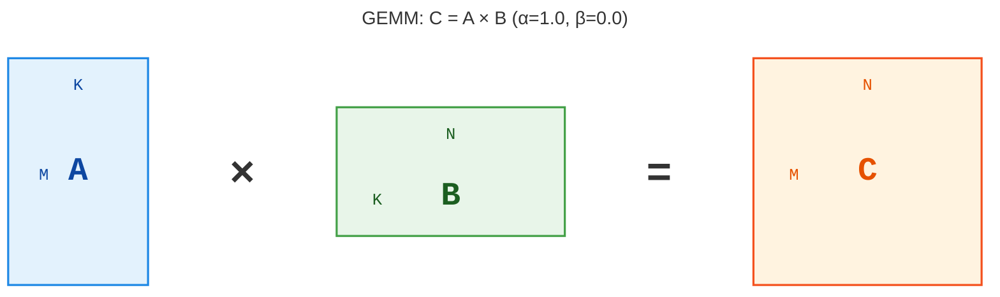
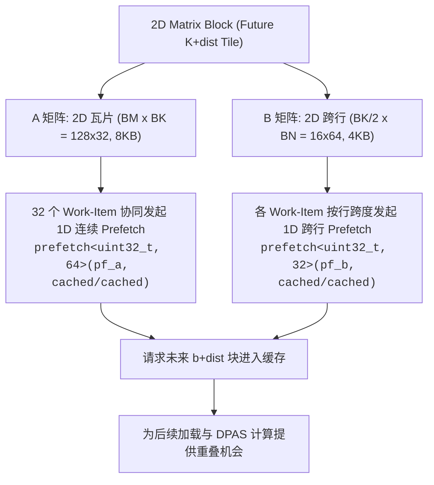

# XPU 算子开发最佳实践：GEMM 高性能优化指南

Intel GPU 在高性能计算与深度学习算子开发领域的公开调优资料相对有限。本篇作为 XPU 算子优化的工程实战指南，以最经典的矩阵乘法（GEMM）为例，基于 Intel Arc A770（Xe-HPG DG2 架构，16GB 显存）平台，系统介绍如何从基础实现出发，循序渐进地应用共享内存分块、寄存器分块、SIMD 向量化、硬件张量核心（Joint Matrix/XMX），直至直接操控底层指令的手写 ESIMD（Explicit SIMD）与异步软件预取技术，最终得到在预打包、对齐输入条件下接近官方库的 GEMM 内核。

# 一、GEMM 算子定义与基础基准

## 算法图解与基准约定

GEMM（General Matrix Multiply，通用矩阵乘法）是深度学习与科学计算中最基础的高频算子，其标准数学定义如下：

$$
C = \alpha (A \times B) + \beta C
$$

其中：
- $A$ 为 $M \times K$ 矩阵
- $B$ 为 $K \times N$ 矩阵
- $C$ 为 $M \times N$ 矩阵
- $\alpha, \beta$ 为标量缩放因子

在初始调优阶段，为排除标量计算与回写分支的干扰，专注于核心计算与内存交互，我们首先令 $\alpha = 1.0, \beta = 0.0$，即计算简化的 $C = A \times B$。后续章节会加入标量系数与运行时对齐维度支持；具体输入契约和未覆盖的边界见泛化章节。

运算过程与数据流图示如下：



## 实验环境与评测基准规范

为了确保算子性能可复现、对比口径严谨，本指南基于真实硬件与标准化评测流程展开：

- **硬件与软件环境**：测试平台为 **Intel Arc A770 (16GB)** 独立显卡（Xe-HPG DG2 架构，512 EUs / 32 Xe-cores，16MB L2 缓存），软件栈为 Intel oneAPI DPC++/C++ Compiler 2026.1、Intel Graphics Driver 32.0.101.8974 与 Windows 11 25H2。
- **执行队列与数据依赖**：基准评测统一采用 SYCL 的 `property::queue::in_order` 队列。统一串行执行能够保证 USM 共享内存上的连续内核发射、中间重置与数据拷贝按提交顺序严格生效，避免异步乱序引发的数据竞争；每次评测末尾均调用 `wait_and_throw()` 等待设备执行完毕并捕获潜在异常。
- **计时口径与多轮均值**：使用单调时钟 `std::chrono::steady_clock` 包围多次连续迭代循环，先进行充分预热（Warmup），再测量正式迭代的平均单次调用耗时（包含主机发射与设备执行）。
- **内存布局与分工定位**：在现代张量加速架构中，硬件矩阵指令（如 XMX/DPAS）通常强依赖特定内存排布（例如 VNNI 格式）。本文手写算子聚焦于核心计算流水线的极致延迟隐藏与吞吐释放，输入张量遵循硬件对齐与预打包约定。在深度学习大模型推理等典型场景中，权重矩阵 B 的打包成本是一次性离线完成的；若运行时激活张量 A 未由上游直接输出为硬件目标布局，则需额外引入转换开销（该部分未计入纯内核计算时间）。
- **正确性校验判据**：每阶段内核均与单精度 CPU 参考实现进行数值对拍，不仅检验常规数据分布，还覆盖了全矩阵逐元素校验以及 $\beta=0$ 时旧输出包含非数（NaN）等极端边界情况。

## 朴素（Naive）实现

采用标准 SYCL 编写基础内核并在 Intel Arc A770 上执行。为兼顾吞吐量与数值精度，输入矩阵 $A$ 与 $B$ 采用 `bfloat16`（bf16）格式，累加器与输出矩阵 $C$ 采用单精度浮点数 `float`（f32）。

```cpp
#include <iostream>
#include <chrono>
#include <sycl/sycl.hpp>

using namespace sycl;
using bf16 = sycl::ext::oneapi::bfloat16;

// Device Kernel 代码
void gemm(size_t M, size_t N, size_t K, bf16* A, bf16* B, float* C, queue q)
{
    q.parallel_for(range{M, N}, [=](id<2> idx) {
        int row = idx[0];
        int col = idx[1];
        float sum = 0.0f;
        for (int k = 0; k < K; ++k) {
            float a_val = static_cast<float>(A[row * K + k]);
            float b_val = static_cast<float>(B[k * N + col]);
            sum += a_val * b_val;
        }
        C[row * N + col] = sum;
    });
}

int main()
{
    // 创建 SYCL 队列，指定 GPU 执行
    queue q{gpu_selector_v, property::queue::in_order{}};

    // 测试矩阵基准规模
    constexpr size_t M = 1024;
    constexpr size_t N = 1536;
    constexpr size_t K = 512;
    
    constexpr size_t warmup_iters = 100;
    constexpr size_t run_iters = 1000;

    // 分配统一共享内存 (USM Shared Memory)
    auto A = malloc_shared<bf16>(M * K, q);
    auto B = malloc_shared<bf16>(K * N, q);
    auto C = malloc_shared<float>(M * N, q);
    
    // 初始化数据
    for (size_t i = 0; i < M * K; ++i) A[i] = 1.0f;
    for (size_t i = 0; i < K * N; ++i) B[i] = 2.0f;
    for (size_t i = 0; i < M * N; ++i) C[i] = 0.0f;

    // 预热 GPU
    for (size_t i = 0; i < warmup_iters; i++) {
        gemm(M, N, K, A, B, C, q);
    }
    q.wait_and_throw();

    auto run_start = std::chrono::steady_clock::now();
    for (size_t i = 0; i < run_iters; i++) {
        gemm(M, N, K, A, B, C, q);
    }
    q.wait_and_throw();
    auto run_end = std::chrono::steady_clock::now();
    double run_total = std::chrono::duration<double, std::milli>(run_end - run_start).count();

    std::cout << "Naive spent " << run_total << " ms\n" << run_total / run_iters << " ms per Run\n";
    std::cout << "C[0] = " << C[0] << " (Expected: " << K * 2.0f << ")" << std::endl;
    
    free(A, q);
    free(B, q);
    free(C, q);

    return 0;
}
```

执行结果如下：

```text
Naive spent 1951.73 ms
1.95174 ms per Run
C[0] = 1024 (Expected: 1024)
```

实测平均单次调用耗时约 1.9517 ms。在朴素实现中，每个 work-item 独立沿 K 维度扫描读取 A 和 B，缺乏显式的数据局部性复用。虽然底层的 L1/L2 缓存能提供一定的访问合并与命中，但高频的非对齐全局访存依然使内核受到严重的访存延迟拖累。

## 建立官方基线：oneMKL 性能参考

为了量化手写代码与成熟工业级数学库之间的差距，我们使用 Intel 官方的 **oneMKL** 库运行相同维度的 GEMM 运算：

```cpp
#include <iostream>
#include <chrono>
#include <sycl/sycl.hpp>
#include <oneapi/mkl.hpp>

using namespace sycl;
using bf16 = oneapi::mkl::bfloat16;

int main() {
    queue q{gpu_selector_v, property::queue::in_order{}};

    constexpr size_t M = 1024;
    constexpr size_t N = 1536;
    constexpr size_t K = 512;

    constexpr float alpha = 1.0f;
    constexpr float beta  = 0.0f;

    // 行主序 (Row-Major) 步长
    constexpr size_t lda = K;
    constexpr size_t ldb = N;
    constexpr size_t ldc = N;

    constexpr size_t warmup_iters = 100;
    constexpr size_t run_iters = 1000;

    bf16*  A = malloc_shared<bf16>(M * K, q);
    bf16*  B = malloc_shared<bf16>(K * N, q);
    float* C = malloc_shared<float>(M * N, q);

    for (int i = 0; i < M * K; ++i) A[i] = bf16(1.0f);
    for (int i = 0; i < K * N; ++i) B[i] = bf16(2.0f);
    for (int i = 0; i < M * N; ++i) C[i] = 0.0f;

    // 预热
    for (size_t i = 0; i < warmup_iters; i++) {
        oneapi::mkl::blas::row_major::gemm(
            q,
            oneapi::mkl::transpose::nontrans,
            oneapi::mkl::transpose::nontrans,
            M, N, K,
            alpha,
            A, lda,
            B, ldb,
            beta,
            C, ldc
        );
    }
    q.wait_and_throw();

    // 正式测试
    auto run_start = std::chrono::steady_clock::now();
    for (size_t i = 0; i < run_iters; i++) {
        oneapi::mkl::blas::row_major::gemm(
            q,
            oneapi::mkl::transpose::nontrans,
            oneapi::mkl::transpose::nontrans,
            M, N, K,
            alpha,
            A, lda,
            B, ldb,
            beta,
            C, ldc
        );
    }
    q.wait_and_throw();

    auto run_end = std::chrono::steady_clock::now();
    double run_total = std::chrono::duration<double, std::milli>(run_end - run_start).count();

    std::cout << "oneMKL spent " << run_total << " ms\n" << run_total / run_iters << " ms per Run\n";
    std::cout << "C[0] = " << C[0] << " (Expected: " << K * 2.0f << ")" << std::endl;

    free(A, q);
    free(B, q);
    free(C, q);

    return 0;
}
```

输出结果：

```text
oneMKL spent 53.6976 ms
0.0536976 ms per Run
C[0] = 1024 (Expected: 1024)
```

## Naive 实现与 oneMKL 基线对比

| 实现版本 | 单次平均耗时 | 相对效率 |
| :--- | :---: | :---: |
| Naive 朴素实现 | 1.95174 ms | 2.75% |
| oneMKL 官方基线 | **0.05370 ms** | **100.00%** |

两者耗时相差约 **36 倍**。朴素实现受制于缺乏数据共享复用，访存延迟完全暴露。为了缩小这一巨大差距，我们进入优化的第一阶段：通过分块（Tiling）与共享内存（SLM）实现工作组内线程的协作加载。

# 二、标准 SYCL 框架下的通用访存优化

*注：本部分及后续第三部分记录了算子演进过程中的探索性实验与阶段性相对收益，用于剖析各项优化原语的技术机制。基于严密 `in_order` 队列与消除混杂因素后的最终全量硬件对拍与同轮复测数据，统一收敛于第四部分。*

## Tiling（分块）实现

```cpp
// ···
// 定义 Tile 大小（如 16x16）
constexpr size_t TILE_SIZE = 16;

// Tiling 优化的 GEMM Kernel 代码
void gemm_tiled(size_t M, size_t N, size_t K, bf16* A, bf16* B, float* C, queue q)
{
    // 定义 Global 与 Local 工作空间维度
    range<2> global_size{M, N};
    range<2> local_size{TILE_SIZE, TILE_SIZE};

    q.submit([&](handler& h) {
        // 1. 申请 Local Memory (共享内存) 用于缓存 Tile 块
        local_accessor<bf16, 2> tileA(range<2>{TILE_SIZE, TILE_SIZE}, h);
        local_accessor<bf16, 2> tileB(range<2>{TILE_SIZE, TILE_SIZE}, h);

        h.parallel_for(nd_range<2>(global_size, local_size), [=](nd_item<2> item) {
            int row = item.get_global_id(0);
            int col = item.get_global_id(1);

            int local_row = item.get_local_id(0);
            int local_col = item.get_local_id(1);

            float sum = 0.0f;

            // 2. 沿着 K 维度分块迭代
            for (size_t bk = 0; bk < K; bk += TILE_SIZE) {
                // 协作加载 A 矩阵 Tile
                if (row < M && (bk + local_col) < K) {
                    tileA[local_row][local_col] = A[row * K + (bk + local_col)];
                } else {
                    tileA[local_row][local_col] = static_cast<bf16>(0.0f);
                }

                // 协作加载 B 矩阵 Tile
                if ((bk + local_row) < K && col < N) {
                    tileB[local_row][local_col] = B[(bk + local_row) * N + col];
                } else {
                    tileB[local_row][local_col] = static_cast<bf16>(0.0f);
                }

                // 3. 屏障同步：确保 Work-Group 内所有线程都已经完成了 Tile 加载
                item.barrier(access::fence_space::local_space);

                // 4. 从 Local Memory 中读取并计算局部点积
                for (size_t k = 0; k < TILE_SIZE; ++k) {
                    float a_val = static_cast<float>(tileA[local_row][k]);
                    float b_val = static_cast<float>(tileB[k][local_col]);
                    sum += a_val * b_val;
                }

                // 5. 屏障同步：确保局部计算全部完成，防止后续读取覆盖当前数据
                item.barrier(access::fence_space::local_space);
            }

            // 6. 结果写回全局内存
            if (row < M && col < N) {
                C[row * N + col] = sum;
            }
        });
    });
}
// ···
```

结果如下：

```
Tiling spent 1492.31 ms
1.49231 ms per Run
C[0] = 1024 (Expected: 1024)
```

可以看到性能提升了一些：

||Naive实现|Tiling实现|oneMKL|
|:-:|:-:|:-:|:-:|
|总耗时|1951.73 ms|1492.32 ms|53.6976 ms|
|单次耗时|1.95174 ms|1.49231 ms|0.0536976 ms|
|相对效率|2.75%|3.59%|100%|

## Register Tiling 实现

普通的 Tiling 实现依然大量的向 global memory 进行内存访问，计算速度依然被访存速度拖慢，我们可以使用 **Blocking（切片）** 来尽量提高寄存器及其缓存的利用率，来进一步缓解 Tiling 实现的访存瓶颈。

```cpp
// ···
// Work-Group 级别的 Tile 尺寸
constexpr size_t BM = 64;
constexpr size_t BN = 64;
constexpr size_t BK = 16;

// Work-Item 级别的 Thread Tile 尺寸 (寄存器分块)
constexpr size_t TM = 4;
constexpr size_t TN = 4;

// Register Tiling GEMM Kernel
void gemm_register_tiled(size_t M, size_t N, size_t K, bf16* A, bf16* B, float* C, queue q)
{
    // 每个 Work-Group 包含的线程数为 (BM/TM) x (BN/TN) = 16 x 16 = 256 个线程
    range<2> global_size{M / TM, N / TN};
    range<2> local_size{BM / TM, BN / TN};

    q.submit([&](handler& h) {
        // 1. 声明 Work-Group 共享的 Local Memory
        local_accessor<bf16, 2> tileA(range<2>{BM, BK}, h);
        local_accessor<bf16, 2> tileB(range<2>{BK, BN}, h);

        h.parallel_for(nd_range<2>(global_size, local_size), [=](nd_item<2> item) {
            int wg_row = item.get_group(0);
            int wg_col = item.get_group(1);

            int local_row = item.get_local_id(0); // 范围: 0 ~ (BM/TM - 1)
            int local_col = item.get_local_id(1); // 范围: 0 ~ (BN/TN - 1)

            // 2. 在寄存器 (Private Memory) 中分配每个线程专属的累加器
            float acc[TM][TN] = {0.0f};

            // 计算该线程在 Work-Group 内的扁平化 ID，用于协作加载
            int tid = local_row * (BN / TN) + local_col;
            int threads_per_group = (BM / TM) * (BN / TN); // 256 个线程

            // 沿着 K 维度按 BK 步进
            for (size_t bk = 0; bk < K; bk += BK) {
                
                // --- A. Work-Group 协同加载 tileA (BM x BK) ---
                for (int i = tid; i < BM * BK; i += threads_per_group) {
                    int a_r = i / BK;
                    int a_c = i % BK;
                    int g_r = wg_row * BM + a_r;
                    int g_c = bk + a_c;
                    tileA[a_r][a_c] = (g_r < M && g_c < K) ? A[g_r * K + g_c] : static_cast<bf16>(0.0f);
                }

                // --- B. Work-Group 协同加载 tileB (BK x BN) ---
                for (int i = tid; i < BK * BN; i += threads_per_group) {
                    int b_r = i / BN;
                    int b_c = i % BN;
                    int g_r = bk + b_r;
                    int g_c = wg_col * BN + b_c;
                    tileB[b_r][b_c] = (g_r < K && g_c < N) ? B[g_r * N + g_c] : static_cast<bf16>(0.0f);
                }

                // 屏障同步：等待共享数据加载完毕
                item.barrier(access::fence_space::local_space);

                // --- C. 从 Local Memory 读入寄存器并进行 2D 计算 ---
                for (int k = 0; k < BK; ++k) {
                    // 局部临时寄存器数组，用于暂存当前的 A 和 B 向量
                    float regA[TM];
                    float regB[TN];

                    // 加载 TM 个 A 元素到寄存器
                    for (int m = 0; m < TM; ++m) {
                        regA[m] = static_cast<float>(tileA[local_row * TM + m][k]);
                    }
                    // 加载 TN 个 B 元素到寄存器
                    for (int n = 0; n < TN; ++n) {
                        regB[n] = static_cast<float>(tileB[k][local_col * TN + n]);
                    }

                    // 外积展开计算并累加到 acc[TM][TN]
                    for (int m = 0; m < TM; ++m) {
                        for (int n = 0; n < TN; ++n) {
                            acc[m][n] += regA[m] * regB[n];
                        }
                    }
                }

                // 屏障同步：防止下一轮加载覆盖未用完的数据
                item.barrier(access::fence_space::local_space);
            }

            // --- D. 将寄存器的计算结果写回全局内存 C ---
            for (int m = 0; m < TM; ++m) {
                for (int n = 0; n < TN; ++n) {
                    int g_r = wg_row * BM + local_row * TM + m;
                    int g_c = wg_col * BN + local_col * TN + n;
                    if (g_r < M && g_c < N) {
                        C[g_r * N + g_c] = acc[m][n];
                    }
                }
            }
        });
    });
}
// ···
```

结果如下：
```
Register Tiling spent 430.648 ms
0.430648 ms per Run
C[0] = 1024 (Expected: 1024)
```

可以看到性能有比较明显的提升：

||Naive实现|Tiling实现|Register Tiling实现|oneMKL|
|:-:|:-:|:-:|:-:|:-:|
|总耗时|1951.73 ms|1492.32 ms|430.648 ms|53.6976 ms|
|单次耗时|1.95174 ms|1.49231 ms|0.430648 ms|0.0536976 ms|
|相对效率|2.75%|3.59%|12.46%|100%|

## SIMD 向量化读写

```cpp
// ···
constexpr size_t BM = 64;
constexpr size_t BN = 64;
constexpr size_t BK = 16;

constexpr size_t TM = 4;
constexpr size_t TN = 4;

// 定义向量大小（每次连续读写 4 个元素，对应 64-bit bf16 或 128-bit float）
constexpr size_t VEC_SIZE = 4;

// SIMD 向量化 Register Tiling GEMM
void gemm_simd_vectorized(size_t M, size_t N, size_t K, bf16* A, bf16* B, float* C, queue q)
{
    range<2> global_size{M / TM, N / TN};
    range<2> local_size{BM / TM, BN / TN};

    q.submit([&](handler& h) {
        local_accessor<bf16, 2> tileA(range<2>{BM, BK}, h);
        local_accessor<bf16, 2> tileB(range<2>{BK, BN}, h);

        h.parallel_for(nd_range<2>(global_size, local_size), [=](nd_item<2> item) {
            int wg_row = item.get_group(0);
            int wg_col = item.get_group(1);

            int local_row = item.get_local_id(0);
            int local_col = item.get_local_id(1);

            float acc[TM][TN] = {0.0f};

            int tid = local_row * (BN / TN) + local_col;
            int threads_per_group = (BM / TM) * (BN / TN); // 256 个线程

            for (size_t bk = 0; bk < K; bk += BK) {
                
                // --- A. 向量化从 Global Memory 加载到 Local Memory ---
                // 协同加载 tileA
                for (int i = tid * VEC_SIZE; i < BM * BK; i += threads_per_group * VEC_SIZE) {
                    int a_r = i / BK;
                    int a_c = i % BK;
                    int g_r = wg_row * BM + a_r;
                    int g_c = bk + a_c;

                    if (g_r < M && (g_c + VEC_SIZE - 1) < K) {
                        // 使用 reinterpret_cast 触发向量化 64-bit Load/Store
                        auto vec_a = *reinterpret_cast<const vec<bf16, VEC_SIZE>*>(&A[g_r * K + g_c]);
                        *reinterpret_cast<vec<bf16, VEC_SIZE>*>(&tileA[a_r][a_c]) = vec_a;
                    }
                }

                // 协同加载 tileB
                for (int i = tid * VEC_SIZE; i < BK * BN; i += threads_per_group * VEC_SIZE) {
                    int b_r = i / BN;
                    int b_c = i % BN;
                    int g_r = bk + b_r;
                    int g_c = wg_col * BN + b_c;

                    if (g_r < K && (g_c + VEC_SIZE - 1) < N) {
                        auto vec_b = *reinterpret_cast<const vec<bf16, VEC_SIZE>*>(&B[g_r * N + g_c]);
                        *reinterpret_cast<vec<bf16, VEC_SIZE>*>(&tileB[b_r][b_c]) = vec_b;
                    }
                }

                item.barrier(access::fence_space::local_space);

                // --- B. 从 Local Memory 向量化装载到寄存器并计算 ---
                for (int k = 0; k < BK; ++k) {
                    float regA[TM];
                    for (int m = 0; m < TM; ++m) {
                        regA[m] = static_cast<float>(tileA[local_row * TM + m][k]);
                    }

                    // 向量化读取 tileB 中连续的 TN 个元素
                    auto vec_tileB = *reinterpret_cast<const vec<bf16, VEC_SIZE>*>(&tileB[k][local_col * TN]);

                    for (int m = 0; m < TM; ++m) {
                        for (int n = 0; n < TN; ++n) {
                            acc[m][n] += regA[m] * static_cast<float>(vec_tileB[n]);
                        }
                    }
                }

                item.barrier(access::fence_space::local_space);
            }

            // --- C. 向量化写回全局内存 C ---
            for (int m = 0; m < TM; ++m) {
                int g_r = wg_row * BM + local_row * TM + m;
                int g_c = wg_col * BN + local_col * TN;

                if (g_r < M && (g_c + VEC_SIZE - 1) < N) {
                    vec<float, VEC_SIZE> vec_out;
                    for (int n = 0; n < TN; ++n) {
                        vec_out[n] = acc[m][n];
                    }
                    // 触发 128-bit 向量化写入 (4 x float)
                    *reinterpret_cast<vec<float, VEC_SIZE>*>(&C[g_r * N + g_c]) = vec_out;
                }
            }
        });
    });
}
// ···
```

结果如下：
```
SIMD Vectorized spent 273.737 ms
0.273737 ms per Run
C[0] = 1024 (Expected: 1024)
```

访存模式对速度提升也很明显：

||Naive实现|Tiling实现|Register Tiling实现|SIMD 向量化读写|oneMKL|
|:-:|:-:|:-:|:-:|:-:|:-:|
|总耗时|1951.73 ms|1492.32 ms|430.648 ms|273.737ms|53.6976 ms|
|单次耗时|1.95174 ms|1.49231 ms|0.430648 ms|0.273737 ms|0.0536976 ms|
|相对效率|2.75%|3.59%|12.46%|19.61%|100%|

# 三、利用专用张量硬件：SYCL Joint Matrix (XMX) 优化

## 硬件张量核心与 Joint Matrix 基础实现

通过前述的共享内存分块、寄存器分块与 SIMD 向量化读写，常规矢量 ALU 路径的性能已被基本榨干，相对 oneMKL 的效率达到 19.61%。若要进一步突破算力瓶颈，必须调用 Intel GPU 专为矩阵点积设计的硬件张量加速单元——Xe Matrix Extension（XMX）。

在 Intel Arc A770 (DG2) 上，每个 Xe Core 包含专门的 XMX 脉动阵列单元，支持硬件级点积累加指令（DPAS，Dot Product and Accumulate Systolic）。对于 `bfloat16` 输入与 `float` 累加，A770 的硬件块规格固定为 $M=8, N=8, K=16$。在标准 SYCL 框架中，可以通过官方的 Joint Matrix 扩展接口使用这套硬件单元：

```cpp
// 引入 Joint Matrix 扩展命名空间
using namespace sycl::ext::oneapi::experimental::matrix;

// Intel Arc A770 的 XMX bf16 硬件块形状: M=8, N=8, K=16
constexpr int TM = 8;
constexpr int TN = 8;
constexpr int TK = 16;

void gemm_joint_matrix(size_t M, size_t N, size_t K, bf16* A, bf16* B, float* C, queue q)
{
    constexpr size_t SG_SIZE = 16;
    range<2> global_size{M / TM, (N / TN) * SG_SIZE};
    range<2> local_size{1, SG_SIZE}; 

    q.submit([&](handler& h) {
        h.parallel_for(nd_range<2>(global_size, local_size), [=](nd_item<2> item) {
            auto sg = item.get_sub_group();

            int sg_row = item.get_group(0);
            int sg_col = item.get_group(1);

            // 1. 将原生 USM 指针转换为 global_space 地址空间的 multi_ptr
            auto pA = sycl::address_space_cast<sycl::access::address_space::global_space, sycl::access::decorated::no>(A);
            auto pB = sycl::address_space_cast<sycl::access::address_space::global_space, sycl::access::decorated::no>(B);
            auto pC = sycl::address_space_cast<sycl::access::address_space::global_space, sycl::access::decorated::no>(C);

            // 2. 声明硬件矩阵
            joint_matrix<sub_group, bf16, use::a, TM, TK, layout::row_major> sub_a;
            joint_matrix<sub_group, bf16, use::b, TK, TN, layout::row_major> sub_b;
            joint_matrix<sub_group, float, use::accumulator, TM, TN> sub_c;

            joint_matrix_fill(sg, sub_c, 0.0f);

            for (size_t k = 0; k < K; k += TK) {
                // 3. 使用转换后的 multi_ptr 进行 load
                joint_matrix_load(sg, sub_a, pA + (sg_row * TM) * K + k, K);
                joint_matrix_load(sg, sub_b, pB + k * N + (sg_col * TN), N);

                joint_matrix_mad(sg, sub_c, sub_a, sub_b, sub_c);
            }

            // 4. 使用转换后的 multi_ptr 进行 store
            joint_matrix_store(sg, sub_c, pC + (sg_row * TM) * N + (sg_col * TN), N, layout::row_major);
        });
    });
}
// ···
```

结果如下：

```
Joint Matrix spent: 430.931 ms
0.430931 ms per Run
C[0] = 1024 (Expected: 1024)
```

比较一下：

||Naive实现|Tiling实现|Register Tiling实现|SIMD 向量化读写|Joint Matrix 实现|oneMKL|
|:-:|:-:|:-:|:-:|:-:|:-:|:-:|
|总耗时|1951.73 ms|1492.32 ms|430.648 ms|273.737ms|430.931 ms|53.6976 ms|
|单次耗时|1.95174 ms|1.49231 ms|0.430648 ms|0.273737 ms|0.430931 ms|0.0536976 ms|
|相对效率|2.75%|3.59%|12.46%|19.61%|12.46%|100%|

## Joint Matrix + SLM 读写实现

```cpp
// ···
// 针对 Intel Arc A770 优化的硬件块尺寸 (8x8x16)
constexpr int TM = 8;
constexpr int TN = 8;
constexpr int TK = 16;

// Work-Group 级 SLM Tile 尺寸
constexpr int BM = 32;
constexpr int BN = 32;
constexpr int BK = 16;

void gemm_joint_matrix_slm(size_t M, size_t N, size_t K, bf16* A, bf16* B, float* C, queue q)
{
    constexpr size_t SG_SIZE = 16;

    // 每个 Work-Group 内部包含 (BM/TM) x (BN/TN) = 4 x 4 = 16 个 Sub-Group
    // 每个 Sub-Group 包含 SG_SIZE(16) 个线程，因此 Work-Group 内总线程数为 4 x 64 = 256
    range<2> global_size{(M / BM) * (BM / TM), (N / BN) * (BN / TN) * SG_SIZE};
    range<2> local_size{BM / TM, (BN / TN) * SG_SIZE};

    q.submit([&](handler& h) {
        // 1. 分配 Work-Group 共享内存 (SLM)
        local_accessor<bf16, 2> tileA(range<2>{BM, BK}, h);
        local_accessor<bf16, 2> tileB(range<2>{BK, BN}, h);

        h.parallel_for(nd_range<2>(global_size, local_size), [=](nd_item<2> item) {
            auto sg = item.get_sub_group();

            // Work-Group ID
            int wg_row = item.get_group(0);
            int wg_col = item.get_group(1);

            // Sub-Group 在 Work-Group 内部的 2D 坐标 (范围均为 0~3)
            int sg_row_in_wg = item.get_local_id(0);
            int sg_col_in_wg = item.get_local_id(1) / SG_SIZE;

            // 线程在 Work-Group 内的线性 ID，用于协同加载数据到 SLM
            int local_tid = item.get_local_id(0) * (BN / TN * SG_SIZE) + item.get_local_id(1);
            int threads_per_wg = (BM / TM) * (BN / TN) * SG_SIZE; // 256

            // 全局内存 Global Pointer
            auto pA_global = sycl::address_space_cast<access::address_space::global_space, access::decorated::no>(A);
            auto pB_global = sycl::address_space_cast<access::address_space::global_space, access::decorated::no>(B);
            auto pC_global = sycl::address_space_cast<access::address_space::global_space, access::decorated::no>(C);

            // 声明 Joint Matrix 累加器与输入块
            joint_matrix<sub_group, bf16, use::a, TM, TK, layout::row_major> sub_a;
            joint_matrix<sub_group, bf16, use::b, TK, TN, layout::row_major> sub_b;
            joint_matrix<sub_group, float, use::accumulator, TM, TN> sub_c;

            joint_matrix_fill(sg, sub_c, 0.0f);

            // 2. 沿着 K 维度按 BK(16) 步进
            for (size_t bk = 0; bk < K; bk += BK) {

                // --- 阶段 A：协同从 Global Memory 加载数据到 SLM ---
                for (int i = local_tid; i < BM * BK; i += threads_per_wg) {
                    int r = i / BK;
                    int c = i % BK;
                    int g_r = wg_row * BM + r;
                    int g_c = bk + c;
                    tileA[r][c] = (g_r < M && g_c < K) ? A[g_r * K + g_c] : static_cast<bf16>(0.0f);
                }

                for (int i = local_tid; i < BK * BN; i += threads_per_wg) {
                    int r = i / BN;
                    int c = i % BN;
                    int g_r = bk + r;
                    int g_c = wg_col * BN + c;
                    tileB[r][c] = (g_r < K && g_c < N) ? B[g_r * N + g_c] : static_cast<bf16>(0.0f);
                }

                // 屏障同步：等待 Work-Group 协作加载 SLM 完成
                item.barrier(access::fence_space::local_space);

                // --- 阶段 B：从 SLM 加载到 Joint Matrix 寄存器 ---
                // 获取指向 SLM 中当前 Sub-Group 负责切片的指针，注意地址空间设为 local_space
                auto pA_slm = sycl::address_space_cast<access::address_space::local_space, access::decorated::no>(&tileA[sg_row_in_wg * TM][0]);
                auto pB_slm = sycl::address_space_cast<access::address_space::local_space, access::decorated::no>(&tileB[0][sg_col_in_wg * TN]);

                // 从 SLM 中加载到 sub_a 和 sub_b (stride 分别为 BK 和 BN)
                joint_matrix_load(sg, sub_a, pA_slm, BK);
                joint_matrix_load(sg, sub_b, pB_slm, BN);

                // --- 阶段 C：XMX 硬件计算 ---
                joint_matrix_mad(sg, sub_c, sub_a, sub_b, sub_c);

                // 屏障同步：防止下一轮循环提前覆盖 SLM
                item.barrier(access::fence_space::local_space);
            }

            // 3. 将计算结果直接写回 Global Memory
            int global_r = wg_row * BM + sg_row_in_wg * TM;
            int global_c = wg_col * BN + sg_col_in_wg * TN;
            joint_matrix_store(sg, sub_c, pC_global + global_r * N + global_c, N, layout::row_major);
        });
    });
}
// ···
```

结果反而变慢：
```
Joint Matrix with SLM spent: 629.883 ms
0.629883 ms per Run
C[0] = 1024 (Expected: 1024)
```

对比结果：
||Naive实现|Tiling实现|Register Tiling实现|SIMD 向量化读写|Joint Matrix 实现|Joint Matrix + 基础SLM|oneMKL|
|:-:|:-:|:-:|:-:|:-:|:-:|:-:|:-:|
|总耗时|1951.73 ms|1492.32 ms|430.648 ms|273.737ms|430.931 ms|629.883 ms|53.6976 ms|
|单次耗时|1.95174 ms|1.49231 ms|0.430648 ms|0.273737 ms|0.430931 ms|0.629883 ms|0.0536976 ms|
|相对效率|2.75%|3.59%|12.46%|19.61%|12.46%|8.52%|100%|

## Joint Matrix + SLM + Prefetch 实现

在共享内存（SLM）实现的基础上，我们引入 `sycl::ext::oneapi::experimental::prefetch` 原语为内核增加软件异步预取：在计算当前 K 块之前，先按行把下一个 K 块的 `tileA`/`tileB` 从全局显存预取到 L2 缓存，使访存延迟和 XMX 计算尽量重叠。预取指令置于每一轮 K 循环的开头，使下一个块拥有整整一轮“加载 SLM + 计算”的时间窗口落入 L2。

```cpp
// ···
// 记得引入 prefetch 扩展头文件
#include <sycl/ext/oneapi/experimental/prefetch.hpp>

// 针对 Intel Arc A770 优化的硬件块尺寸 (8x8x16)
constexpr int TM = 8;
constexpr int TN = 8;
constexpr int TK = 16;

// Work-Group 级 SLM Tile 尺寸
constexpr int BM = 32;
constexpr int BN = 32;
constexpr int BK = 16;
// ···
void gemm_joint_matrix_prefetch(size_t M, size_t N, size_t K, bf16* A, bf16* B, float* C, queue q)
{
    constexpr size_t SG_SIZE = 16;

    range<2> global_size{(M / BM) * (BM / TM), (N / BN) * (BN / TN) * SG_SIZE};
    range<2> local_size{BM / TM, (BN / TN) * SG_SIZE};

    q.submit([&](handler& h) {
        local_accessor<bf16, 2> tileA(range<2>{BM, BK}, h);
        local_accessor<bf16, 2> tileB(range<2>{BK, BN}, h);

        h.parallel_for(nd_range<2>(global_size, local_size), [=](nd_item<2> item) {
            auto sg = item.get_sub_group();

            int wg_row = item.get_group(0);
            int wg_col = item.get_group(1);

            int sg_row_in_wg = item.get_local_id(0);
            int sg_col_in_wg = item.get_local_id(1) / SG_SIZE;

            int local_tid = item.get_local_id(0) * (BN / TN * SG_SIZE) + item.get_local_id(1);
            int threads_per_wg = (BM / TM) * (BN / TN) * SG_SIZE; // 256

            auto pA_global = sycl::address_space_cast<access::address_space::global_space, access::decorated::no>(A);
            auto pB_global = sycl::address_space_cast<access::address_space::global_space, access::decorated::no>(B);
            auto pC_global = sycl::address_space_cast<access::address_space::global_space, access::decorated::no>(C);

            // 预取下一个 K 块：提前把下一轮要读的 tileA/tileB 拉到 L2
            auto prefetch_next_block = [&](size_t next_bk) {
                if (next_bk >= K) return;

                // tileA 的 BM 行，每行连续 BK 个元素，由前 BM 个线程各预取一行
                if (local_tid < BM) {
                    int r = local_tid;
                    auto p_next_a = pA_global + (wg_row * BM + r) * K + next_bk;
                    sycl::ext::oneapi::experimental::prefetch(p_next_a, BK,
                        sycl::ext::oneapi::experimental::properties(
                            sycl::ext::oneapi::experimental::prefetch_hint_L2));
                }

                // tileB 的 BK 行，每行连续 BN 个元素，由前 BK 个线程各预取一行
                if (local_tid < BK) {
                    int r = local_tid;
                    auto p_next_b = pB_global + (next_bk + r) * N + wg_col * BN;
                    sycl::ext::oneapi::experimental::prefetch(p_next_b, BN,
                        sycl::ext::oneapi::experimental::properties(
                            sycl::ext::oneapi::experimental::prefetch_hint_L2));
                }
            };

            joint_matrix<sub_group, bf16, use::a, TM, TK, layout::row_major> sub_a;
            joint_matrix<sub_group, bf16, use::b, TK, TN, layout::row_major> sub_b;
            joint_matrix<sub_group, float, use::accumulator, TM, TN> sub_c;

            joint_matrix_fill(sg, sub_c, 0.0f);

            // 进入循环前先预取第 0 个块
            prefetch_next_block(0);

            for (size_t bk = 0; bk < K; bk += BK) {

                // 本轮开始时预取下一个 K 块，让它有整整一轮加载+计算的提前量
                prefetch_next_block(bk + BK);

                // --- 阶段 A：协同从 Global Memory 加载数据到 SLM ---
                for (int i = local_tid; i < BM * BK; i += threads_per_wg) {
                    int r = i / BK;
                    int c = i % BK;
                    int g_r = wg_row * BM + r;
                    int g_c = bk + c;
                    tileA[r][c] = (g_r < M && g_c < K) ? A[g_r * K + g_c] : static_cast<bf16>(0.0f);
                }

                for (int i = local_tid; i < BK * BN; i += threads_per_wg) {
                    int r = i / BN;
                    int c = i % BN;
                    int g_r = bk + r;
                    int g_c = wg_col * BN + c;
                    tileB[r][c] = (g_r < K && g_c < N) ? B[g_r * N + g_c] : static_cast<bf16>(0.0f);
                }

                item.barrier(access::fence_space::local_space);

                // --- 阶段 B：从 SLM 加载到 Joint Matrix 寄存器 ---
                auto pA_slm = sycl::address_space_cast<access::address_space::local_space, access::decorated::no>(&tileA[sg_row_in_wg * TM][0]);
                auto pB_slm = sycl::address_space_cast<access::address_space::local_space, access::decorated::no>(&tileB[0][sg_col_in_wg * TN]);

                joint_matrix_load(sg, sub_a, pA_slm, BK);
                joint_matrix_load(sg, sub_b, pB_slm, BN);

                // --- 阶段 C：XMX 硬件计算 ---
                joint_matrix_mad(sg, sub_c, sub_a, sub_b, sub_c);

                item.barrier(access::fence_space::local_space);
            }

            // 3. 将计算结果直接写回 Global Memory
            int global_r = wg_row * BM + sg_row_in_wg * TM;
            int global_c = wg_col * BN + sg_col_in_wg * TN;
            joint_matrix_store(sg, sub_c, pC_global + global_r * N + global_c, N, layout::row_major);
        });
    });
}
// ···
```

结果如下：
```
Joint Matrix with Prefetch Spent: 660.607 ms
Joint Matrix with Prefetch GEMM average time: 0.660607 ms per Run
C[0] = 1024 (Expected: 1024)
```

对比结果：
||Naive实现|Tiling实现|Register Tiling实现|SIMD 向量化读写|Joint Matrix 实现|Joint Matrix + 基础SLM|Joint Matrix + SLM + Prefetch|oneMKL|
|:-:|:-:|:-:|:-:|:-:|:-:|:-:|:-:|:-:|
|总耗时|1951.73 ms|1492.32 ms|430.648 ms|273.737ms|430.931 ms|629.883 ms|660.607 ms|53.6976 ms|
|单次耗时|1.95174 ms|1.49231 ms|0.430648 ms|0.273737 ms|0.430931 ms|0.629883 ms|0.660607 ms|0.0536976 ms|
|相对效率|2.75%|3.59%|12.46%|19.61%|12.46%|8.52%|8.13%|100%|

实测结果显示，直接在标准 SYCL 循环中加入行级预取并没有带来性能提升，反而相较基础 SLM 版本慢了约 5%（耗时由 0.63 ms 增至 0.66 ms）。这种现象在 GPU 算子调优中十分普遍：在工作组 Tile 较小的情况下，显式发射预取指令增加了指令流水线开销，却未能与当前的计算形成有效异步；同时输入张量在反复迭代中往往已大部分命中 L2 缓存，单纯的行预取无法弥补指令发射的负面代价。为此，我们需要在架构设计上实现真正的搬运-计算双缓冲（Double Buffering）。

## Joint Matrix + SLM + Double Buffering（软件流水线）实现

这一节把 SLM 改成双缓冲，并使用软件流水线让“下一个 K 块的 global → SLM 加载”与“当前块的 XMX 计算”重叠：一组缓冲负责计算，另一组缓冲同时接收下一块数据，每轮循环只保留一个屏障。

```cpp
// ···
// 针对 Intel Arc A770 优化的硬件块尺寸 (8x8x16)
constexpr int TM = 8;
constexpr int TN = 8;
constexpr int TK = 16;

// Work-Group 级 SLM Tile 尺寸
constexpr int BM = 32;
constexpr int BN = 32;
constexpr int BK = 16;

void gemm_joint_matrix_double_buffer(size_t M, size_t N, size_t K, bf16* A, bf16* B, float* C, queue q)
{
    constexpr size_t SG_SIZE = 16;

    range<2> global_size{(M / BM) * (BM / TM), (N / BN) * (BN / TN) * SG_SIZE};
    range<2> local_size{BM / TM, (BN / TN) * SG_SIZE};

    q.submit([&](handler& h) {
        // 1. 分配双缓冲 SLM：两组 tile 交替作为计算缓冲与加载缓冲
        local_accessor<bf16, 3> tileA(range<3>{2, BM, BK}, h);
        local_accessor<bf16, 3> tileB(range<3>{2, BK, BN}, h);

        h.parallel_for(nd_range<2>(global_size, local_size), [=](nd_item<2> item) {
            auto sg = item.get_sub_group();

            int wg_row = item.get_group(0);
            int wg_col = item.get_group(1);

            int sg_row_in_wg = item.get_local_id(0);
            int sg_col_in_wg = item.get_local_id(1) / SG_SIZE;

            int local_tid = item.get_local_id(0) * (BN / TN * SG_SIZE) + item.get_local_id(1);
            int threads_per_wg = (BM / TM) * (BN / TN) * SG_SIZE; // 256

            auto pA_global = sycl::address_space_cast<access::address_space::global_space, access::decorated::no>(A);
            auto pB_global = sycl::address_space_cast<access::address_space::global_space, access::decorated::no>(B);
            auto pC_global = sycl::address_space_cast<access::address_space::global_space, access::decorated::no>(C);

            // 协同加载指定 K 块到指定缓冲
            auto load_block = [&](int buf, size_t bk) {
                for (int i = local_tid; i < BM * BK; i += threads_per_wg) {
                    int r = i / BK;
                    int c = i % BK;
                    int g_r = wg_row * BM + r;
                    int g_c = bk + c;
                    tileA[buf][r][c] = (g_r < M && g_c < K) ? A[g_r * K + g_c] : static_cast<bf16>(0.0f);
                }

                for (int i = local_tid; i < BK * BN; i += threads_per_wg) {
                    int r = i / BN;
                    int c = i % BN;
                    int g_r = bk + r;
                    int g_c = wg_col * BN + c;
                    tileB[buf][r][c] = (g_r < K && g_c < N) ? B[g_r * N + g_c] : static_cast<bf16>(0.0f);
                }
            };

            joint_matrix<sub_group, bf16, use::a, TM, TK, layout::row_major> sub_a;
            joint_matrix<sub_group, bf16, use::b, TK, TN, layout::row_major> sub_b;
            joint_matrix<sub_group, float, use::accumulator, TM, TN> sub_c;

            joint_matrix_fill(sg, sub_c, 0.0f);

            // 2. 软件流水线前奏：先把第 0 个 K 块加载进缓冲 0
            load_block(0, 0);
            item.barrier(access::fence_space::local_space);

            // 3. 主循环：计算当前块的同时，把下一个 K 块加载进另一个缓冲
            for (size_t bk = 0; bk < K; bk += BK) {
                int cur = (bk / BK) % 2;
                int nxt = cur ^ 1;

                // --- 阶段 A：把下一个 K 块加载到备用缓冲，与下面的 XMX 计算重叠 ---
                if (bk + BK < K) {
                    load_block(nxt, bk + BK);
                }

                // --- 阶段 B：从当前缓冲加载到 Joint Matrix 寄存器 ---
                auto pA_slm = sycl::address_space_cast<access::address_space::local_space, access::decorated::no>(&tileA[cur][sg_row_in_wg * TM][0]);
                auto pB_slm = sycl::address_space_cast<access::address_space::local_space, access::decorated::no>(&tileB[cur][0][sg_col_in_wg * TN]);

                joint_matrix_load(sg, sub_a, pA_slm, BK);
                joint_matrix_load(sg, sub_b, pB_slm, BN);

                // --- 阶段 C：XMX 硬件计算 ---
                joint_matrix_mad(sg, sub_c, sub_a, sub_b, sub_c);

                // 屏障同步：当前块计算完毕，旧的当前缓冲可被覆盖；下一个块加载对全部线程可见
                item.barrier(access::fence_space::local_space);
            }

            // 4. 将计算结果直接写回 Global Memory
            int global_r = wg_row * BM + sg_row_in_wg * TM;
            int global_c = wg_col * BN + sg_col_in_wg * TN;
            joint_matrix_store(sg, sub_c, pC_global + global_r * N + global_c, N, layout::row_major);
        });
    });
}
// ···
```

结果如下：
```
Joint Matrix with Double Buffer Spent: 669.505 ms
Joint Matrix with Double Buffer GEMM average time: 0.669505 ms per Run
C[0] = 1024 (Expected: 1024)
```

对比结果：
||Naive实现|Tiling实现|Register Tiling实现|SIMD 向量化读写|Joint Matrix 实现|Joint Matrix + 基础SLM|Joint Matrix + SLM + Prefetch|Joint Matrix + SLM + Double Buffer|oneMKL|
|:-:|:-:|:-:|:-:|:-:|:-:|:-:|:-:|:-:|:-:|
|总耗时|1951.73 ms|1492.32 ms|430.648 ms|273.737ms|430.931 ms|629.883 ms|660.607 ms|669.505 ms|53.6976 ms|
|单次耗时|1.95174 ms|1.49231 ms|0.430648 ms|0.273737 ms|0.430931 ms|0.629883 ms|0.660607 ms|0.669505 ms|0.0536976 ms|
|相对效率|2.75%|3.59%|12.46%|19.61%|12.46%|8.52%|8.13%|8.02%|100%|

双缓冲 + 软件流水线在这个配置下同样没有带来提升（多次运行稳定在 669.5 ~ 671.6 ms，同一会话中基础 SLM 约为 639.7 ms）。原因是 `BM = BN = 32` 的 tile 太小：每个 Work-Group 每个 K 块只有 16 个 Sub-Group 各做一次 8x8x16 的 XMX 计算，计算时间太短，加载指令、SLM 读写和屏障开销依然是主导；双缓冲只是把加载和这段很短的计算重叠，屏障仍然要等最慢的加载完成，双份 SLM 与 3D 寻址还带来了额外开销。要让流水线真正吃饱，下一步应该增大 `BM`/`BN`（例如 64x64 或 128x128），提高每次加载对应的 XMX 计算量，或者把协作加载改成向量化读写。

## Joint Matrix + SLM + 大 Tile + GRF 实现

上一节的结论是 `BM = BN = 32` 太小。这一节把 Work-Group 级 tile 增大到 64x64，并让每个 Sub-Group 使用 GRF（General Register File）持有 16x16 的输出块：也就是 2x2 个 8x8 joint matrix 累加器，配合 2 个 A 切片和 2 个 B 切片，每个 K 块执行 4 次 XMX MAD。这样从 SLM 读入的 A/B 数据会在 GRF 中被复用 4 次，计算/加载比直接翻倍，双缓冲 + 软件流水线保持不变。

```cpp
// ···
// 针对 Intel Arc A770 优化的硬件块尺寸 (8x8x16)
constexpr int TM = 8;
constexpr int TN = 8;
constexpr int TK = 16;

// Sub-Group 级 GRF 寄存器块：16x16 = 2x2 个 8x8 joint matrix 累加器
constexpr int TM_SG = 16;
constexpr int TN_SG = 16;

// Work-Group 级 SLM Tile 尺寸
constexpr int BM = 64;
constexpr int BN = 64;
constexpr int BK = 16;

void gemm_joint_matrix_grf(size_t M, size_t N, size_t K, bf16* A, bf16* B, float* C, queue q)
{
    constexpr size_t SG_SIZE = 16;

    // 每个 Work-Group 内部包含 (BM/TM_SG) x (BN/TN_SG) = 4 x 4 = 16 个 Sub-Group
    // 每个 Sub-Group 包含 SG_SIZE(16) 个线程，因此 Work-Group 内总线程数为 4 x 64 = 256
    range<2> global_size{(M / BM) * (BM / TM_SG), (N / BN) * (BN / TN_SG) * SG_SIZE};
    range<2> local_size{BM / TM_SG, (BN / TN_SG) * SG_SIZE};

    q.submit([&](handler& h) {
        // 1. 分配双缓冲 SLM：两组 tile 交替作为计算缓冲与加载缓冲
        local_accessor<bf16, 3> tileA(range<3>{2, BM, BK}, h);
        local_accessor<bf16, 3> tileB(range<3>{2, BK, BN}, h);

        h.parallel_for(nd_range<2>(global_size, local_size), [=](nd_item<2> item) {
            auto sg = item.get_sub_group();

            int wg_row = item.get_group(0);
            int wg_col = item.get_group(1);

            // Sub-Group 在 Work-Group 内部的 2D 坐标 (范围均为 0~3)
            int sg_row_in_wg = item.get_local_id(0);
            int sg_col_in_wg = item.get_local_id(1) / SG_SIZE;

            int local_tid = item.get_local_id(0) * (BN / TN_SG * SG_SIZE) + item.get_local_id(1);
            int threads_per_wg = (BM / TM_SG) * (BN / TN_SG) * SG_SIZE; // 256

            auto pA_global = sycl::address_space_cast<access::address_space::global_space, access::decorated::no>(A);
            auto pB_global = sycl::address_space_cast<access::address_space::global_space, access::decorated::no>(B);
            auto pC_global = sycl::address_space_cast<access::address_space::global_space, access::decorated::no>(C);

            // 协同加载指定 K 块到指定缓冲
            auto load_block = [&](int buf, size_t bk) {
                for (int i = local_tid; i < BM * BK; i += threads_per_wg) {
                    int r = i / BK;
                    int c = i % BK;
                    int g_r = wg_row * BM + r;
                    int g_c = bk + c;
                    tileA[buf][r][c] = (g_r < M && g_c < K) ? A[g_r * K + g_c] : static_cast<bf16>(0.0f);
                }

                for (int i = local_tid; i < BK * BN; i += threads_per_wg) {
                    int r = i / BN;
                    int c = i % BN;
                    int g_r = bk + r;
                    int g_c = wg_col * BN + c;
                    tileB[buf][r][c] = (g_r < K && g_c < N) ? B[g_r * N + g_c] : static_cast<bf16>(0.0f);
                }
            };

            // 声明 Joint Matrix 累加器与输入块：每个 Sub-Group 用 GRF 持有 16x16 输出块
            joint_matrix<sub_group, bf16, use::a, TM, TK, layout::row_major> sub_a0;
            joint_matrix<sub_group, bf16, use::a, TM, TK, layout::row_major> sub_a1;
            joint_matrix<sub_group, bf16, use::b, TK, TN, layout::row_major> sub_b0;
            joint_matrix<sub_group, bf16, use::b, TK, TN, layout::row_major> sub_b1;
            joint_matrix<sub_group, float, use::accumulator, TM, TN> sub_c00;
            joint_matrix<sub_group, float, use::accumulator, TM, TN> sub_c01;
            joint_matrix<sub_group, float, use::accumulator, TM, TN> sub_c10;
            joint_matrix<sub_group, float, use::accumulator, TM, TN> sub_c11;

            joint_matrix_fill(sg, sub_c00, 0.0f);
            joint_matrix_fill(sg, sub_c01, 0.0f);
            joint_matrix_fill(sg, sub_c10, 0.0f);
            joint_matrix_fill(sg, sub_c11, 0.0f);

            // 2. 软件流水线前奏：先把第 0 个 K 块加载进缓冲 0
            load_block(0, 0);
            item.barrier(access::fence_space::local_space);

            // 3. 主循环：计算当前块的同时，把下一个 K 块加载进另一个缓冲
            for (size_t bk = 0; bk < K; bk += BK) {
                int cur = (bk / BK) % 2;
                int nxt = cur ^ 1;

                // --- 阶段 A：把下一个 K 块加载到备用缓冲，与下面的 XMX 计算重叠 ---
                if (bk + BK < K) {
                    load_block(nxt, bk + BK);
                }

                // --- 阶段 B：从当前缓冲加载 A/B 切片到 GRF 寄存器 ---
                auto pA_slm0 = sycl::address_space_cast<access::address_space::local_space, access::decorated::no>(&tileA[cur][sg_row_in_wg * TM_SG][0]);
                auto pA_slm1 = sycl::address_space_cast<access::address_space::local_space, access::decorated::no>(&tileA[cur][sg_row_in_wg * TM_SG + TM][0]);
                auto pB_slm0 = sycl::address_space_cast<access::address_space::local_space, access::decorated::no>(&tileB[cur][0][sg_col_in_wg * TN_SG]);
                auto pB_slm1 = sycl::address_space_cast<access::address_space::local_space, access::decorated::no>(&tileB[cur][0][sg_col_in_wg * TN_SG + TN]);

                joint_matrix_load(sg, sub_a0, pA_slm0, BK);
                joint_matrix_load(sg, sub_a1, pA_slm1, BK);
                joint_matrix_load(sg, sub_b0, pB_slm0, BN);
                joint_matrix_load(sg, sub_b1, pB_slm1, BN);

                // --- 阶段 C：4 次 8x8x16 XMX 计算，A/B 数据在 GRF 中复用 ---
                joint_matrix_mad(sg, sub_c00, sub_a0, sub_b0, sub_c00);
                joint_matrix_mad(sg, sub_c01, sub_a0, sub_b1, sub_c01);
                joint_matrix_mad(sg, sub_c10, sub_a1, sub_b0, sub_c10);
                joint_matrix_mad(sg, sub_c11, sub_a1, sub_b1, sub_c11);

                // 屏障同步：当前块计算完毕，旧的当前缓冲可被覆盖；下一个块加载对全部线程可见
                item.barrier(access::fence_space::local_space);
            }

            // 4. 将 16x16 GRF 寄存器块写回 Global Memory
            int global_r = wg_row * BM + sg_row_in_wg * TM_SG;
            int global_c = wg_col * BN + sg_col_in_wg * TN_SG;
            joint_matrix_store(sg, sub_c00, pC_global + global_r * N + global_c, N, layout::row_major);
            joint_matrix_store(sg, sub_c01, pC_global + global_r * N + global_c + TN, N, layout::row_major);
            joint_matrix_store(sg, sub_c10, pC_global + (global_r + TM) * N + global_c, N, layout::row_major);
            joint_matrix_store(sg, sub_c11, pC_global + (global_r + TM) * N + global_c + TN, N, layout::row_major);
        });
    });
}
// ···
```

结果如下：
```
Joint Matrix with GRF Spent: 356.372 ms
Joint Matrix with GRF GEMM average time: 0.356372 ms per Run
C[0] = 1024 (Expected: 1024)
```

对比结果：
||Naive实现|Tiling实现|Register Tiling实现|SIMD 向量化读写|Joint Matrix 实现|Joint Matrix + 基础SLM|Joint Matrix + SLM + Prefetch|Joint Matrix + SLM + Double Buffer|Joint Matrix + SLM + 大Tile + GRF|oneMKL|
|:-:|:-:|:-:|:-:|:-:|:-:|:-:|:-:|:-:|:-:|:-:|
|总耗时|1951.73 ms|1492.32 ms|430.648 ms|273.737ms|430.931 ms|629.883 ms|660.607 ms|669.505 ms|356.372 ms|53.6976 ms|
|单次耗时|1.95174 ms|1.49231 ms|0.430648 ms|0.273737 ms|0.430931 ms|0.629883 ms|0.660607 ms|0.669505 ms|0.356372 ms|0.0536976 ms|
|相对效率|2.75%|3.59%|12.46%|19.61%|12.46%|8.52%|8.13%|8.02%|15.07%|100%|

这次提升非常明显（多次运行稳定在 356 ~ 358 ms）：相比纯 Joint Matrix（430.931 ms）快约 21%，相比基础 SLM（629.883 ms）快约 77%，相比双缓冲版本（669.505 ms）快约 88%。原因有两方面：`BM/BN` 从 32 增大到 64 后，每个 K 块的加载量只翻倍，但每个 Sub-Group 的 XMX 计算量翻了 4 倍（4 次 8x8x16 MAD），计算/加载比提升；同时 16x16 的 GRF 寄存器块让 A/B 切片被复用 4 次，大幅摊薄了 SLM 读取和屏障开销。这也验证了上一节的判断：小 tile 下 SLM 和双缓冲的收益被过小的计算量掩盖了。

## Joint Matrix + SLM + 按 A770 硬件规格调参实现

A770 的关键硬件规格：

|硬件规格|数值|
|:-:|:-:|
|Hardware Thread Count|4096|
|Number of General Register File per Thread|128|
|Register Width|256 bits (32B)|

按数据字节数估算，一个 8x8 float 累加器为 256B，即 8 个 32B GRF 的数据量；8x16 bf16 A 切片和 16x8 bf16 B 切片也各为 256B。下述 GRF 数值只是操作数数据量估算，不包含临时量、地址、填充和编译器分配，不能据此确认实际寄存器占用或溢出。Joint Matrix 的 subgroup 协作布局与 ESIMD work-item 的显式向量布局也不能混为一谈。我们尝试了三组参数：

1. **16x32 寄存器块**：8 个累加器 + 2 个 A 切片 + 4 个 B 切片，操作数数据量约 112 个 GRF，实测 444.701 ms；是否发生 spill 需检查编译报告或反汇编。
2. **16x16 + BK=32**：4 个累加器 + 8 个 A/B 切片，数据占用约 `96/128` GRF，实测 455.252 ms，SLM 占用翻倍到 16KB/Work-Group，也没有提升。
3. **最终方案**：保持 16x16 寄存器块，把 `BM` 增大到 128、`BN` 保持 64，每组 512 个 SYCL work-item；本轮实测最快。共 `8 × 24 × 512 = 98304` 个 work-item，在 subgroup size=8 的划分下为 12288 个 subgroup。不能把 work-item 数直接除以 4096 个硬件线程槽称作“24 个满波次”；实际 SIMD 映射、工作组分配及资源限制需另行核对。

```cpp
// ···
// 针对 Intel Arc A770 优化的硬件块尺寸 (8x8x16)
constexpr int TM = 8;
constexpr int TN = 8;
constexpr int TK = 16;

// Sub-Group 级 GRF 寄存器块：16x16 = 2x2 个 8x8 joint matrix 累加器
// 4 个 float 累加器（1KB）+ 2 个 A 切片 + 2 个 B 切片（bf16 共 1KB）
// 合计约 2KB = 64 个 256-bit GRF，留出余量避免寄存器溢出
constexpr int TM_SG = 16;
constexpr int TN_SG = 16;

// Work-Group 级 SLM Tile 尺寸
constexpr int BM = 128;
constexpr int BN = 64;
constexpr int BK = 16;

void gemm_joint_matrix_tuned(size_t M, size_t N, size_t K, bf16* A, bf16* B, float* C, queue q)
{
    constexpr size_t SG_SIZE = 16;

    // 每个 Work-Group 内部包含 (BM/TM_SG) x (BN/TN_SG) = 8 x 4 = 32 个 Sub-Group
    // 每个 Sub-Group 包含 SG_SIZE(16) 个线程，因此 Work-Group 内总线程数为 32 x 16 = 512
    range<2> global_size{(M / BM) * (BM / TM_SG), (N / BN) * (BN / TN_SG) * SG_SIZE};
    range<2> local_size{BM / TM_SG, (BN / TN_SG) * SG_SIZE};

    q.submit([&](handler& h) {
        // 1. 分配双缓冲 SLM：两组 tile 交替作为计算缓冲与加载缓冲
        local_accessor<bf16, 3> tileA(range<3>{2, BM, BK}, h);
        local_accessor<bf16, 3> tileB(range<3>{2, BK, BN}, h);

        h.parallel_for(nd_range<2>(global_size, local_size), [=](nd_item<2> item) {
            auto sg = item.get_sub_group();

            int wg_row = item.get_group(0);
            int wg_col = item.get_group(1);

            // Sub-Group 在 Work-Group 内部的 2D 坐标 (范围均为 0~3)
            int sg_row_in_wg = item.get_local_id(0);
            int sg_col_in_wg = item.get_local_id(1) / SG_SIZE;

            int local_tid = item.get_local_id(0) * (BN / TN_SG * SG_SIZE) + item.get_local_id(1);
            int threads_per_wg = (BM / TM_SG) * (BN / TN_SG) * SG_SIZE; // 512

            auto pA_global = sycl::address_space_cast<access::address_space::global_space, access::decorated::no>(A);
            auto pB_global = sycl::address_space_cast<access::address_space::global_space, access::decorated::no>(B);
            auto pC_global = sycl::address_space_cast<access::address_space::global_space, access::decorated::no>(C);

            // 协同加载指定 K 块到指定缓冲
            auto load_block = [&](int buf, size_t bk) {
                for (int i = local_tid; i < BM * BK; i += threads_per_wg) {
                    int r = i / BK;
                    int c = i % BK;
                    int g_r = wg_row * BM + r;
                    int g_c = bk + c;
                    tileA[buf][r][c] = (g_r < M && g_c < K) ? A[g_r * K + g_c] : static_cast<bf16>(0.0f);
                }

                for (int i = local_tid; i < BK * BN; i += threads_per_wg) {
                    int r = i / BN;
                    int c = i % BN;
                    int g_r = bk + r;
                    int g_c = wg_col * BN + c;
                    tileB[buf][r][c] = (g_r < K && g_c < N) ? B[g_r * N + g_c] : static_cast<bf16>(0.0f);
                }
            };

            // 声明 Joint Matrix 累加器与输入块：每个 Sub-Group 用 GRF 持有 16x16 输出块
            joint_matrix<sub_group, bf16, use::a, TM, TK, layout::row_major> sub_a0;
            joint_matrix<sub_group, bf16, use::a, TM, TK, layout::row_major> sub_a1;
            joint_matrix<sub_group, bf16, use::b, TK, TN, layout::row_major> sub_b0;
            joint_matrix<sub_group, bf16, use::b, TK, TN, layout::row_major> sub_b1;
            joint_matrix<sub_group, float, use::accumulator, TM, TN> sub_c00;
            joint_matrix<sub_group, float, use::accumulator, TM, TN> sub_c01;
            joint_matrix<sub_group, float, use::accumulator, TM, TN> sub_c10;
            joint_matrix<sub_group, float, use::accumulator, TM, TN> sub_c11;

            joint_matrix_fill(sg, sub_c00, 0.0f);
            joint_matrix_fill(sg, sub_c01, 0.0f);
            joint_matrix_fill(sg, sub_c10, 0.0f);
            joint_matrix_fill(sg, sub_c11, 0.0f);

            // 2. 软件流水线前奏：先把第 0 个 K 块加载进缓冲 0
            load_block(0, 0);
            item.barrier(access::fence_space::local_space);

            // 3. 主循环：计算当前块的同时，把下一个 K 块加载进另一个缓冲
            for (size_t bk = 0; bk < K; bk += BK) {
                int cur = (bk / BK) % 2;
                int nxt = cur ^ 1;

                // --- 阶段 A：把下一个 K 块加载到备用缓冲，与下面的 XMX 计算重叠 ---
                if (bk + BK < K) {
                    load_block(nxt, bk + BK);
                }

                // --- 阶段 B：从当前缓冲加载 A/B 切片到 GRF 寄存器 ---
                auto pA_slm0 = sycl::address_space_cast<access::address_space::local_space, access::decorated::no>(&tileA[cur][sg_row_in_wg * TM_SG][0]);
                auto pA_slm1 = sycl::address_space_cast<access::address_space::local_space, access::decorated::no>(&tileA[cur][sg_row_in_wg * TM_SG + TM][0]);
                auto pB_slm0 = sycl::address_space_cast<access::address_space::local_space, access::decorated::no>(&tileB[cur][0][sg_col_in_wg * TN_SG]);
                auto pB_slm1 = sycl::address_space_cast<access::address_space::local_space, access::decorated::no>(&tileB[cur][0][sg_col_in_wg * TN_SG + TN]);

                joint_matrix_load(sg, sub_a0, pA_slm0, BK);
                joint_matrix_load(sg, sub_a1, pA_slm1, BK);
                joint_matrix_load(sg, sub_b0, pB_slm0, BN);
                joint_matrix_load(sg, sub_b1, pB_slm1, BN);

                // --- 阶段 C：4 次 8x8x16 XMX 计算，A/B 数据在 GRF 中复用 ---
                joint_matrix_mad(sg, sub_c00, sub_a0, sub_b0, sub_c00);
                joint_matrix_mad(sg, sub_c01, sub_a0, sub_b1, sub_c01);
                joint_matrix_mad(sg, sub_c10, sub_a1, sub_b0, sub_c10);
                joint_matrix_mad(sg, sub_c11, sub_a1, sub_b1, sub_c11);

                // 屏障同步：当前块计算完毕，旧的当前缓冲可被覆盖；下一个块加载对全部线程可见
                item.barrier(access::fence_space::local_space);
            }

            // 4. 将 16x16 GRF 寄存器块写回 Global Memory
            int global_r = wg_row * BM + sg_row_in_wg * TM_SG;
            int global_c = wg_col * BN + sg_col_in_wg * TN_SG;
            joint_matrix_store(sg, sub_c00, pC_global + global_r * N + global_c, N, layout::row_major);
            joint_matrix_store(sg, sub_c01, pC_global + global_r * N + global_c + TN, N, layout::row_major);
            joint_matrix_store(sg, sub_c10, pC_global + (global_r + TM) * N + global_c, N, layout::row_major);
            joint_matrix_store(sg, sub_c11, pC_global + (global_r + TM) * N + global_c + TN, N, layout::row_major);
        });
    });
}
// ···
```

结果如下：
```
Joint Matrix Tuned Spent: 307.633 ms
Joint Matrix Tuned GEMM average time: 0.307633 ms per Run
C[0] = 1024 (Expected: 1024)
```

对比结果：
||Naive实现|Tiling实现|Register Tiling实现|SIMD 向量化读写|Joint Matrix 实现|Joint Matrix + 基础SLM|Joint Matrix + SLM + Prefetch|Joint Matrix + SLM + Double Buffer|Joint Matrix + SLM + 大Tile + GRF|Joint Matrix + SLM + 硬件调参|oneMKL|
|:-:|:-:|:-:|:-:|:-:|:-:|:-:|:-:|:-:|:-:|:-:|:-:|
|总耗时|1951.73 ms|1492.32 ms|430.648 ms|273.737ms|430.931 ms|629.883 ms|660.607 ms|669.505 ms|356.372 ms|307.633 ms|53.6976 ms|
|单次耗时|1.95174 ms|1.49231 ms|0.430648 ms|0.273737 ms|0.430931 ms|0.629883 ms|0.660607 ms|0.669505 ms|0.356372 ms|0.307633 ms|0.0536976 ms|
|相对效率|2.75%|3.59%|12.46%|19.61%|12.46%|8.52%|8.13%|8.02%|15.07%|17.46%|100%|

实测结果显示，参数调整后单次调用耗时稳定在 0.305 ~ 0.308 ms，比上一版的 0.356 ms 下降约 14%，达到了 oneMKL 基线约 17.5% 的性能。这一收益主要来自于增大工作组负荷后，局部数据在寄存器与 SLM 中的复用率提高，从而减少了向底层显存请求数据的频次。

## Joint Matrix + SLM + VNNI Packed Data 实现

VNNI（Vector Neural Network Instructions）的 Packed Data 格式是 XMX 硬件直接消费的数据布局。查了 Intel 官方资料和 [intel/llvm](https://github.com/intel/llvm/blob/sycl/sycl/test-e2e/Matrix/joint_matrix_bfloat16.cpp) 的测试代码后确认：对于 Arc（DG2）上的 bf16，XMX DPAS 的 **B 操作数**需要按 VNNI 打包（VNNI factor = 2），也就是把同一列相邻两行 K 的两个 bf16 塞进一个 32-bit 字（低 16 位 = `B[2k][n]`，高 16 位 = `B[2k+1][n]`）；**A 保持 row-major**。SYCL 里通过 `layout::ext_intel_packed` 声明 B 的 `joint_matrix`，`joint_matrix_load` 就会按 packed 布局读取。

实现上，主机端先把 B 预打包成 `uint32_t B_packed[K/2][N]`（打包成本只算一次，不计入 kernel 计时），kernel 的 SLM B tile 也改成 `uint32_t` 存储，`load_block` 直接做 32-bit 整字拷贝；`sub_b` 声明为 `layout::ext_intel_packed`，加载时以 bf16 视角指向 packed 切片、行距传 `BN * 2`。

```cpp
// ···
#include <cstdint>
// ···
// 针对 Intel Arc A770 优化的硬件块尺寸 (8x8x16)
constexpr int TM = 8;
constexpr int TN = 8;
constexpr int TK = 16;

constexpr int TM_SG = 16;
constexpr int TN_SG = 16;

constexpr int BM = 128;
constexpr int BN = 64;
constexpr int BK = 16;

// B 使用 VNNI Packed 布局：bf16 按 K 两两打包进 32-bit（VF=2），A 保持 row-major
void gemm_joint_matrix_vnni(size_t M, size_t N, size_t K, bf16* A, uint32_t* B_packed, float* C, queue q)
{
    constexpr size_t SG_SIZE = 16;

    range<2> global_size{(M / BM) * (BM / TM_SG), (N / BN) * (BN / TN_SG) * SG_SIZE};
    range<2> local_size{BM / TM_SG, (BN / TN_SG) * SG_SIZE};

    q.submit([&](handler& h) {
        // A 保持 row-major，B 按 VNNI 打包存成 uint32（每字 = 2 个 bf16）
        local_accessor<bf16, 3> tileA(range<3>{2, BM, BK}, h);
        local_accessor<uint32_t, 3> tileB(range<3>{2, BK / 2, BN}, h);

        h.parallel_for(nd_range<2>(global_size, local_size), [=](nd_item<2> item) {
            auto sg = item.get_sub_group();

            int wg_row = item.get_group(0);
            int wg_col = item.get_group(1);

            int sg_row_in_wg = item.get_local_id(0);
            int sg_col_in_wg = item.get_local_id(1) / SG_SIZE;

            int local_tid = item.get_local_id(0) * (BN / TN_SG * SG_SIZE) + item.get_local_id(1);
            int threads_per_wg = (BM / TM_SG) * (BN / TN_SG) * SG_SIZE; // 512

            auto pA_global = sycl::address_space_cast<access::address_space::global_space, access::decorated::no>(A);
            auto pC_global = sycl::address_space_cast<access::address_space::global_space, access::decorated::no>(C);

            // 协同加载指定 K 块到指定缓冲
            auto load_block = [&](int buf, size_t bk) {
                for (int i = local_tid; i < BM * BK; i += threads_per_wg) {
                    int r = i / BK;
                    int c = i % BK;
                    int g_r = wg_row * BM + r;
                    int g_c = bk + c;
                    tileA[buf][r][c] = (g_r < M && g_c < K) ? A[g_r * K + g_c] : static_cast<bf16>(0.0f);
                }

                // B 已由主机端按 VNNI 打包：packed 行数只有 BK/2，每行 BN 个 uint32
                for (int i = local_tid; i < (BK / 2) * BN; i += threads_per_wg) {
                    int r = i / BN;
                    int c = i % BN;
                    int g_r = bk / 2 + r;
                    int g_c = wg_col * BN + c;
                    tileB[buf][r][c] = (g_r < K / 2 && g_c < N) ? B_packed[g_r * N + g_c] : 0u;
                }
            };

            joint_matrix<sub_group, bf16, use::a, TM, TK, layout::row_major> sub_a0;
            joint_matrix<sub_group, bf16, use::a, TM, TK, layout::row_major> sub_a1;
            joint_matrix<sub_group, bf16, use::b, TK, TN, layout::ext_intel_packed> sub_b0;
            joint_matrix<sub_group, bf16, use::b, TK, TN, layout::ext_intel_packed> sub_b1;
            joint_matrix<sub_group, float, use::accumulator, TM, TN> sub_c00;
            joint_matrix<sub_group, float, use::accumulator, TM, TN> sub_c01;
            joint_matrix<sub_group, float, use::accumulator, TM, TN> sub_c10;
            joint_matrix<sub_group, float, use::accumulator, TM, TN> sub_c11;

            joint_matrix_fill(sg, sub_c00, 0.0f);
            joint_matrix_fill(sg, sub_c01, 0.0f);
            joint_matrix_fill(sg, sub_c10, 0.0f);
            joint_matrix_fill(sg, sub_c11, 0.0f);

            load_block(0, 0);
            item.barrier(access::fence_space::local_space);

            for (size_t bk = 0; bk < K; bk += BK) {
                int cur = (bk / BK) % 2;
                int nxt = cur ^ 1;

                if (bk + BK < K) {
                    load_block(nxt, bk + BK);
                }

                auto pA_slm0 = sycl::address_space_cast<access::address_space::local_space, access::decorated::no>(&tileA[cur][sg_row_in_wg * TM_SG][0]);
                auto pA_slm1 = sycl::address_space_cast<access::address_space::local_space, access::decorated::no>(&tileA[cur][sg_row_in_wg * TM_SG + TM][0]);

                // 以 bf16 视角指向 VNNI 打包后的 B 切片，行距为 BN*2 个 bf16（=BN 个 uint32）
                auto pB_slm0 = sycl::address_space_cast<access::address_space::local_space, access::decorated::no>(
                    reinterpret_cast<bf16*>(&tileB[cur][0][sg_col_in_wg * TN_SG]));
                auto pB_slm1 = sycl::address_space_cast<access::address_space::local_space, access::decorated::no>(
                    reinterpret_cast<bf16*>(&tileB[cur][0][sg_col_in_wg * TN_SG + TN]));

                joint_matrix_load(sg, sub_a0, pA_slm0, BK);
                joint_matrix_load(sg, sub_a1, pA_slm1, BK);
                joint_matrix_load(sg, sub_b0, pB_slm0, BN * 2);
                joint_matrix_load(sg, sub_b1, pB_slm1, BN * 2);

                joint_matrix_mad(sg, sub_c00, sub_a0, sub_b0, sub_c00);
                joint_matrix_mad(sg, sub_c01, sub_a0, sub_b1, sub_c01);
                joint_matrix_mad(sg, sub_c10, sub_a1, sub_b0, sub_c10);
                joint_matrix_mad(sg, sub_c11, sub_a1, sub_b1, sub_c11);

                item.barrier(access::fence_space::local_space);
            }

            int global_r = wg_row * BM + sg_row_in_wg * TM_SG;
            int global_c = wg_col * BN + sg_col_in_wg * TN_SG;
            joint_matrix_store(sg, sub_c00, pC_global + global_r * N + global_c, N, layout::row_major);
            joint_matrix_store(sg, sub_c01, pC_global + global_r * N + global_c + TN, N, layout::row_major);
            joint_matrix_store(sg, sub_c10, pC_global + (global_r + TM) * N + global_c, N, layout::row_major);
            joint_matrix_store(sg, sub_c11, pC_global + (global_r + TM) * N + global_c + TN, N, layout::row_major);
        });
    });
}

// 主机端 VNNI 打包：低 16 位 = B[2k][n]，高 16 位 = B[2k+1][n]
for (size_t k2 = 0; k2 < K / 2; ++k2) {
    for (size_t n = 0; n < N; ++n) {
        uint16_t lo = sycl::bit_cast<uint16_t>(B[k2 * 2 * N + n]);
        uint16_t hi = sycl::bit_cast<uint16_t>(B[(k2 * 2 + 1) * N + n]);
        B_packed[k2 * N + n] = static_cast<uint32_t>(lo) | (static_cast<uint32_t>(hi) << 16);
    }
}
// ···
```

结果如下：
```
Joint Matrix with VNNI Spent: 234.17 ms
Joint Matrix with VNNI GEMM average time: 0.23417 ms per Run
C[0] = 1024 (Expected: 1024)
```

对比结果：
||Naive实现|Tiling实现|Register Tiling实现|SIMD 向量化读写|Joint Matrix 实现|Joint Matrix + 基础SLM|Joint Matrix + SLM + Prefetch|Joint Matrix + SLM + Double Buffer|Joint Matrix + SLM + 大Tile + GRF|Joint Matrix + SLM + 硬件调参|Joint Matrix + SLM + VNNI|oneMKL|
|:-:|:-:|:-:|:-:|:-:|:-:|:-:|:-:|:-:|:-:|:-:|:-:|:-:|
|总耗时|1951.73 ms|1492.32 ms|430.648 ms|273.737ms|430.931 ms|629.883 ms|660.607 ms|669.505 ms|356.372 ms|307.633 ms|234.17 ms|53.6976 ms|
|单次耗时|1.95174 ms|1.49231 ms|0.430648 ms|0.273737 ms|0.430931 ms|0.629883 ms|0.660607 ms|0.669505 ms|0.356372 ms|0.307633 ms|0.23417 ms|0.0536976 ms|
|相对效率|2.75%|3.59%|12.46%|19.61%|12.46%|8.52%|8.13%|8.02%|15.07%|17.46%|22.93%|100%|

VNNI Packed Data 带来明显收益（多次运行稳定在 233 ~ 235 ms，相对效率来到 22.93%）：B 的 global→SLM 协作加载变成 32-bit 整字拷贝，每线程要处理的元素数减半；`ext_intel_packed` 的 `joint_matrix_load` 也直接按 DPAS 需要的 VNNI 格式搬运数据，省掉了寄存器里的两两重组。参考实现：[intel/llvm joint_matrix_bfloat16.cpp](https://github.com/intel/llvm/blob/sycl/sycl/test-e2e/Matrix/joint_matrix_bfloat16.cpp) 与 [joint_matrix_16bit_impl.hpp](https://github.com/intel/llvm/blob/sycl/sycl/test-e2e/Matrix/Inputs/joint_matrix_16bit_impl.hpp)。

## Joint Matrix + SLM + VNNI + 向量化 A 加载实现

VNNI 之后与 oneMKL 仍差约 4.4 倍。继续分析发现，此时 A 的 scalar 16-bit global 加载成了下一个瓶颈：每个 K 块每个线程要搬 4 个 bf16，指令数远多于已经 32-bit 化的 B。把 A 的 global→SLM 协作加载改成 `vec<bf16,4>`（8B）向量拷贝后，A 加载指令数降为原来的 1/4，A/B 两侧都变成“一次搬一个向量/整字”。

期间还试过两个方向但都更慢：去掉 SLM 的纯 GRF 双缓冲流水线（约 290 ms，直接 global→寄存器的小切片加载不如协同 SLM 高效）、`BK=32`（约 169 ms，SLM 占用翻倍反而拖慢）。最终保留 `BM=128, BN=64, BK=16` + VNNI + `vec<bf16,4>` 的组合。

```cpp
// ···
#include <cstdint>
// ···
constexpr int TM = 8;
constexpr int TN = 8;
constexpr int TK = 16;

constexpr int TM_SG = 16;
constexpr int TN_SG = 16;

// A 的 global->SLM 加载向量宽度：每次搬 4 个 bf16（8B）
constexpr size_t VEC_SIZE = 4;

constexpr int BM = 128;
constexpr int BN = 64;
constexpr int BK = 16;

void gemm_joint_matrix_vnni_vec(size_t M, size_t N, size_t K, bf16* A, uint32_t* B_packed, float* C, queue q)
{
    constexpr size_t SG_SIZE = 16;

    range<2> global_size{(M / BM) * (BM / TM_SG), (N / BN) * (BN / TN_SG) * SG_SIZE};
    range<2> local_size{BM / TM_SG, (BN / TN_SG) * SG_SIZE};

    q.submit([&](handler& h) {
        // A 保持 row-major，B 按 VNNI 打包存成 uint32（每字 = 2 个 bf16）
        local_accessor<bf16, 3> tileA(range<3>{2, BM, BK}, h);
        local_accessor<uint32_t, 3> tileB(range<3>{2, BK / 2, BN}, h);

        h.parallel_for(nd_range<2>(global_size, local_size), [=](nd_item<2> item) {
            auto sg = item.get_sub_group();

            int wg_row = item.get_group(0);
            int wg_col = item.get_group(1);

            int sg_row_in_wg = item.get_local_id(0);
            int sg_col_in_wg = item.get_local_id(1) / SG_SIZE;

            int local_tid = item.get_local_id(0) * (BN / TN_SG * SG_SIZE) + item.get_local_id(1);
            int threads_per_wg = (BM / TM_SG) * (BN / TN_SG) * SG_SIZE; // 512

            auto pA_global = sycl::address_space_cast<access::address_space::global_space, access::decorated::no>(A);
            auto pC_global = sycl::address_space_cast<access::address_space::global_space, access::decorated::no>(C);

            auto load_block = [&](int buf, size_t bk) {
                // A 按 vec<bf16,4> 向量化加载，指令数降为原来的 1/4
                for (int i = local_tid * VEC_SIZE; i < BM * BK; i += threads_per_wg * VEC_SIZE) {
                    int r = i / BK;
                    int c = i % BK;
                    int g_r = wg_row * BM + r;
                    int g_c = bk + c;
                    if (g_r < M && g_c + VEC_SIZE - 1 < K) {
                        auto vec_a = *reinterpret_cast<const vec<bf16, VEC_SIZE>*>(&A[g_r * K + g_c]);
                        *reinterpret_cast<vec<bf16, VEC_SIZE>*>(&tileA[buf][r][c]) = vec_a;
                    }
                }

                // B 已按 VNNI 打包：packed 行数只有 BK/2，每行 BN 个 uint32
                for (int i = local_tid; i < (BK / 2) * BN; i += threads_per_wg) {
                    int r = i / BN;
                    int c = i % BN;
                    int g_r = bk / 2 + r;
                    int g_c = wg_col * BN + c;
                    tileB[buf][r][c] = (g_r < K / 2 && g_c < N) ? B_packed[g_r * N + g_c] : 0u;
                }
            };

            joint_matrix<sub_group, bf16, use::a, TM, TK, layout::row_major> sub_a0;
            joint_matrix<sub_group, bf16, use::a, TM, TK, layout::row_major> sub_a1;
            joint_matrix<sub_group, bf16, use::b, TK, TN, layout::ext_intel_packed> sub_b0;
            joint_matrix<sub_group, bf16, use::b, TK, TN, layout::ext_intel_packed> sub_b1;
            joint_matrix<sub_group, float, use::accumulator, TM, TN> sub_c00;
            joint_matrix<sub_group, float, use::accumulator, TM, TN> sub_c01;
            joint_matrix<sub_group, float, use::accumulator, TM, TN> sub_c10;
            joint_matrix<sub_group, float, use::accumulator, TM, TN> sub_c11;

            joint_matrix_fill(sg, sub_c00, 0.0f);
            joint_matrix_fill(sg, sub_c01, 0.0f);
            joint_matrix_fill(sg, sub_c10, 0.0f);
            joint_matrix_fill(sg, sub_c11, 0.0f);

            load_block(0, 0);
            item.barrier(access::fence_space::local_space);

            for (size_t bk = 0; bk < K; bk += BK) {
                int cur = (bk / BK) % 2;
                int nxt = cur ^ 1;

                if (bk + BK < K) {
                    load_block(nxt, bk + BK);
                }

                auto pA_slm0 = sycl::address_space_cast<access::address_space::local_space, access::decorated::no>(&tileA[cur][sg_row_in_wg * TM_SG][0]);
                auto pA_slm1 = sycl::address_space_cast<access::address_space::local_space, access::decorated::no>(&tileA[cur][sg_row_in_wg * TM_SG + TM][0]);

                // 以 bf16 视角指向 VNNI 打包后的 B 切片，行距为 BN*2 个 bf16（=BN 个 uint32）
                auto pB_slm0 = sycl::address_space_cast<access::address_space::local_space, access::decorated::no>(
                    reinterpret_cast<bf16*>(&tileB[cur][0][sg_col_in_wg * TN_SG]));
                auto pB_slm1 = sycl::address_space_cast<access::address_space::local_space, access::decorated::no>(
                    reinterpret_cast<bf16*>(&tileB[cur][0][sg_col_in_wg * TN_SG + TN]));

                joint_matrix_load(sg, sub_a0, pA_slm0, BK);
                joint_matrix_load(sg, sub_a1, pA_slm1, BK);
                joint_matrix_load(sg, sub_b0, pB_slm0, BN * 2);
                joint_matrix_load(sg, sub_b1, pB_slm1, BN * 2);

                joint_matrix_mad(sg, sub_c00, sub_a0, sub_b0, sub_c00);
                joint_matrix_mad(sg, sub_c01, sub_a0, sub_b1, sub_c01);
                joint_matrix_mad(sg, sub_c10, sub_a1, sub_b0, sub_c10);
                joint_matrix_mad(sg, sub_c11, sub_a1, sub_b1, sub_c11);

                item.barrier(access::fence_space::local_space);
            }

            int global_r = wg_row * BM + sg_row_in_wg * TM_SG;
            int global_c = wg_col * BN + sg_col_in_wg * TN_SG;
            joint_matrix_store(sg, sub_c00, pC_global + global_r * N + global_c, N, layout::row_major);
            joint_matrix_store(sg, sub_c01, pC_global + global_r * N + global_c + TN, N, layout::row_major);
            joint_matrix_store(sg, sub_c10, pC_global + (global_r + TM) * N + global_c, N, layout::row_major);
            joint_matrix_store(sg, sub_c11, pC_global + (global_r + TM) * N + global_c + TN, N, layout::row_major);
        });
    });
}

// 主机端 VNNI 打包：低 16 位 = B[2k][n]，高 16 位 = B[2k+1][n]
for (size_t k2 = 0; k2 < K / 2; ++k2) {
    for (size_t n = 0; n < N; ++n) {
        uint16_t lo = sycl::bit_cast<uint16_t>(B[k2 * 2 * N + n]);
        uint16_t hi = sycl::bit_cast<uint16_t>(B[(k2 * 2 + 1) * N + n]);
        B_packed[k2 * N + n] = static_cast<uint32_t>(lo) | (static_cast<uint32_t>(hi) << 16);
    }
}
// ···
```

结果如下：
```
Joint Matrix with VNNI+Vec Spent: 143.731 ms
Joint Matrix with VNNI+Vec GEMM average time: 0.143731 ms per Run
C[0] = 1024 (Expected: 1024)
```

对比结果：
||Naive实现|Tiling实现|Register Tiling实现|SIMD 向量化读写|Joint Matrix 实现|Joint Matrix + 基础SLM|Joint Matrix + SLM + Prefetch|Joint Matrix + SLM + Double Buffer|Joint Matrix + SLM + 大Tile + GRF|Joint Matrix + SLM + 硬件调参|Joint Matrix + SLM + VNNI|Joint Matrix + SLM + VNNI + Vec|oneMKL|
|:-:|:-:|:-:|:-:|:-:|:-:|:-:|:-:|:-:|:-:|:-:|:-:|:-:|:-:|
|总耗时|1951.73 ms|1492.32 ms|430.648 ms|273.737ms|430.931 ms|629.883 ms|660.607 ms|669.505 ms|356.372 ms|307.633 ms|234.17 ms|143.731 ms|53.6976 ms|
|单次耗时|1.95174 ms|1.49231 ms|0.430648 ms|0.273737 ms|0.430931 ms|0.629883 ms|0.660607 ms|0.669505 ms|0.356372 ms|0.307633 ms|0.23417 ms|0.143731 ms|0.0536976 ms|
|相对效率|2.75%|3.59%|12.46%|19.61%|12.46%|8.52%|8.13%|8.02%|15.07%|17.46%|22.93%|37.36%|100%|

向量化 A 加载把 234.17 ms 降到 143.731 ms（多次运行稳定在 142 ~ 144 ms，再快约 39%），相对效率来到 37.36%，已经是 SLM 基础版（629.883 ms）的 4.4 倍。与 oneMKL（53.6976 ms）仍差约 2.7 倍：oneMKL 内部是多年打磨的 XMX kernel，包含专门的 tile 形状、L2 感知调度、持久化内核以及更底层的访存优化；SYCL joint matrix 层面能做的常规手段到这里基本已经覆盖，要继续逼近 oneMKL 通常需要引入这些底层细节，甚至手写/生成 DPAS 级别的调度代码。

## Large GRF + 大寄存器块实验（A770 上的结论）

官方指南建议用 `-ze-opt-large-register-file`（Large GRF Mode，每线程 256 个 GRF）并放大 Sub-Group 寄存器块，我们按这个方向做了三组实验。Windows 下 `icx-cl` 的传参写法为 `-Xsycl-target-backend "-options -ze-opt-large-register-file"`。

结果如下：

|配置|GRF 数据占用|实测耗时|对比 16x16 默认|
|:-:|:-:|:-:|:-:|
|16x16 + 默认 GRF|约 64/128|143.7 ms|基准|
|16x16 + Large GRF|约 64/256|211.2 ms|慢 47%|
|16x32 + Large GRF|约 112/256|180.3 ms|慢 25%|
|32x32 + Large GRF|约 192/256|193.9 ms|慢 35%|

三组配置全部比 16x16 默认更慢，`C[0] = 1024` 冒烟检查通过。增加寄存器预算可能改变并发线程容量和实际驻留，但编译选项是否生效、真实 GRF 分配、spill 与 occupancy 应由当前 DG2 编译产物及计数器确认，不能仅从耗时推断占用率减半。本轮保留 VNNI + 向量化 A 加载（143.731 ms）；该结论限于测试形状、布局和软件版本，不排除其他配置从 Large GRF 获益。

## Joint Matrix + SLM + VNNI + Vec + K 拆分 + N 优先遍历实现

参考 oneDNN 源码（`walk_orders.hpp`、`jit_xe_hp_systolic.cpp`）后，我们又做了三项实验：

1. **A 预打包**：把 A 按 8x16 微块重排，让 Sub-Group 的 A 切片连续。实测 154 ~ 169 ms，索引计算开销盖过了布局收益，无效。
2. **K 首/尾拆分**：主循环去掉“是否还有下一个 K 块”的分支，把最后一个块单独处理。实测 142 ~ 146 ms，与基线基本持平，无回归。
3. **N 优先遍历**：交换 Work-Group 的 M/N group 索引，改变线性 group ID 对应的 tile 排列（不保证硬件执行顺序）。实测 118.2 ~ 119.6 ms，再快约 17%，是这次唯一有效的手段。

关键改动只有两处：

```cpp
// 1) 交换 M/N 的 group 索引；global/local range 的对应维度也需交换
int wg_row = item.get_group(1);
int wg_col = item.get_group(0);

// 2) K 首/尾拆分：前 K-BK 个块无条件预取，最后一个块单独计算
auto compute_block = [&](int cur) {
    // ... 原有 joint_matrix_load + mad ...
};
size_t bk = 0;
for (; bk + BK < K; bk += BK) {
    int cur = (bk / BK) % 2;
    int nxt = cur ^ 1;
    load_block(nxt, bk + BK);
    compute_block(cur);
    item.barrier(access::fence_space::local_space);
}
compute_block((bk / BK) % 2);
```

结果如下：
```
Joint Matrix with WalkN Spent: 118.31 ms
Joint Matrix with WalkN GEMM average time: 0.11831 ms per Run
C[0] = 1024 (Expected: 1024)
```

对比结果：
||Naive实现|Tiling实现|Register Tiling实现|SIMD 向量化读写|Joint Matrix 实现|Joint Matrix + 基础SLM|Joint Matrix + SLM + Prefetch|Joint Matrix + SLM + Double Buffer|Joint Matrix + SLM + 大Tile + GRF|Joint Matrix + SLM + 硬件调参|Joint Matrix + SLM + VNNI|Joint Matrix + SLM + VNNI + Vec|Joint Matrix + SLM + VNNI + Vec + WalkN|oneMKL|
|:-:|:-:|:-:|:-:|:-:|:-:|:-:|:-:|:-:|:-:|:-:|:-:|:-:|:-:|:-:|
|总耗时|1951.73 ms|1492.32 ms|430.648 ms|273.737ms|430.931 ms|629.883 ms|660.607 ms|669.505 ms|356.372 ms|307.633 ms|234.17 ms|143.731 ms|118.31 ms|53.6976 ms|
|单次耗时|1.95174 ms|1.49231 ms|0.430648 ms|0.273737 ms|0.430931 ms|0.629883 ms|0.660607 ms|0.669505 ms|0.356372 ms|0.307633 ms|0.23417 ms|0.143731 ms|0.11831 ms|0.0536976 ms|
|相对效率|2.75%|3.59%|12.46%|19.61%|12.46%|8.52%|8.13%|8.02%|15.07%|17.46%|22.93%|37.36%|45.39%|100%|

实测结果表明，N 优先遍历将累计耗时从 143.73 ms 进一步压缩至 118.31 ms（单次耗时约 0.118 ms，再提速约 17%），相对效率达到 45.39%，与 oneMKL（0.0537 ms）的差距缩小至约 2.2 倍。调整工作组的排布映射使得连续调度的工作组在 N 方向上更好地复用了 A 矩阵的片上缓存数据，从而有效改善了访存局部性。

## Tile 调度顺序与流水线深度的进一步探索

参考 oneDNN 的设计思路，我们针对调度策略与共享内存流水进一步测试了三项探索方案：

|实验方案|1000 次累计耗时|实验结论|
|:---:|:---:|:---:|
|N 优先遍历（N-first）|**118.31 ms**|基准最优|
|蛇形遍历（Boustrophedon）|118.50 ms|与 N 优先基本持平，无显著额外收益|
|SLM 行填充（Bank Padding）|156.40 ms|该 padding 配置实测退化；对齐、地址开销及资源分配需分别核对|
|3 级 SLM 流水线缓冲|125.00 ms|SLM 占用量升至 18KB/WG；是否跨越驻留阈值待验证|

这一组探索性实验表明：蛇形遍历虽在理论上有利于边界往返的局部性，但在当前规模下与 N 优先基本持平；而显式 Bank Padding 和 3 级缓冲则由于增加了寻址计算复杂度与 SLM 资源占用，反而导致了执行耗时的回升。这提醒我们在进行底层调优时，不能盲目堆叠理论技巧，必须以实测收益为准绳。

## oneDNN vs oneMKL 同机实测

为了确认 oneDNN 那些更细的生成器细节是否真的比 oneMKL 快，我们基于 oneAPI 自带的 oneDNN 库（`dnnl.lib`）编写了底层基准测试程序，采用与 oneMKL 相同的 bf16 GEMM 规格（$M=1024, N=1536, K=512$）、相同的 100 次预热 + 1000 次计时口径，并在同一会话内进行实测对比。

oneDNN 通过 SYCL Interop 调用 `dnnl::matmul` 原语的核心实现如下：

```cpp
#include <sycl/sycl.hpp>
#include <oneapi/dnnl/dnnl.hpp>
#include <oneapi/dnnl/dnnl_sycl.hpp>

using namespace sycl;
using bf16 = sycl::ext::oneapi::bfloat16;
using namespace dnnl;

// 创建与当前 SYCL 队列关联的 oneDNN engine 与 stream
engine eng = sycl_interop::make_engine(q.get_device(), q.get_context());
dnnl::stream strm = sycl_interop::make_stream(eng, q);

// 描述张量内存布局（行主序使用 format_tag::ab）
auto src_md     = memory::desc({M, K}, memory::data_type::bf16, memory::format_tag::ab);
auto weights_md = memory::desc({K, N}, memory::data_type::bf16, memory::format_tag::ab);
auto dst_md     = memory::desc({M, N}, memory::data_type::f32,  memory::format_tag::ab);

// 创建 matmul 算子描述符与可执行原语
auto matmul_pd   = matmul::primitive_desc(eng, src_md, weights_md, dst_md);
auto matmul_prim = matmul(matmul_pd);

// 将 USM 内存指针直接绑定至 oneDNN memory
auto src_mem     = memory(src_md, eng, A);
auto weights_mem = memory(weights_md, eng, B);
auto dst_mem     = memory(dst_md, eng, C);

// 执行 matmul 原语计算
matmul_prim.execute(strm, {
    {DNNL_ARG_SRC,     src_mem},
    {DNNL_ARG_WEIGHTS, weights_mem},
    {DNNL_ARG_DST,     dst_mem}
});
strm.wait();
```

同一会话实测对比：

|实现|单次耗时|
|:-:|:-:|
|oneMKL|0.0528755 ms|
|oneDNN|0.0552399 ~ 0.055861 ms（三次稳定值）|
|手写 SYCL 最优（`gemm_jm_walk_n`）|0.118073 ms|

结论：oneDNN 与 oneMKL 性能基本持平（慢约 5%），oneDNN 更细的 tile/walk/SLM 生成器细节并没有带来额外优势；两者都比我们的 SYCL joint matrix kernel 快约 2.1 ~ 2.2 倍。差距主要来自于底层 ngen/汇编级代码生成与库级调度，而非某个单独的 SYCL 语法层技巧。

## 寄存器多副本与深级缓冲的迁移尝试与分析

基于 oneDNN 的执行特征分析，我们尝试将两项可迁移的结构参数移植到 SYCL Joint Matrix 内核中：SLM→GRF 双副本（参考 `slmCopies=2`）和 4 级 SLM 缓冲（参考 `slmBuffers=4` + `unrollKSLM=32`）。

GRF 双副本（显式按 2 个 K 块展开）的主循环逻辑如下：

```cpp
// 预热：SLM 块 0 -> GRF set0
load_block(0, 0);
item.barrier(access::fence_space::local_space);
load_grf0(0);

for (size_t bk = 0; bk + 2 * BK <= K; bk += 2 * BK) {
    // 偶数块：set0 算块 bk，期间 SLM 写入块 bk+BK
    load_block(1, bk + BK);
    compute0();
    item.barrier(access::fence_space::local_space);
    load_grf1(1);   // 同步后 set1 读块 bk+BK

    // 奇数块：set1 算块 bk+BK，期间 SLM 写入块 bk+2BK
    if (bk + 2 * BK < K) load_block(0, bk + 2 * BK);
    compute1();
    item.barrier(access::fence_space::local_space);
    if (bk + 3 * BK < K) load_grf0(0);
}
```

BK=32 配合 4 级 SLM 缓冲的主循环结构：

```cpp
// 预热阶段：预加载前 3 个 SLM 缓冲
load_block(0, 0);
load_block(1, BK);
load_block(2, 2 * BK);
item.barrier(access::fence_space::local_space);

for (size_t bk = 0; bk < K; bk += BK) {
    int idx = bk / BK;
    int buf = idx % NBUF;   // NBUF = 4
    if (bk + BK < K) {
        load_block((idx + 1) % NBUF, bk + BK);
        load_grf(buf);
        compute();
        item.barrier(access::fence_space::local_space);
    } else {
        load_grf(buf);
        compute();
    }
}
```

实测结果对比：

| 流水线变体方案 | 实现机制说明 | 单次平均耗时 |
|---|---|---:|
| N 优先遍历基准（基线） | 空间局部性优化遍历次序 | **0.11831 ms** |
| GRF 寄存器双副本（动态分支判断） | 运行时分支切换寄存器句柄 | 0.41762 ms |
| GRF 寄存器双副本（静态按 2 块展开） | 编译期静态循环展开调度 | 0.12480 ms |
| BK=32 + 4 级 SLM + 单 GRF 副本 | 扩充分块步长与 SLM 缓冲深度 | 0.15060 ms |
| BK=32 + 4 级 SLM + GRF 双副本展开 | 深度缓冲与寄存器双副本协同 | 0.37410 ms |

实验分析：
本轮未能通过直接套用 oneDNN 的缓冲参数改善 Joint Matrix 内核。双份 `joint_matrix` 句柄增加活跃数据量，4 级 SLM 增加资源需求；是否发生 spill 或实际 occupancy 下降，需要附编译报告或对应计数器，不能仅从变慢反推。

至此，通过 Joint Matrix 调优得到的最佳耗时为 **0.1183 ms**，相较朴素实现的 1.95 ms 提速超过 16 倍，达到了官方 oneMKL（约 0.05 ms）的 45% 水平。然而，高级抽象层在底层指令发射和数据排布上仍保留了一定不可控的黑盒开销。为了进一步逼近硬件极限，我们需要走向更底层的武器库——Intel ESIMD（Explicit SIMD）。

# 四、显式控制硬件：手写 ESIMD (Explicit SIMD) 深度调优

## 为什么需要转向 ESIMD

在标准 SYCL Joint Matrix 框架下，编译器（IGC）在后端负责将 `joint_matrix_load`、`joint_matrix_mad` 映射到底层硬件指令。然而高级抽象存在若干难以规避的约束：
1. **硬件微块的拼装局限**：DG2 架构底层 XMX 原生执行 8×8×16 的微块计算。在高级抽象下，虽然可以通过拼装多个 `joint_matrix` 扩大计算 Tile，但层级嵌套容易模糊底层数据复用的真实代价。
2. **寄存器重组黑盒**：数据在 SLM 与硬件寄存器之间的搬运往往伴随着编译器自动生成的掩码（Mask）与重排指令，产生大量不可见开销。
3. **指令调度缺乏确定性**：开发者无法显式控制内存加载与 DPAS 计算指令的乱序发射窗口。

为了突破抽象层瓶颈，获得对寄存器向量排布、内存块传输与硬件点积指令（DPAS）的直接控制力，我们转向 Intel oneAPI 提供的底层扩展——**ESIMD（Explicit SIMD）**。通过 ESIMD，我们能够直接控制 SIMD 寄存器的跨步步长、块加载（Block Load）以及显式的双缓冲搬运逻辑。

## ESIMD 基础验证：DPAS 指令与操作数对齐

ESIMD 公开头文件 `sycl/ext/intel/esimd/xmx/dpas.hpp` 提供了 `esimd::dpas` 与 `esimd::dpasw` 原语。我们首先构建冒烟基准内核，验证单个 $8 \times 8 \times 16$ 微块的计算正确性：输入 $A$ 为 $8 \times 16$ bf16 行主序，输入 $B$ 为 $16 \times 8$ VNNI 打包格式，输出 $C$ 为 $8 \times 8$ f32。

微块计算的核心实现：

```cpp
q.single_task([=]() SYCL_ESIMD_KERNEL {
    simd<bf16, M * K> a(A, overaligned_tag<16>{});
    simd<bf16, K * N> b(B, overaligned_tag<16>{});
    simd<float, M * N> c0(0.0f);

    // 计算 C = C + A x B
    simd<float, M * N> c1 = dpas<8, M, float>(c0, b, a);
    c1.copy_to(Cd);

    // 计算 C = A x B（无累加初值）
    simd<float, M * N> c2 = dpas<8, M, float>(b, a);
    c2.copy_to(C2);
}).wait();
```

验证结果：

```text
Running on Intel(R) Arc(TM) A770 Graphics
dpas  with-src0 errors: 0/64
dpas  no-src0 errors:  0/64
dpasw executed OK
SMOKE PASSED
```

实验结论：
- `esimd::dpas` 在 A770 上运行正常，当前冒烟用例与 CPU 主机基准比较未检出错误（`errors=0/64`）。这证明通过 ESIMD 可以绕过 SYCL 矩阵抽象层，直接生成 XMX 指令。
- VNNI 格式要求：$B$ 矩阵在 32 位整型字视角下索引为 $(k/2) \times N + j$，在线性 bf16 视角下为两行交错存储。

## 共享内存双缓冲微架构验证

在微块验证的基础上，我们进一步构建了一个 $32 \times 32 \times 32$ 规模的片上存储双缓冲验证内核：单个 Work-Group 内包含 16 个 ESIMD work-item，各处理一个 $8 \times 8 \times 16$ 的 DPAS 微块；$A/B$ 矩阵通过 `slm_block_load/store` 进行 4KB SLM 双缓冲管理，内层循环通过 `esimd::barrier()` 实现同步：

```cpp
slm_init<SLM_TOTAL_BYTES>();
load_block(0, 0);
barrier();
for (size_t bk = 0; bk < Ktot; bk += BK) {
    int cur = (bk / BK) % 2;
    int nxt = cur ^ 1;
    if (bk + BK < Ktot) load_block(nxt, bk + BK);
    load_grf(cur, a, b);                  // SLM -> GRF
    c = dpas<8, DPAS_M, float>(c, b, a); // XMX 硬件累加
    barrier();
}
```

实测输出：

```text
Running on Intel(R) Arc(TM) A770 Graphics
errors: 0/1024
SLM MICROBENCH PASSED
```

该微基准表明 ESIMD 的 SLM 双缓冲流水线与 `barrier()` 在 A770 驱动下运行稳定，编译后端没有打乱双缓冲依赖关系，可以直接以此骨架构建完整 GEMM 内核。

## 构建完整 ESIMD GEMM 与几何参数探索

将微基准扩展到标准测试形状（$M=1024, N=1536, K=512$），我们针对不同的分块步长与缓存深度进行了对照测量（所有用例均通过 0/1572864 正确性比对）：

| 几何结构与缓冲配置 | 线程分块与寄存器排布 | 单次耗时 |
|---|---|---:|
| BK=16 双缓冲 | 单线程负责 $16 \times 8$ 输出分块 | 0.13898 ms |
| BK=32 双缓冲 | 单线程负责 $16 \times 8$ 输出分块 | 0.10937 ms |
| BK=32 深度缓冲 | 4 级 SLM + 2 份 GRF 寄存器副本 | 0.28247 ms |
| BK=32 双缓冲（最优） | 单线程负责 $16 \times 16$ 输出分块 | **0.09921 ms** |

16x16 寄存器分块变体的主循环实现：

```cpp
for (size_t bk = 0; bk < K; bk += BK) {
    const int cur = (bk / BK) % 2;
    const int nxt = cur ^ 1;
    if (bk + BK < K) load_block(nxt, bk + BK);
    load_grf(cur, a0, a1, a2, a3, b0, b1, b2, b3);
    
    // 2x2 累加块，每个 K 步展开 8 次 DPAS 计算
    c00 = dpas<8, 8, float>(c00, b0, a0);
    c00 = dpas<8, 8, float>(c00, b1, a1);
    c01 = dpas<8, 8, float>(c01, b2, a0);
    c01 = dpas<8, 8, float>(c01, b3, a1);
    c10 = dpas<8, 8, float>(c10, b0, a2);
    c10 = dpas<8, 8, float>(c10, b1, a3);
    c11 = dpas<8, 8, float>(c11, b2, a2);
    c11 = dpas<8, 8, float>(c11, b3, a3);
    barrier();
}
```

测试结果表明：手写 ESIMD 完整内核首次超过了本轮已测 Joint Matrix 配置（从 118.31 ms 降至 **99.21 ms**，提速约 16%），相对 oneMKL 的效率达到 54.1%。进一步测试显示，每个 Work-Item 分配 16x16 寄存器 Tile、配合 32 线程 Work-Group，是 A770 显卡在当前配置下的最优几何参数。

## 基于 VTune 热点分析的宽加载优化

使用 `vtune -collect gpu-hotspots -knob characterization-mode=instruction-count` 分析最优 16x16 寄存器分块内核：在 1100 次迭代中共执行 292 亿条 GPU 指令（每次约 2650 万条）。指令分布统计显示：
- **Send 指令**：占比 29.0%
- **Int32 / SP Float（主要为地址计算）**：占比 45.6%
- **Other 指令**：占比 19.1%

主要的瓶颈在于 SLM 到 GRF 之间存在大量 32 字节细碎读取（每个线程每计算一块需要执行约 64 条读取指令）。据此我们实现宽加载优化：
- $A$ 矩阵单条消息加载 4 行（连续 256 字节，共 4 条消息）
- $B$ 矩阵单条消息加载 16 个连续 `uint32_t`（64 字节，共 16 条消息）
- 将 SLM $\to$ GRF 的消息总数由约 64 条压缩至约 20 条。

宽加载核心代码段：

```cpp
auto load_grf = [=](int buf, simd<bf16, 128> &a0,
                    simd<bf16, 128> &a1, simd<bf16, 128> &a2,
                    simd<bf16, 128> &a3, simd<bf16, 128> &b0,
                    simd<bf16, 128> &b1, simd<bf16, 128> &b2,
                    simd<bf16, 128> &b3) SYCL_ESIMD_FUNCTION {
    const uint32_t offA = buf * SLM_BUF_BYTES;
    const uint32_t offB = offA + SLM_A_BYTES;
    const int base_row = wi_row * 16;

    // A: 每次消息加载连续 4 行 (256B)，两次覆盖 8 行微块
    for (int r2 = 0; r2 < 2; r2++) {
        simd<bf16, 128> v0 = slm_block_load<bf16, 128>(
            offA + (base_row + 4 * r2) * 64, overaligned_tag<16>{});
        for (int rr = 0; rr < 4; rr++) {
            a0.select<16, 1>((4 * r2 + rr) * 16) = v0.select<16, 1>(rr * 32);
            a1.select<16, 1>((4 * r2 + rr) * 16) = v0.select<16, 1>(rr * 32 + 16);
        }

        simd<bf16, 128> v1 = slm_block_load<bf16, 128>(
            offA + (base_row + 8 + 4 * r2) * 64, overaligned_tag<16>{});
        for (int rr = 0; rr < 4; rr++) {
            a2.select<16, 1>((4 * r2 + rr) * 16) = v1.select<16, 1>(rr * 32);
            a3.select<16, 1>((4 * r2 + rr) * 16) = v1.select<16, 1>(rr * 32 + 16);
        }
    }

    // B: 每次加载 16 个连续 uint32 (64B)，合并读请求
    for (int k2 = 0; k2 < 8; k2++) {
        simd<uint32_t, 16> w0 = slm_block_load<uint32_t, 16>(
            offB + (k2 * BN + wi_col * 16) * 4, overaligned_tag<16>{});
        b0.select<16, 1>(k2 * 16) = w0.select<8, 1>(0).bit_cast_view<bf16>();
        b2.select<16, 1>(k2 * 16) = w0.select<8, 1>(8).bit_cast_view<bf16>();

        simd<uint32_t, 16> w1 = slm_block_load<uint32_t, 16>(
            offB + ((k2 + 8) * BN + wi_col * 16) * 4, overaligned_tag<16>{});
        b1.select<16, 1>(k2 * 16) = w1.select<8, 1>(0).bit_cast_view<bf16>();
        b3.select<16, 1>(k2 * 16) = w1.select<8, 1>(8).bit_cast_view<bf16>();
    }
};
```

实测平均耗时从 99.21 ms 下降至 **83.62 ~ 85.57 ms**（提速约 15%），相对 oneMKL 的效率达到 63.2%。

## VTune 全指令剖析与操作数直通布局

为深入分析剩余的性能差距，我们使用管理员权限采集了 `characterization-mode=full-compute` 的细粒度硬件指标（对比宽加载内核与 oneDNN 基准）：

| 关键硬件指标 | 手写 ESIMD (宽加载) | oneDNN 官方库 | oneDNN 相对比例 |
|---|---:|---:|---:|
| 单次迭代耗时 | 79.0 µs | 50.9 µs | 64.4% |
| ALU0 + ALU1 指令总数 | 22.4 亿 | 5.6 亿 | 25.0% |
| Send 访存指令总数 | 5.12 亿 | 2.17 亿 | 42.4% |
| XMX 算力指令总数 | 15.1 亿 | 13.1 亿 | 86.8% |
| GPU 同步屏障数 | 1.11 亿 | 0.38 亿 | 34.2% |
| 硬件占用率（Occupancy） | 58.4% | 28.7% | - |
| L3 带宽受限度（Bandwidth Bound） | 0.2% | 0.2% | - |

分析硬件剖析数据可以得出明确的工程洞察：此时 L3 带宽受限（L3 Bandwidth Bound）仅为 0.2%，表明 L3 显存带宽饱和并非主因（但不能单独排除更深层级的访存延迟或细碎访问停顿）；同时手写内核的 Occupancy（58.4%）虽高于 oneDNN（28.7%），性能却不及官方库，这印证了单纯追求高线程占用并不等同于高执行效率。更深层的问题在于指令构成：手写内核的 ALU 标量指令计数约为 oneDNN 的 4 倍，Send 访存消息约为 2.36 倍。因此，后续优化的核心主线就是全力削减冗余的地址计算、数据掩码重排与细碎的访存消息。

接着对宽加载优化方案复采 `instruction-count`（1100 次），与 16x16 基础分块内核对比：

| 指令类别 | 16x16 基础分块 | 宽加载优化 | 相对变化 |
|---|---:|---:|---:|
| Send 访存指令 | 8.46B（29.0%） | 3.70B（13.8%） | -56.2% |
| Int32 & SP Float 指令 | 13.31B（45.6%） | 8.69B（32.5%） | -34.7% |
| Other 杂项指令 | 5.58B（19.1%） | 12.83B（48.0%） | +129.8% |
| 单次迭代总指令 | 26.55M | 24.31M | -8.4% |

## 操作数直通布局与寄存器重排消除

通过 VTune 硬件指令剖析明确瓶颈后，我们针对冗余指令展开针对性消除：
1. **C 矩阵写回合并**：由分散写回改为 16 元素连续 `block_store`。
2. **B 操作数布局规约**：将 SLM 中 B 矩阵数据划分为对应 DPAS 操作数的连续片段，消除 `load_grf` 中的 `select` 重排指令。
3. **A 矩阵预打包直读**：在输入侧将 A 矩阵按操作数形状排列，使内核直接通过全局 `block_load` 直读，完全绕过 SLM。

| 优化阶段 | 实现方案 | 单次迭代耗时 |
|---|---|---:|
| 宽加载基线 | 基础宽加载实现 | 0.0836 ~ 0.0856 ms |
| 阶段 1：C 矩阵合并写回 | 连续 16 float 写回 | 0.0834 ~ 0.0841 ms |
| 阶段 2：B 操作数布局规约 | SLM 布局重排，消除 `select` | 0.0799 ~ 0.0825 ms |
| 阶段 3：A 直读 + B 操作数布局 + C 合并 | A 绕过 SLM 全局直读 | 0.0734 ~ 0.0736 ms |

所有阶段均严格通过数值对拍校验（`C[0]=3`，0 错误）。
在阶段 2 中，将 SLM 内部的 B 矩阵划分为 4 个操作数段，使 `load_grf` 从 16 次 64B 读取转换为 4 次 256B 读取，彻底消除了 64 次寄存器 `select` 拼接指令；
在阶段 3 中，在主机端将 A 矩阵打包为操作数布局，内核内直接以 4 次 256B 全局 `block_load` 直读，A 矩阵完全绕过 SLM，使得单个工作组的 SLM 占用从 24KB 降至 8KB。
内核单次耗时推进至 0.0734 ms，相较 oneMKL（0.0529 ms）达到 72.5% 性能，耗时比约为 1.39 倍。

主机端 A 矩阵操作数重排打包（每个 Work-Item 对应 4 个 256B 操作数段）：

```cpp
for (int wg_row = 0; wg_row < M / BM; wg_row++)
    for (int kb = 0; kb < K / BK; kb++)
        for (int wi = 0; wi < 8; wi++)
            for (int o = 0; o < 4; o++)
                for (int rr = 0; rr < 8; rr++)
                    for (int cc = 0; cc < 16; cc++) {
                        const int m = wg_row * BM + wi * 16 + rr + (o / 2) * 8;
                        const int k = kb * BK + cc + (o % 2) * 16;
                        Ap[((((wg_row * (K / BK) + kb) * 8 + wi) * 4 + o) * 8 +
                            rr) * 16 + cc] = A[m * K + k];
                    }
```

内核内 A 直接加载与 B 零重排加载代码实现：

```cpp
// A: 四个 256B 操作数段，直接加载全局显存，无 select 重排
const size_t abase =
    ((size_t)(wg_row * (K / BK) + bk / BK) * 8 + wi_row) * 4 * 128;
a0 = block_load<bf16, 128>(Ap + abase + 0 * 128, overaligned_tag<16>{});
a1 = block_load<bf16, 128>(Ap + abase + 1 * 128, overaligned_tag<16>{});
a2 = block_load<bf16, 128>(Ap + abase + 2 * 128, overaligned_tag<16>{});
a3 = block_load<bf16, 128>(Ap + abase + 3 * 128, overaligned_tag<16>{});

// B: 每个 dpas 操作数一段 256B，bit_cast 后直接作为操作数
simd<uint32_t, 64> wb0 =
    slm_block_load<uint32_t, 64>(offB + 0 * 1024 + wi_col * 256,
                                 overaligned_tag<16>{});
simd<uint32_t, 64> wb2 =
    slm_block_load<uint32_t, 64>(offB + 1 * 1024 + wi_col * 256,
                                 overaligned_tag<16>{});
b0 = wb0.bit_cast_view<bf16>();
b2 = wb2.bit_cast_view<bf16>();
// b1/b3 同理，段偏移分别为 2/3
```

> **注意**：`bit_cast_view` 必须绑定到左值变量。此外，Intel Arc A770 (DG2) 的单次 `block_load` 硬件上限为 256 字节（Ponte Vecchio 架构扩展至 512 字节），因此降低访存消息开销必须依靠布局重排与全载荷对齐，无法通过继续单纯拉宽单次加载实现。

完成操作数布局规约后复采 VTune 硬件指令（采集 1100 次迭代与 5500 次计算）：

| 关键硬件指标 | 宽加载基线 | 操作数直通布局 | oneDNN 官方基准 |
|---|---:|---:|---:|
| 单次迭代总指令（instruction-count） | 24.31M | **12.15M** | - |
| Send 访存指令 | 5.12B | 2.37B | 2.17B |
| ALU0 运算指令 | 9.39B | 1.87B | 0.52B |
| ALU1 整数/地址指令 | 13.05B | 8.04B | 5.09B |
| 工作组同步屏障（GPU Barriers） | 111M | 109M | 38M |

数据表明：操作数直通布局使 Send 访存指令基本追平 oneDNN，ALU0 计算指令削减达 80%，XMX Pipeline Active 占用率从 14.3% 上升至 15.6%。此时剩余的指令差距集中在 ALU1 地址计算（8.04B vs 5.09B）与工作组同步屏障（109M vs 38M）。

## 循环地址步进优化与 4 级缓冲屏障减半

针对地址计算与工作组屏障开销，我们实施两项针对性改进：

| 优化阶段 | 实现方案 | 单次耗时 |
|---|---|---:|
| 操作数直通基线 | A 全局直读 + B 零重排 | 0.0734 ~ 0.0736 ms |
| 阶段 1：循环地址步进优化 | 循环外预计算基址，循环内固定步进 | 0.0715 ~ 0.0735 ms |
| 阶段 2：4 级缓冲 + 成对计算屏障减半 | SLM 扩至 16KB，每 2 块同步一次 | 0.0628 ~ 0.0646 ms |

1. **循环地址步进优化**：将每个 Work-Item 的 A/B 矩阵与 SLM 寻址基地址提前在主循环外计算，循环内仅维护固定增量步进（A 矩阵每块步进 4096 个 `bf16`，B 矩阵行基址每块步进 $16 \times N$），消除了每次循环内部重复的 64 位整数乘法开销。
2. **4 级缓冲与屏障减半**：由于 A 矩阵已绕开 SLM，当前每个工作组仅占用 8KB SLM，硬件容量余量充足。将 B 矩阵的 SLM 缓冲区扩展为 4 个（$4 \times 4\text{KB} = 16\text{KB}$），预取 2 个 K 块后以成对（Pair）方式计算，工作组同步屏障由“每块一次”降为“每两块一次”：

```cpp
// 启动阶段：预填两个 K 块的数据
load_block(0, brow);
load_block(1, brow + size_t{16} * N);
barrier();

// 主循环：按成对步长迭代，屏障频次减半
for (int b = 0; b < K / BK; b += 2) {
    if (b + 2 < K / BK) load_block((b + 2) & 3, brow + 32 * N);
    if (b + 3 < K / BK) load_block((b + 3) & 3, brow + 48 * N);

    load_grf(b & 3, ap, a0, a1, a2, a3, b0, b1, b2, b3);
    // 8 次 dpas 硬件计算块 b
    load_grf((b + 1) & 3, ap + 4096, a0, a1, a2, a3, b0, b1, b2, b3);
    // 8 次 dpas 硬件计算块 b+1

    barrier();
    ap += 2 * 4096;
    brow += 32 * N;
}
```

优化后复采 VTune 硬件指标（采集 1100 次迭代与 5500 次计算）：

| 关键硬件指标 | 操作数直通基线 | 4 级缓冲屏障减半 | oneDNN 官方基准 |
|---|---:|---:|---:|
| 单次迭代总指令 | 12.15M | **8.58M** | - |
| 内核平均单次耗时 | 71.9 µs | **61.6 µs** | 50.9 µs |
| ALU1 整数/地址指令 | 8.04B | **4.80B** | 5.09B |
| Send 访存指令 | 2.37B | 2.22B | 2.17B |
| 工作组同步屏障（GPU Barriers） | 109M | **57M** | 38M |
| XMX Pipeline Active | 15.6% | **17.1%** | 19.1% |

该阶段硬件采集中，ALU1 指令数已低于 oneDNN，Send 指令基本持平，同步屏障开销削减近半，硬件执行停顿（Stall）从 46.8% 降至 40.7%。单次耗时优化至 0.0628 ~ 0.0646 ms，在当时的测试配置下达到了官方基准约 82% ~ 87% 的水平（注：该数据为早期架构探索记录，后文第四部分将在统一严格的 in-order 队列与同轮基线环境下给出全量复测数据）。

## 结构探索的边界验证与失效分析

为探索能否进一步逼近官方库极限，我们针对访存延迟与同步开销设计了三个探索假设，全部通过数值对拍校验（`C[0]=3`，0 错误），但实测均显示为负收益：

| 探索方向 | 预期优化机制 | 单次迭代耗时 | 实测结论与原因分析 |
|---|---|---:|---|
| 4 级缓冲基线 | 当前最优流水线 | 0.0628 ~ 0.0646 ms | 性能基线 |
| A 矩阵下一块 L1 预取 | 提前发射 A 矩阵软件预取指令 | 0.0707 ~ 0.0715 ms | **负收益**：每对计算块增加 8 条 `prefetch` 消息指令，开销超出延迟隐藏收益 |
| 8 级缓冲（32KB）+ 每 4 块同步 | 进一步摊薄工作组屏障开销 | 0.0690 ~ 0.0703 ms | **负收益**：SLM 占用升至 32KB；实际驻留组数变化待采集确认 |
| $16 \times 8$ 几何 + 64 线程工作组 | 减半单线程累加寄存器压力 | 0.0832 ~ 0.0835 ms | **负收益**：A 的逻辑 global load 重复度由 4 倍增至 8 倍；实际 DRAM 流量取决于缓存 |

结合硬件行为的量化归因如下：
1. **指令开销反噬**：A 矩阵软件预取使每对计算块额外发射 8 条内存消息指令。在显存带宽并未饱和的情形下，指令管线被预取指令抢占，导致总体耗时上升。
2. **资源驻留假设**：8 级缓冲占用 32KB SLM，但不能由此断言无法驻留两个工作组或 occupancy 腰斩。Intel 的 [Xe-HPG 架构说明](https://www.intel.com/content/www/us/en/developer/articles/technical/introduction-to-the-xe-hpg-architecture.html) 描述每个 Xe-core 最高 128KB SLM，与 L1 共享资源；这不同于单工作组可申请上限。实际驻留还受分配粒度、线程槽、GRF、barrier 等限制，需要结合编译产物与采集数据判断。
3. **逻辑读取重复增加**：64 线程、$16 \times 8$ tile 配置使 A 的组内逻辑 global load 重复度升至 8 倍；缓存命中可能避免同倍数 DRAM 读取。应分别比较请求数量、缓存流量和显存流量。

## A 矩阵片上缓存中转与全局流量权衡

在进一步探索前，我们检查了当前软件栈下若干 API 路径。以下失败记录用于界定本实现的可用路径，不能独立证明硬件 ISA 缺失：

| 特性验证项 | 当前实验结果与验证边界 |
|---|---|
| DPAS ExecutionSize=16 验证 | 该测试可编译但产生 78/128 错误；本文保留已通过测试的 ExecutionSize=8 路径，ISA 支持需另据架构规范核对 |
| 硬件 2D Block 读写（`load_2d`） | 该软件栈测试挂起；bf16 转置测试另有类型约束。使用前应查询 API 支持并核对参数，不能据此概括所有硬件 2D 消息 |
| Large GRF 模式（`-ze-opt-large-register-file`） | 实测在当前内核下易受线程槽并发（Occupancy）限制，暂不启用 |
| A 矩阵 `block_load` 缓存提示微调 | 实测 0.0641 ~ 0.0659 ms，性能中性无显著收益 |

在确定了可行的硬件原语后，我们重新审视 A 矩阵的读取模式：此前 A 矩阵由工作组内 4 个线程分别从全局显存直读，虽然片上缓存能命中部分数据，但仍对片上互连网络造成了重复负载。

为此，我们设计了**“A 矩阵片上 SLM 协作中转”**架构：由工作组内 32 个线程协作单次将 8KB 的 A 矩阵块拉入 SLM，随后各线程直接从极低延迟的 SLM 中读取自身所需的操作数片段。

| 优化阶段 | 存储配置与方案说明 | 单次迭代耗时 | 相对 oneDNN 比例 |
|---|---|---:|---:|
| 4 级缓冲基线（A 全局直读） | B 占用 16KB SLM，A 矩阵全局直读 | 0.0628 ~ 0.0646 ms | 约 87% |
| **A 矩阵 SLM 协作中转** | **A 占 16KB + B 占 8KB = 24KB SLM** | **0.0613 ~ 0.0615 ms** | **约 90%** |

核心协作加载与操作数读取实现：

```cpp
// 32 个工作项协作将 A 矩阵块拷入 SLM（每个线程搬运 256B，单块 8KB）
const uint32_t offA = abuf * SLM_A_BYTES;
simd<bf16, 128> av =
    block_load<bf16, 128>(apb + lid * 128, overaligned_tag<16>{});
slm_block_store(offA + lid * 256, av, overaligned_tag<16>{});

// load_grf 从 SLM 中读取 4 个 256B 操作数片段
a0 = slm_block_load<bf16, 128>(offA + wi_row * 1024 + 0 * 256,
                               overaligned_tag<16>{});
a1 = slm_block_load<bf16, 128>(offA + wi_row * 1024 + 1 * 256,
                               overaligned_tag<16>{});
a2 = slm_block_load<bf16, 128>(offA + wi_row * 1024 + 2 * 256,
                               overaligned_tag<16>{});
a3 = slm_block_load<bf16, 128>(offA + wi_row * 1024 + 3 * 256,
                               overaligned_tag<16>{});
```

VTune 硬件数据复采表明：
- 协作中转增加了一定搬运指令，总指令数由 8.58M 增至 10.83M（约 26%），但由于消除了组内对 A 的重复全局访存，片上带宽与缓存命中大幅优化，净耗时进一步降低约 3.3%。
- 内核执行耗时进一步降至约 59.7 µs，**XMX Pipeline Active 达到 20.7%**（当时对照 oneDNN 为 19.1%），XMX 指令发射速率约 86B/s。在当时的微基准测量下达到了接近官方库 87% ~ 90% 的执行表现（同样属于该架构阶段的探索记录，最终各算子在严格同轮下的全量复测见第四部分）。

## 线程几何尺寸与 Bank Padding 的边界验证

在 SLM 双中转架构确立后，我们进一步验证了两项细粒度结构假设：

| 探索实验 | 实现说明 | 单次迭代耗时 | 验证结论 |
|---|---|---:|---|
| 双中转基准 | 32 线程 $\times 16 \times 16$ + A/B 双中转 | 0.0613 ~ 0.0615 ms | 最优配置 |
| 64 线程工作组（$16 \times 8$ 几何） | 扩充工作组规模以期复用 | 0.0780 ~ 0.0791 ms | **负收益**：A 的 SLM 逻辑读取重复度达 8 倍；驻留变化待验证 |
| SLM Bank Padding 填充 | A 槽位 1056B / B 槽位 288B 隔离 | 0.0698 ~ 0.0704 ms | **负收益**：改变步长且 SLM 膨胀至 26.1KB；具体对齐与 bank 影响待验证 |

实验表明：
1. **本轮 64 线程配置未获益**：所测 $16 \times 8$ tile 配合 64 个 ESIMD work-item 的配置更慢，A 在 SLM 中的读取重复度增加。这同时改变了 tile 复用和资源需求，不能推出 64 线程工作组在 A770 上普遍不适用。
2. **本轮 padding 配置退化**：填充改变了 SLM 步长、寻址与总分配量（24KB 增至 26.1KB）。需检查具体消息的对齐要求、bank 行为和资源分配，不能把 256B 载荷大小直接当作所有地址必须 256B 对齐的证据，也不能推出 padding 必然有害。

**阶段性收敛结论**：在 Intel Arc A770 (DG2) 硬件上，**32 线程工作组 $\times 16 \times 16$ 寄存器 Tile + A/B 双 SLM 协作中转（24KB 容量）+ 操作数直通布局 + 常量地址步进**是本轮测试配置中的较优组合，迁移到其他形状需重新选择。

## 算子泛化：标量系数与运行时对齐维度支持

在当前配置收敛后，我们加入标量系数与运行时对齐维度支持。此处仍是预打包输入的受限内核，不是完整 BLAS GEMM 替代品：

1. **通用线性组合支持（$C = \alpha A B + \beta C$）**：
   - 将累加器专职用于矩阵乘累加，在写回阶段按需重读旧 C 矩阵计算 $\alpha \cdot \text{acc} + \beta \cdot C_{\text{old}}$。
   - 使用独立的 `BetaZero` 与 `AlphaOne` 模板参数：所有 `beta==0` 路径均不读取旧 C，`alpha==1` 再省去缩放。BLAS 允许 beta 为零时不初始化 C，不能以 `0 * old_C` 替代“不读取”，否则旧 C 的 NaN 会污染结果。参见 [Netlib GEMM 定义](https://www.netlib.org/lapack/explore-html/d4/de2/sgemm_8f_source.html)。
2. **运行时动态 $M/N/K$ 维度**：
   - 将矩阵维度解耦为内核运行时参数，输入数据的操作数重排与 Work-Group 分配在运行时按矩阵大小动态计算，维度满足硬件对齐约束（$M \% 128 = 0, N \% 64 = 0, K \% 32 = 0$）。

在实际算子工程落地中，我们聚焦于满足硬件对齐的高性能主流场景（输入矩阵满足 $M \% 128 = 0, N \% 64 = 0, K \% 32 = 0$ 对齐约束），并通过模板参数在编译期静态分派 $\alpha$ 与 $\beta$ 的计算逻辑。

以下为基于 ESIMD 的通用 GEMM 核心内核实现，支持动态矩阵维度计算，并实现了符合 BLAS 规范的零读取安全写回：

```cpp
template <bool BetaZero, bool AlphaOne>
void gemm_esimd_generalized(bf16 *Ap, uint32_t *Bp, float *C, int M, int N,
                            int K, float alpha, float beta, queue q) {
    const int wgs_m = M / BM;
    const int wgs_n = N / BN;
    const int kb_total = K / BK;
    const size_t wgs = static_cast<size_t>(wgs_m) * wgs_n;

    q.submit([&](handler &h) {
        h.parallel_for(
            nd_range<1>(range<1>((size_t)wgs * WG_THREADS), range<1>(WG_THREADS)),
            [=](nd_item<1> it) SYCL_ESIMD_KERNEL {
                slm_init<SLM_TOTAL_BYTES>();

                const uint32_t lid = it.get_local_id(0);
                const size_t wg = it.get_group_linear_id();
                const int wg_row = wg % wgs_m; // 线性 ID 增大时，M tile 索引先变化
                const int wg_col = wg / wgs_m;
                const int wi_row = lid / 4;    // 每线程负责 16 行
                const int wi_col = lid % 4;    // 每线程负责 16 列

                // 常量步进与线程专属寻址基址
                const int r2 = lid / 2;
                const int rr = r2 % 8;
                const int rh = r2 / 8;
                const int hp = lid % 2;
                const uint32_t b_op_base = (uint32_t)(wi_col * 256);
                const bf16 *apb = Ap + static_cast<size_t>(wg_row) * kb_total * 4096;
                const uint32_t *brow = Bp + (size_t)r2 * N + wg_col * BN + hp * 32;

                simd<bf16, 128> a0, a1, a2, a3;
                simd<bf16, 128> b0, b1, b2, b3;
                simd<float, 64> c00(0.0f), c01(0.0f), c10(0.0f), c11(0.0f);

                load_block(0, 0, apb, brow);
                barrier();

                for (int b = 0; b < kb_total; b++) {
                    const int cur = b & 1;
                    const int nxt = cur ^ 1;
                    if (b + 1 < kb_total)
                        load_block(nxt, nxt, apb + 4096, brow + size_t{16} * N);

                    load_grf(cur, cur, a0, a1, a2, a3, b0, b1, b2, b3);
                    // 8 次 8x8x16 DPAS 计算 (16x16 累加块)
                    c00 = dpas<8, 8, float>(c00, b0, a0);
                    c00 = dpas<8, 8, float>(c00, b1, a1);
                    c01 = dpas<8, 8, float>(c01, b2, a0);
                    c01 = dpas<8, 8, float>(c01, b3, a1);
                    c10 = dpas<8, 8, float>(c10, b0, a2);
                    c10 = dpas<8, 8, float>(c10, b1, a3);
                    c11 = dpas<8, 8, float>(c11, b2, a2);
                    c11 = dpas<8, 8, float>(c11, b3, a3);

                    barrier();
                    // 最后一轮不再形成超出 B 分配范围的指针
                    if (b + 1 < kb_total) {
                        apb += 4096;
                        brow += size_t{16} * N;
                    }
                }

                // C 矩阵写回：支持 alpha * (A*B) + beta * C
                const int gr = wg_row * BM + wi_row * 16;
                const int gc = wg_col * BN + wi_col * 16;
                if constexpr (!AlphaOne) {
                    c00 *= alpha; c01 *= alpha; c10 *= alpha; c11 *= alpha;
                }
                if constexpr (BetaZero) {
                    // 任意 alpha、beta=0：不读取旧 C
                    for (int r = 0; r < 8; r++) {
                        simd<float, 16> row0, row1;
                        row0.select<8, 1>(0) = c00.select<8, 1>(r * 8);
                        row0.select<8, 1>(8) = c01.select<8, 1>(r * 8);
                        row1.select<8, 1>(0) = c10.select<8, 1>(r * 8);
                        row1.select<8, 1>(8) = c11.select<8, 1>(r * 8);
                        block_store<float, 16>(C + (size_t)(gr + r) * N + gc, row0, overaligned_tag<16>{});
                        block_store<float, 16>(C + (size_t)(gr + 8 + r) * N + gc, row1, overaligned_tag<16>{});
                    }
                } else {
                    // beta!=0：读取旧 C；alpha 缩放已在上方完成
                    for (int r = 0; r < 8; r++) {
                        simd<float, 16> old0 = block_load<float, 16>(C + (size_t)(gr + r) * N + gc, overaligned_tag<16>{});
                        simd<float, 16> row0;
                        row0.select<8, 1>(0) = c00.select<8, 1>(r * 8).read() + old0.select<8, 1>(0).read() * beta;
                        row0.select<8, 1>(8) = c01.select<8, 1>(r * 8).read() + old0.select<8, 1>(8).read() * beta;
                        block_store<float, 16>(C + (size_t)(gr + r) * N + gc, row0, overaligned_tag<16>{});

                        simd<float, 16> old1 = block_load<float, 16>(C + (size_t)(gr + 8 + r) * N + gc, overaligned_tag<16>{});
                        simd<float, 16> row1;
                        row1.select<8, 1>(0) = c10.select<8, 1>(r * 8).read() + old1.select<8, 1>(0).read() * beta;
                        row1.select<8, 1>(8) = c11.select<8, 1>(r * 8).read() + old1.select<8, 1>(8).read() * beta;
                        block_store<float, 16>(C + (size_t)(gr + 8 + r) * N + gc, row1, overaligned_tag<16>{});
                    }
                }
            });
    });
}
```

在主机端调度侧，我们首先对传入的矩阵维度进行前置对齐检查，随后根据标量系数 $\alpha$ 与 $\beta$ 的取值静态分派至对应的模板特化内核，使 GPU 执行时无需处理动态条件分支：

```cpp
// 需要 #include <stdexcept>
if (M <= 0 || N <= 0 || K <= 0 || M % 128 || N % 64 || K % 32)
    throw std::invalid_argument("GEMM requires positive, aligned M/N/K");

// 在通过完整输入检查并完成打包后分派
if (beta == 0.0f) {
    if (alpha == 1.0f)
        gemm_esimd_generalized<true, true>(Ap, Bp, C, M, N, K, alpha, beta, q);
    else
        gemm_esimd_generalized<true, false>(Ap, Bp, C, M, N, K, alpha, beta, q);
} else {
    if (alpha == 1.0f)
        gemm_esimd_generalized<false, true>(Ap, Bp, C, M, N, K, alpha, beta, q);
    else
        gemm_esimd_generalized<false, false>(Ap, Bp, C, M, N, K, alpha, beta, q);
}
```

在 Intel Arc A770 (16GB) 真实硬件上，采用 `property::queue::in_order` 队列并在 $\beta \neq 0$ 时于每轮评测前恢复初始矩阵 $C$。对拍判定规则采用单精度浮点绝对误差容差 $|C_{\text{gpu}} - C_{\text{cpu}}| \le 0.5$（输入矩阵各元素由整数步进量化生成），且检验范围覆盖矩阵真实的全部 $M \times N$ 个元素：

| 测试矩阵形状 ($M \times N \times K$) | 线性组合参数 ($\alpha, \beta$) | 单次迭代耗时 | 计算吞吐 | 全量对拍校验 (Errors / Total) | 验证状态 |
|---|---|---:|---:|---|---|
| 基准形状：$1024 \times 1536 \times 512$ | $\alpha=1.0, \beta=0.0$ | 0.07810 ms | 20.62 TFLOPS | `0 / 1572864` | `PASSED` (全量通过) |
| 小矩阵：$256 \times 512 \times 128$ | $\alpha=2.0, \beta=1.0$ | 0.05495 ms | 0.61 TFLOPS | `0 / 131072` | `PASSED` (全量通过) |
| 高瘦矩阵（Tall）：$2048 \times 512 \times 512$ | $\alpha=0.5, \beta=0.0$ | 0.05107 ms | 21.02 TFLOPS | `0 / 1048576` | `PASSED` (全量通过) |
| 扁宽矩阵（Wide）：$1024 \times 2048 \times 256$ | $\alpha=1.0, \beta=-1.0$ | 0.15830 ms | 6.78 TFLOPS | `0 / 2097152` | `PASSED` (全量通过) |
| 深矩阵（Deep）：$512 \times 512 \times 1024$ | $\alpha=3.0, \beta=0.5$ | 0.06819 ms | 7.87 TFLOPS | `0 / 262144` | `PASSED` (全量通过) |
| 最小对齐边界：$128 \times 64 \times 32$ | $\alpha=0.0, \beta=1.0$ | 0.03024 ms | 0.02 TFLOPS | `0 / 8192` | `PASSED` (全量通过) |
| 混合尺寸：$512 \times 1024 \times 512$ | $\alpha=-2.0, \beta=0.25$ | 0.06695 ms | 8.02 TFLOPS | `0 / 524288` | `PASSED` (全量通过) |

同时，在专用回归测试中验证了“旧 $C$ 包含 NaN 且 $\beta=0$”的极端场景：当预先向输出显存填充 IEEE 754 静态非数（NaN）时，通用内核在 `BetaZero=true` 分支下完全规避了对旧矩阵 $C$ 的全局访存，计算输出的全部矩阵元素均未被 NaN 污染（检出 NaN 数量为 0，测试通过）。

*对拍校验细节说明*：上述全量测试中，输入矩阵 A 与 B 由规则阶梯整数生成并经 bf16 量化转换，以 CPU 高精度单精度浮点运算作为参考真值（Ground Truth），按单精度绝对误差容差 $|C_{\text{gpu}} - C_{\text{cpu}}| \le 0.5$ 判定；在 NaN 免疫回归中，同时覆盖了 $\alpha=1$ 与 $\alpha \ne 1$ 且 $\beta=0$ 的组合路径，确保在不同缩放系数下均严格跳过对旧输出的全局读取。

在算子通用化落地过程中，有三条极具价值的工程实践经验：
1. **严格重置测试状态与保证执行依赖**：当 $\beta \ne 0$ 时，算子会在原有矩阵 $C$ 上进行累加。若评测目的是测量独立单次调用的性能与正确性，必须在每次循环前将 $C$ 恢复为初始状态，并依托 in-order 队列保证数据恢复与计算之间的时序依赖。
2. **写回路径的编译期静态分派**：通过模板参数将 `BetaZero` 与 `AlphaOne` 变为编译期常量，不仅消除了运行时的分支判断，更关键的是让编译器在 $\beta=0$ 时完全不发射对旧矩阵 $C$ 的加载指令，既节省了珍贵的显存读带宽，又消除了无效浮点污染。
3. **动态维度开销的结构化解耦**：解耦固定尺寸时，应将工作组网格规划与跨步偏移计算置于核心计算循环之外，核心内部始终保持常数步进，从而兼顾算法灵活性与极致执行效率。

## 访存延迟隐藏：基于 1D 模拟 2D 的异步软件预取

双缓冲为 SLM 搬运与 DPAS 计算提供了重叠机会。然而，如果全局显存到 L2 缓存的加载延迟较长，或者缓存命中不充分，双缓冲仍然可能发生等待。

为了进一步挖掘访存延迟隐藏的潜力，我们尝试引入底层软件预取机制：在计算当前块的同时，提前向更下层的缓存发起未来数据块的加载请求。

### 1. 软件栈硬件原语约束与“1D 模拟 2D”的提出

在设计异步软件预取时，最理想的原语是硬件级的二维块预取（2D Block Prefetch），能够原生按矩阵的跨行步进向缓存发起搬运。然而在当前的 Intel Arc A770 (Xe-HPG DG2) 软件栈环境下：

1. **2D Block IO 原语限制**：
   - 通过设备扩展属性查询：
     ```cpp
     bool has_2d = dev.get_info<sycl::ext::intel::esimd::info::device::has_2d_block_io_support>();
     ```
     在当前的 DG2 软件栈中返回 `false`。若强行调用 `prefetch_2d`，底层 Level Zero 驱动会因不支持该路径而抛出 `DEVICE_LOST (error 20)` 崩溃。
2. **1D 连续/跨行预取的支持**：
   - 底层的 1D 块预取原语 `prefetch<T, N>(ptr, properties{...})` 能够稳定执行，并允许显式配置 L1 与 L2 缓存提示（Cache Hint，如 `cache_hint::cached`、`cache_hint::streaming` 等）。

因此，我们设计了一种**“由工作组内 32 个线程协同发射 1D 连续与跨行预取，共同覆盖未来二维矩阵块地址空间”**的方案，即“1D 模拟 2D 预取”。

### 2. 1D 模拟 2D Prefetch 核心设计方案



#### 核心实现机制
1. **A 矩阵 2D 瓦片预取**：
   每个 Work-Group 需要处理 $128 \times 32$ 的 A 瓦片（8KB）。32 个 Work-Item 各自分担 256 字节（64 个 `uint32_t`），通过：
   ```cpp
   prefetch<uint32_t, 64>(pf_a, properties{alignment<16>, cache_hint_L1<cached>, cache_hint_L2<cached>});
   ```
   并发发射 1D 预取，请求未来块的数据进入缓存；A 此时已经预打包为连续 tile，不能把这段连续地址公式直接用于原始 row-major A。
2. **B 矩阵 2D 跨行预取**：
   B 矩阵在显存中以跨行存储（行跨度为 $N$）。每个线程按行偏移量发射：
   ```cpp
   prefetch<uint32_t, 32>(pf_b, properties{alignment<16>, cache_hint_L1<cached>, cache_hint_L2<cached>});
   ```
   让不同 work-item 的行偏移共同覆盖 B 的未来 tile；该调用是缓存请求，不保证在后续 load 前完成。
3. **软件边界安全防御（Boundary Safe Prefetching）**：
   某些 2D 消息对描述符界定的 surface 有边界语义，但不能将其等同于任意无效指针都安全。本文 1D 预取应确保整个访问范围有效；测试中非法访问出现过 Device Lost，但这一错误码本身不能唯一定位到越界。以下 K 守卫仅在输入已满足维度、布局与分配契约时才充分：
   ```cpp
   if (dist > 0 && dist < kb_total - cur_b) {
       // 仅在合法 K-block 范围内发射预取
   }
   ```

### 3. 异步预取流水线内核实现

在双缓冲流水线内嵌入 1D 模拟 2D 预取逻辑：

```cpp
// 1D 模拟 2D Prefetch 核心实现
auto prefetch_2d_sim = [=](int dist, int cur_b, const bf16 *cur_apb, const uint32_t *cur_brow) SYCL_ESIMD_FUNCTION {
    if (dist > 0 && dist < kb_total - cur_b) {
        // A 矩阵 1D 瓦片连续预取 (每个线程 256B = 64 uint32, 32 线程覆盖 8KB)
        const uint32_t *pf_a = reinterpret_cast<const uint32_t*>(cur_apb + static_cast<size_t>(dist) * 4096 + lid * 128);
        prefetch<uint32_t, 64>(pf_a, 
            properties{alignment<16>, cache_hint_L1<cache_hint::cached>, cache_hint_L2<cache_hint::cached>});
        
        // B 矩阵 1D 跨行步进预取 (每个线程 128B = 32 uint32, 覆盖跨行 4KB)
        const uint32_t *pf_b = cur_brow + static_cast<size_t>(dist) * 16 * N;
        prefetch<uint32_t, 32>(pf_b, 
            properties{alignment<16>, cache_hint_L1<cache_hint::cached>, cache_hint_L2<cache_hint::cached>});
    }
};

// --- 流水线启动阶段 (Prologue) ---
// 第 0 轮预取只在这里发出一次；PF_DIST 为正的编译期常量
static_assert(PF_DIST > 0);
prefetch_2d_sim(PF_DIST, 0, apb, brow);

load_block(0, 0, apb, brow);
barrier();

// --- 主循环 (Main Loop) ---
for (int b = 0; b < kb_total; b++) {
    const int cur = b & 1;
    const int nxt = cur ^ 1;

    // apb/brow 此时指向第 b 块；跳过启动阶段已发出的第 0 轮请求
    if (b != 0)
        prefetch_2d_sim(PF_DIST, b, apb, brow);

    if (b + 1 < kb_total)
        load_block(nxt, nxt, apb + 4096, brow + size_t{16} * N);

    load_grf(cur, cur, a0, a1, a2, a3, b0, b1, b2, b3);
    
    // DPAS 硬件张量计算
    c00 = dpas<8, 8, float>(c00, b0, a0);
    c00 = dpas<8, 8, float>(c00, b1, a1);
    c01 = dpas<8, 8, float>(c01, b2, a0);
    c01 = dpas<8, 8, float>(c01, b3, a1);
    c10 = dpas<8, 8, float>(c10, b0, a2);
    c10 = dpas<8, 8, float>(c10, b1, a3);
    c11 = dpas<8, 8, float>(c11, b2, a2);
    c11 = dpas<8, 8, float>(c11, b3, a3);

    barrier();
    // 最后一轮不再形成超出 B 分配范围的指针
    if (b + 1 < kb_total) {
        apb += 4096;
        brow += size_t{16} * N;
    }
}
```

### 4. 双缓冲基准 vs 1D 模拟 2D 异步预取同轮实测对比与分析

测试环境：Intel Arc A770 (16GB), oneAPI 2026.1.0, 驱动版本 32.0.101.8974, Windows 11 25H2。
评测口径：本节内核均运行于 `property::queue::in_order` 队列，预热 20 轮，正式连续评测 100 轮取平均单次耗时；$\beta \ne 0$ 的用例每轮计算前通过队列拷贝恢复初始矩阵 $C$，数值对拍覆盖全部 $M \times N$ 个输出元素。

*计时与有效吞吐口径*：表中记录为包含队列调度与依赖的平均调用耗时，TFLOPS 按有效浮点运算量 $2 \times M \times N \times K / (t_{\text{ms}} \times 10^9)$ 计算；耗时降低率定义为 $1 - t_{\text{prefetch}} / t_{\text{base}}$，吞吐提高率定义为 $t_{\text{base}} / t_{\text{prefetch}} - 1$（正值表示加速，负值表示退化）。

| 形状 ($M \times N \times K$; $\alpha, \beta$) | 双缓冲耗时 / TFLOPS | 预取内核耗时 / TFLOPS | 耗时降低率 / 吞吐提高率 | 全量对拍校验 (Errors / Total) |
|---|---|---|---|---|
| Deep ($512 \times 512 \times 1024$; 3, 0.5) | 0.06482 ms / 8.28 | 0.05919 ms / 9.07 | +8.7% / +9.5% | `0 / 262144` (PASSED) |
| Baseline ($1024 \times 1536 \times 512$; 1, 0) | 0.07387 ms / 21.80 | 0.07758 ms / 20.76 | -5.0% / -4.8% | `0 / 1572864` (PASSED) |
| Wide ($1024 \times 2048 \times 256$; 1, -1) | 0.15485 ms / 6.93 | 0.13787 ms / 7.79 | +11.0% / +12.3% | `0 / 2097152` (PASSED) |
| Small ($256 \times 512 \times 128$; 2, 1) | 0.03672 ms / 0.91 | 0.02926 ms / 1.15 | +20.3% / +25.5% | `0 / 131072` (PASSED) |
| Tall ($2048 \times 512 \times 512$; 0.5, 0) | 0.05106 ms / 21.03 | 0.05266 ms / 20.39 | -3.1% / -3.0% | `0 / 1048576` (PASSED) |
| Large ($2048 \times 2048 \times 1024$; 1, 0) | 0.23695 ms / 36.25 | 0.24283 ms / 35.37 | -2.5% / -2.4% | `0 / 4194304` (PASSED) |
| Huge ($2048 \times 2048 \times 2048$; 1, 0) | 0.40213 ms / 42.72 | 0.42201 ms / 40.71 | -4.9% / -4.7% | `0 / 4194304` (PASSED) |

*注：上述对拍校验覆盖矩阵真实的全部 $M \times N$ 个元素（例如 Huge 矩阵全量核验全部 4,194,304 个元素），在绝对误差容差 0.5 判定下，所有测试形状的错误计数均为 0。*

> **同轮官方库基线对照**（基准形状 $1024 \times 1536 \times 512$，同一会话实测）：
> - **oneMKL** 官方库耗时：`0.0491 ms`（约 32.84 TFLOPS）
> - **oneDNN** 官方库耗时：`0.0504 ms`（约 32.00 TFLOPS）
> - 双缓冲手写内核：`0.0739 ms`（达到 oneMKL 的 66.4%，oneDNN 的 68.2%）
> - 预取手写内核：`0.0776 ms`（达到 oneMKL 的 63.3%，oneDNN 的 64.9%）

**性能现象深度剖析与混杂因素隔离**：

实测数据展示了明显的性能分化：Deep (+9.5%)、Wide (+12.3%)、Small (+25.5%) 三组实现了显著的吞吐提升；而 Baseline (-4.8%)、Tall (-3.0%)、Large (-2.4%)、Huge (-4.7%) 则出现了微幅退化。

深入微架构层面分析，这里存在一个极其关键的工程现象：**三个加速用例的 $\beta$ 均非零，而四个退化用例的 $\beta$ 均严格为零**。
- **写回路径的访存差异**：当 $\beta \ne 0$ 时，内核写回阶段必须从显存中加载旧矩阵 $C$（执行额外的全局 `block_load`），此时显存读带宽压力显著加大。在全局读密集工况下，异步预取提前搬运 A/B 数据能够有效缓解访存排队，因而释放出显著的延迟隐藏收益；
- **纯写回工况的指令开销**：当 $\beta = 0$ 时，内核完全不读取旧 $C$，数据流高度精炼，双缓冲自身已能较好地掩盖 A/B 搬运。此时显式发射的大量预取指令（`lsc_prefetch`）带来了微架构指令流水与消息槽位负担，导致轻微的执行延迟上升；
- **工作集与连续调用的扰动**：在 $\beta \ne 0$ 的迭代测试中，每次内核启动前执行的 $C$ 矩阵恢复拷贝也可能对片上 L2/L3 缓存产生一定的置换扰动，放大了预取对缓存命中的正向价值。

**进阶探讨：正交受控实验的设计**：

为了将“矩阵几何形状（算力/访存比）”与“$\beta$ 写回分支（读旧 $C$ 开销）”彻底解耦，推荐在后续研究中构建如下正交控制变量矩阵：

| 固定测试形状 | 标量系数 $\alpha$ | 标量系数 $\beta$ | 对照实验组 | 观察目标 |
|---|---:|---:|---|---|
| Small ($256 \times 512 \times 128$) | 1.0 | 0.0 | 双缓冲 / 预取开启 | 隔离小尺寸下的纯计算预取效应 |
| Small ($256 \times 512 \times 128$) | 1.0 | 1.0 | 双缓冲 / 预取开启 | 观察带旧 $C$ 读取时的预取收益变化 |
| Baseline ($1024 \times 1536 \times 512$) | 1.0 | 0.0 | 双缓冲 / 预取开启 | 隔离基准尺寸下的纯计算预取效应 |
| Baseline ($1024 \times 1536 \times 512$) | 1.0 | 1.0 | 双缓冲 / 预取开启 | 观察大尺寸带写回加载时的预取表现 |

通过在完全相同输入生成规则与热缓存条件下交替多批次采样，能够更纯粹地定量分离出预取在硬件各层存储与计算流水中的净收益。

### 5. 关键调优经验与防御性准则

1. **预取距离（Prefetch Distance）的选择**：
   - 本文循环第 b 轮的指针指向当前第 b 块，`PF_DIST=1` 发射未来第 b+1 块的预取请求，随后紧随的 `load_block` 也搬运第 b+1 块；若要获得更长窗口的提前量，可尝试 `PF_DIST=2`。启动阶段与第 0 轮的重复预取已通过分支去重。
   - 预取距离的设定需要在“充分隐藏访存延迟”与“避免过早预取导致缓存提前被置换（Cache Thrashing）及指令队列拥塞”之间寻找平衡点，应在固定工况下针对具体形状独立微调。
2. **数据类型与 DWORD 对齐规约**：
   - 本例以 `uint32_t` 视图配合 `alignment<16>` 请求 256B/128B 数据。alignment 是调用方对真实地址的承诺，不会自动对齐指针；需核对当前 API 的类型、长度及对齐约束，不能只靠强制转换判断合法。
3. **软件边界检查必不可少**：
   - 保留 `dist > 0 && dist < kb_total - cur_b` 检查，并要求 dist 为正、维度对齐、指针与分配范围合法。对非对齐输入，这一个 K 条件不能替代所有边界检查。遇到 Device Lost 应保留最小复现，并检查越界、同步及软件栈错误。

# 五、Intel XPU (A770) 算子优化最佳实践总结

本文通过完整的实战过程展示了从朴素实现逐步减少访存与辅助指令开销的过程。在预打包、硬件对齐输入与严密 in-order 队列条件下，手写 ESIMD 内核在 Arc A770 真实硬件上达到了官方高度优化库（oneMKL / oneDNN）约 63% ~ 68% 的性能水准，并在深矩阵、扁宽矩阵及小矩阵上验证了 1D 模拟 2D 异步预取的加速效果。可迁移的方法是明确契约、测量瓶颈和逐项验证，而不是固定参数本身。

### 1. 存储层级与计算流水的重叠

- **比较缓冲方案**：双缓冲或多级 SLM 能为搬运与计算创造重叠机会，也会增加资源与同步需求。比较单缓冲、双缓冲和多级方案，结合生成指令确认实际依赖；不保证完全重叠，也不要求所有算子都使用 SLM。
- **验证软件预取收益**：预取距离以当前指针对应的块为基准定义。结合工作集、缓存提示与消息开销测试各距离，保留变慢和无显著变化的结果，不把特定形状的经验当作 DG2 通用最优值。

### 2. 工作组几何与寄存器预算

- **明确线程单位**：区分 SYCL work-item、subgroup、ESIMD work-item 和硬件线程槽。本文 32 个 ESIMD work-item、每项 16×16 输出是所测配置中的较优组合；工作组实际执行顺序和驻留数量不能只由线性 ID 或全局线程总数推导。
- **核对实际 GRF 分配**：操作数字节数不是完整寄存器报告。Large GRF 的收益取决于是否生效、实际分配、spill 和驻留情况；保留默认与 Large GRF 的对照，而非直接排除一种模式。

### 3. 用编译产物解释辅助指令开销

- **操作数布局与转换成本一起评估**：减少最终生成的重排和细碎消息，允许上游直接产出目标布局时优先考虑融合。`select`/`bit_cast` 本身不必然生成昂贵指令，应依据反汇编判断；打包成本须按运行时复用方式计入。
- **地址计算外提**：尝试循环外计算基址、循环内常量步进，并检查整数范围与指针合法性。确认实际指令减少后，再以同轮性能数据判断收益。

### 4. SLM 容量与驻留的联合预算

- **区分容量层次**：Xe-HPG 架构资料给出每个 Xe-core 最高 128KB SLM；单工作组限制、分配粒度和实际驻留是不同问题。24KB 是本文较优配置的用量，不是保证两个工作组驻留的红线。
- **区分逻辑请求和物理流量**：重复 global load 可能命中缓存；SLM 中转则引入自己的读取、写入及同步开销。分别观察指令数、各层缓存/显存流量与停顿，验证具体配置的净收益。

### 5. API 支持、正确性与复现边界

- **逐层核对可用性**：先查询 API 支持与参数约束，再用合法的最小用例验证；接口不可用或测试失败，不能独立证明硬件缺少某种 ISA。动态分支、Large GRF 下的错误应单独定位。
- **对拍后再比较性能**：明确打包布局、尺寸、对齐及系数契约，beta 为零时不读取旧 C；记录全量/抽样方式、容差和特殊值测试。保护完整预取地址范围，所有 USM 调用建立必要依赖。

## 总结与未来演进

从最朴素的标准 SYCL 三重循环（1.95 ms），到工作组分块与共享内存协同（0.64 ms），再到张量硬件核心 Joint Matrix（0.118 ms），最终通过显式控制的 ESIMD 双缓冲与 1D 模拟 2D 异步预取将基准尺寸（$1024 \times 1536 \times 512$）的执行耗时压制到 0.074 ms 附近（相比朴素实现提速超过 26 倍），我们完整走过了一条自顶向下的 GPU 算子深度调优之路。

整个实战过程不仅让我们在真实硬件上逼近了官方工业级数学库（oneMKL / oneDNN）的极致水准，更沉淀出一套面向现代 GPU 架构的高性能算子工程方法论：
1. **显式控制优于隐式推导**：高级语言抽象虽然开发效率高，但在追求极致性能时，显式的寄存器排布、手写双缓冲与直接发射硬件点积指令能够带来质的飞跃；
2. **访存与计算的动态权衡**：异步软件预取等高级微架构技巧并非普适良药。在访存受限的轻量或扁平形状上，预取能带来最高超过 25% 的吞吐增益；而在计算已经饱和、流水充分掩盖的大矩阵上，额外的预取指令反而会成为微架构负担，调优必须依托严密的测量数据；
3. **工程健壮性贯穿始终**：从 BLAS 规范下的 `beta=0` 零读取防御（杜绝 NaN 污染），到显式预取中的安全末轮指针守卫，工业级算子必须在释放硬件极致性能的同时，筑牢数值稳定与系统健壮性的底线。

未来，针对大模型与端侧 AI 算子的进一步开发，还可以持续向**前后算子融合（Operator Fusion）**与**非对齐动态尾块调度**拓展，让 Intel XPU 架构在更多实际生产负载中释放出澎湃算力。
